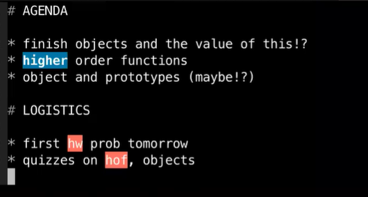
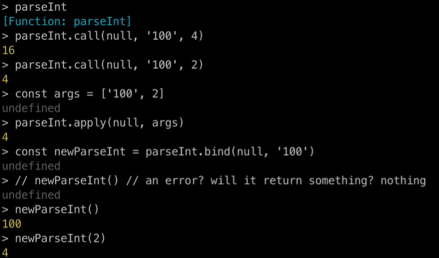
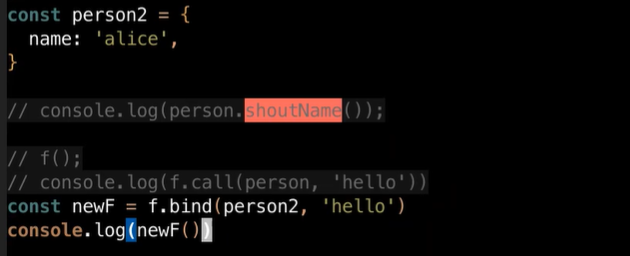

# Class - 2022/09/13

[TOC]



## Previously /modules

* we used to use common js
    * `‘require()` / `module.exports`<--- ignore this in the slides
* ES modules
  * `import` /`exports`<---- use this instead

* why are we doing this?
  * ES modules are a standard and it's the future
  * node docs favor ES modules

### Using ESM

* two ways of using ES6 modules
    * `.mjs`
    * `package.json`
* `strict mode` is default in ESM / vs `sloppy` (`use strict`)
    * `this` will cause an error when used in a regular function invocation

## The value of `this`

* called as a method: `this` is object that method was called on
    * a method is a function called on an object (in the context of an object)

* The value of `this` is different in <u>Strict Mode</u> and <u>Sloppy Mode</u>
  
    * In ESM or Strict Mode, when called as a regular function: `this` will be `undefined` (you will likely get an error because `this.propName`, cannot read prop off of undefined
    * In CJs or "Sloppy" Mode,`this` will be the global object 
    
    ```javascript
    const f = function() {
    	console.log('this is', this);
    }
    f();
    // In strict mode: this is undefined
    // In sloppy mode: this is <Window or Global Object>
    ```
    
* using `call` `apply` or `bind`

    * `this` is whatever you set it to be!

    ```javascript
    function greet(person) { 
        console.log(this.greeting, person); 
    }
    const obj = { greeting: 'hi' };
    greet("JOE");   //undefined 'JOE'
    greet.call(obj, 'joe');    //hi joe
    greet.apply(obj, ['Joe']);    //hi Joe
    const greetToad = greet.bind(obj, "toad");
    greetToad();  //hi toad
    ```

    

## Functions as Objects have methods

* functions can have their own methods
    * like call, apply, etc.

* can be passed as arguments and returned

### call/apply/bind

* methods on a function

* first arguments is always `this` (can be `null`)

* `.call` invokes the function
    * first argument:  what do we set `this` to?
    * remaining arguments are passed to original function that `call` was called on
    
* `.apply` also invokes the function
    * first argument: what do we set `this` to?
    * second argument is array, and array is implicitly `...` (spread) as arguments to original function
    
* `bind` gives back a new function <--- a higher order function
  
    * function returned is the original function
    * but with `this` bound as first arg
    * and any additional args bound as positional args 
    * potentially reducing the num of args?
    
* Example: `parseInt`

    

## Higher Order Functions

* a function that either or does both of:
    * taking in functions as arguments
    * giving back functions as return value




### Array methods that are higher order functions

All of the follow are examples of functions (methods on array) that take a function as an argument

* `map`
* `reduce`
* `filter`
* `forEach`

> Note that these methods acturally exist on the array object it self.
>
> They are witten in the prototype of the object (Array.prototype).
>
> ```javascript
> > const num = [1, 2, 3]
> 
> > nums.map
> f map() {[nativ code]}
> > nums.hasOwnProperty('map')
> false
> 
> > Array.prototype.map
> f map() {[nativ code]}
> > Array.prototype.hasOwnProperty('map')
> true
> ```

Therefore for non-array objects, if we want to use these methods, we can call:

`Array.prototype.forEach.call(Obj, function)`

```javascript
const images = document.getElementsByTagName('img')
Array.prototype.forEach.call(images, function(img){img.src = "......"})
//the images on the website will all be changed to the image in the url
```

> This is not inheritence! 

### map

```javascript
//Create new array and increment numbers by 1
const nums = [2, 4, 6]

//Normal Solution 
sonct newNums = []
for (let i = 0l i< nums; i++){
    newNums.push(nums[i]+1)
}

//Solution using map
function inc(x){
    return x+1;
}
const newNums = nums.map(inc);

//Or use anonymous function
const newNums = nums.map(x => x+1);

//We can also create our new map function
const myMap = (arr, transform) => {
    const neweArr = [];
    for (let i = 0; i<arr.length; i++){
        newArr.push(transform(arr[i]));
    }
    return newArr;
}
const newNums = myMap(nums, x=>x+1);

```

* The transform function we defined accept 1 argument
* but the callback function of map actually takes 3 arguments (element, index, array)

```javascript
const nums = [100,200,300]

const res = nums.map((ele,i) => '${i} - ${ele}')
//res = ['0 - 100', '1 - 200', '2 - 300']

const res2 = nums.map((ele, i, arr) => {
    arr[(i != arr.length - 1) ? i+1 : 0] *= -1;
    return ele*ele;
});
console.log(res2)  //[10000,40000,90000]
console.log(nums)  //[-100,-200,-300]
```

### filter

* filter will create new array
    * consists of elements that pass the test (function that gives back true or false)

```javascript
const myFilter = (arr, test) => {
    const newArr = [];
    for (let i=0; i<arr.length; i++){
        if (test(arr[i])){
            newArr.push(arr[i]);
        }
    }
    return newArr;
}

const nums = [1,2,3,4,5]
const odds = myFilter(nums, n) => n%2===1)
//odds = [1, 3, 5]

// Now use the built in filter method
const odds = nums.filter(n => n%2===1)
//odds = [1, 3, 5]
```

* These array methods can also be chained

```javascript
const result = nums
                .filter(n => n%2===1)
                .map(n => n+2)
console.log(result);
//prints [2, 6, 10]
```

### reduce

* We can use it to sum up numbers.

```javascript
const nums = [2, 4, 4]

//Normal way to sum
let total = 0;
for(let i = 0; i < nums.length; i++) {
    total += nums[i];
}
console.log(total);
```

```javascript
//To make our own version
const myReduce = (arr, reducer, initValue) => {
    // arr is originla array to reduce
    // reducer function will take accumulate and element and return new accumulator
    //initValue is initial value of accumulator
    
    let total = initValue;//accumulator initialization
    for(let i = 0; i < nums.length; i++) {
        //"action" / reducer goes here to accumulate into single value
        acc = reducer(acc, nums[i]);
    }
    return acc;
}

//signature for reducer
(acc, ele) => {}
//accumulator and element

//test
const nums = [1, 2, 3, 4]
const res = myReduce(nums, (total, ele)=> total+ele, 0)
console.log(res)
//will print 10

//Another version
const res = myReduce(nums, (s, ele)=> s+ele+'-', '')
console.log(res)
//print 1-2-3-4-
```

```javascript
//Real reduce
const res = nums.reduce((s, ele)=> s+ele+'-', '')
console.log(res)
```

## ⚠️ when using map, reduce and filter

* TL;DR AVOID SIDE EFFECTS
* don't use it just for a regular loop
* don't change the original array ... instead make all of your changes so that new array has changes
* don't change variables outside of your callback function

