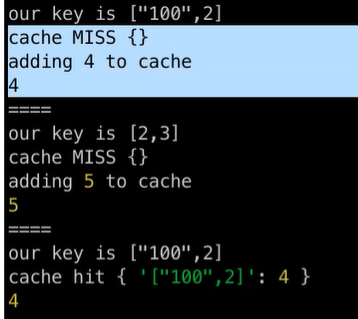
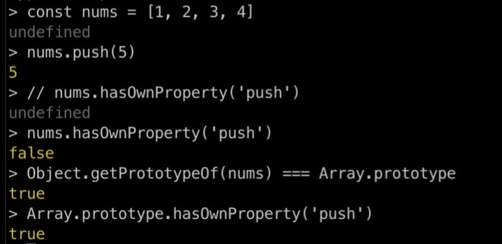
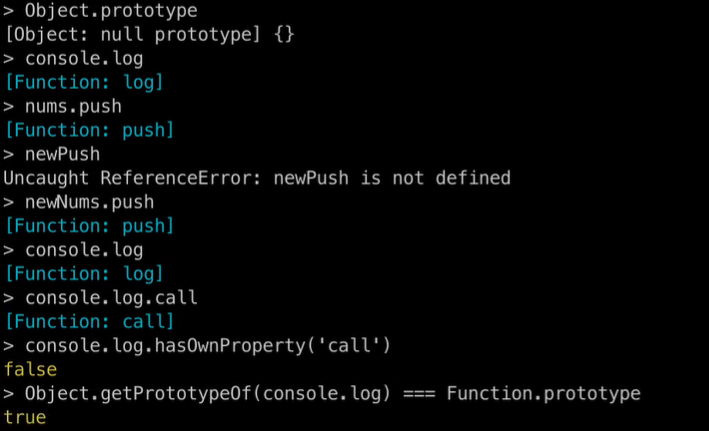
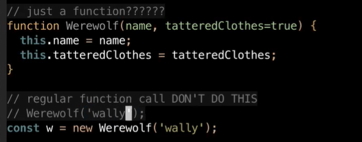
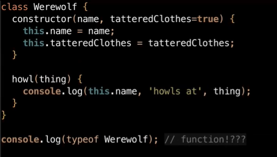

# Class - 2022/09/15

## Agenda

* Higher Order Functions that WE create
* Prototypal inheritance / classes
* maybe web


## Higher Order Functions

### Closure

 ```javascript
 function makeAdder(baseNumber) {
     //baseNumber is local
     function adder(n){
         return baseNumber + n;
     }
     return adder;
     // The inner function, adder, has access to locals from enclosing scope, even after parent or outer function finished executing
 }
 
 const addFive = makeAdder(5);
 console.log(addFive(2));
 //prints 7
 ```

* Note that `baseNumber`  is a local variable, so normally we'll think that it'l not usable outside of the function.

* but Now we can access it through the returned function adder.

* This is an example of **<u>closure</u>**.

* A closure is 
    * a function
    * the scope that it was created

### Decorator: Function that takes a function and returns a function

* Example
    * Make a function that takes an old function and returns a new function
    * The new function will do same thing as old function
    * but return value will be modified to add 1

```javascript
//create a new function to wrap up the old function
function incReturn(oldFn){
    const newFn = (arg)=> {
        return oldFn(arg) + 1;
    };
    return newFn;
}

const incrementedParseInt = incReturn(ParseInt);
const res = incrementedParseInt('100');
console.log(res)
//prints 101


//We can also modify the old function
function myAbsoluteValue(n) {
    if (n<0) {
        return n*-1;
    } else {
        return n;
    }
myAbsolutevalue = incReturn(myAbsoluteValue);
console.log(myAbsoluteValue(-5))

```

> You can even rewrite console.log
>
> ```javascript
> console.log = "wat?"
> console.log('1234')
> //now you get an error: console.log is not a function
> ```
>
> But don't ever do this!

#### Arity

* Note that the function we created above only takes one argument. But there are functions like `parseInt` who can take multiple arguments.
    * Fix: use the **spread operator**(`...`) to take arbitrary numbers of arguments

```javascript
function incReturn(oldFn){
    const newFn = (...arg)=> {
        return oldFn(...arg) + 1;
    };
    return newFn;
}

const incrementedParseInt = incReturn(ParseInt);
const res = incrementedParseInt('100', 2);
console.log(res)
//prints 5
```

* Arity: the number of arguments or operands taken by a function
    * To reduce arity, you can use methods like `bind`
* Variadic Function: a function of indefinite arity, i.e., one which accepts a variable number of arguments

### Application of Decorators

* caching / memorization
* timing decorator
* authentication <----
* adding routes
* logging

### Caching in Decorators (Example of Closure)

* HOF: takes a function as argument or returns a function as argument (this does both)
* Decorator: a function that takes old function, and returns a new function 
    * the new function is same as old, but with some modifications
* We do: decorator that takes any function and makes that function use a cache
    * keep track for arguments and return values
    * if it sees arguments that have been used before
    * then use cache to give back return value
    * otherwise run the old function

```javascript
function cachify(oldFn) {
    const cache = {};
    //keys are the string version of arguments
    //value ... the return value of the function
    const newFn = (...args) => {
        const k = JSON.stringify(args);
        console.log('our key is', k);
        if (cache.hasOwnProperty(k)){
            //don't have to run old function!!!
            console.log('cache hit', cache);
            return cache [k];
        } else {
            console.log('cache MISS', cache);
            const ret=oldFn(...args);
            console.log ('adding', ret, 'to cache');
            cache[k] = ret;
            return ret;
        }
    }
    return newFn;
}

const cachedAdd = cachify(add);
const cachedParseIne = cachify(parseInt);
console.log(cachedParseInt('100',2)); // miss
console.log('====')
console.log(cachedAdd(2，3));// miss
console.log('====')
console.log(cachedParseIne('100',2));// hit
```

<u>Output</u>: 

* This is also an example of **closure**, because cache is a local variable in the function.
* But we still have access to cache and can add or modify the keys through `cachedParseInt`
* However you can't access it directly by calling cache

> Note: The `cachedParseInt` and `cachedAdd` only work on its own version of cache. It doesn't get overwritten.


## Prototype

* Another object that some object points at for property lookup
* We can use `Object.create(arg)`
    * creates new object with argument passed in as prototype
* Find prototype use `Object.getPrototypeOf()`

```javascript
const proto0bj= {y: 8};
const obj = Object.create(proto0bj);
obj.x = 100;

console.log(obj)    //{x:100}
console.log(obj.y)  //8

console.log(obj.has0wnProperty('x')); // true
console.log(obj.hasOwnProperty('y')); // false

```

### Prototype Chain

* array --> Array.prototype --> Object.prototype
* 
* 
* Ways to check if a property exist in the chain
    * `in`
    * 
* `Object.prototype` is the last on the chain
    * `Object.getPrototypeOf(Object.prototype) === null`

### prototype methods

* We can define methods in prototype ourselves

    ```javascript
    const nums = [1, 2, 3, 4, 5]
    Array.prototype.lest = function() {
        return this[this.length - 1]
    }
    console.log(nums.last)
    // prints 5
    ```

>  Note that we must use regular function, not arrow function

* if we use arrow function, the value of `this` might not always be the instance it's called on.

* If you define using arrow function, its going to use the value of this at the moment it's created. 

    ```javascript
    Array.prototype.lest = () => this[0]
    nums.first()
    //undefined
    ```

* In this case, when it's defined, this references to the global object, so  `this[0]` is undefined.




### Functions as constructor



### create class in JS in modern way



* note that now we have a new value of this

    * this is value of instance when it's called on
    * it's undefined in a regular function implementation
    * it's the first argument to call upon a bind
    * it's wherever the arrow function is created when you use arrow functions
    * Lastly, when we use a constructor, `this `is a <u>brand new instance</u>

    01:16:46

    看不下去了

    