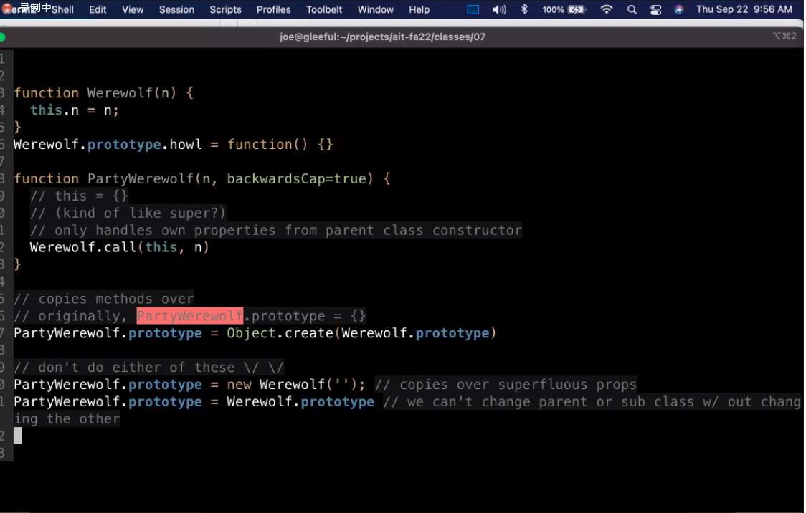

# Class - 2022/09/22

## Agenda

* inheritance + prototypes
* net module, nc, curl browser <---------- important
* class activity
    * 5 questions on previous material
    * 1 create a question + an answer
        * review quiz (does not count towards grade)
        * maybe include as pool for random 1 or 2 questions on exam

## Inheritance and Prototypes

```javascript
class Werewolf{
    constructor(n){
        //this = {}
        this.n = n;
        //return this
    }
    howl(thing){
        console.log(this.n, "howls at the", thing)
    }
}

const w = neww Werewolf('wally')
w.howl('in class activity')

Object.hasOwn(w, 'n');//true
Obhect.hasOwn(w, 'howl');//false, howl
is defined on the prototype of w
// What's the prototype of w?
Object.getPrototypeOf(w) === Werewolf.prototype //Werewolf is not same as Werewolf.prototype
Object.getPrototypeOf(Werewolf.prototype) === Object.prototype // true (Werewolf is just an object)
Object.getPrototypeOf(Werewolf) === Function.prototype // true, typeof Werewolf is function

class PartyWerewolf extends Werewolf {
    
}
const p = new PartyWerewolf('wendy');
p.howl('beverages');
Object.getPrototypeOf(p) === PartyWerewolf.prototype
Object.getPrototypeOf(PartyWerewolf.prototype) === Werewolf.prototype

function Werewolf(n){
    this.n = n;
}
Werewolf.prototype.howl = function() {}

function PartyWerewolf(n, backwordsCap=true){
    //this = {}
    //kind of like super?
    //only handles own properties from parent class constructor
    Werewolf.call(this, n)
}

//copies methods over
PartyWerewolf.prototype = Object.create(Werewolf.prototype)

//don't do either of these 
PartyWerewolf.prototype 没写完

class Foo {
    
}
const f = new Foo();
console.log(f)
```



## Net Module

* net module - creation of tcp/ip clients and servers
    * allows you to create server that can handle connections. react when data is sent
* We'll build we

### web server

* two ways 

1. 
2. database driven server side web app
3. single page web apps
    * gmail is like this

We do

1. create server side framework

    * mimics - express <------- we are doing this
    * koa
    * nextjs (also handles some frontend fw w/ react)

    ```javascript
    import net from 'net';
    
    // pass in cb function that is called when client connects
    const server = new.createServer(function(){
        console.log('cloent connected');
    })
    
    
    const server = new.createServer(function(sock){
        console.log('cloent connected');
        sock.write('Hello world!');
        // on will set event handler .....
        sock.on('data', function(data){
            console.log(data+'');//convert to str
        })
        sock.end();
        
    })
    
    server.listen(3000, '127.0.0.1')
    ```

    * Http request method
        * get <-----
        * post <----
        * put
        * delete


### quiz

```javascript
function assignment(n){
    console.log(this.name+' has '+n+' assignments.')
}
const course = {
    name: 'AIT',
    assignment
}

//If we want to print 'AIT has 10 assignments.'
//what of the following is correct?
course.assignment(10) //
assignment(10)
assignment.call(course,10) //
assignment.call(course)
assignment.apply(course,10)
assignment.apply(course,[10]) //
const f = assignment.bind(course); f(); //
```