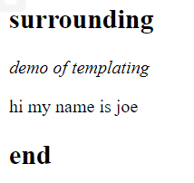
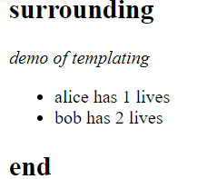

# AIT - 2022/09/29

[TOC]

## Agenda

* HW
* web frameworks in general
* express
* routing
* templating
* forms

## HW

...... (on 2022/10/12)

Parsing CSV:

## Web Frameworks

1. Server-Side (**Express**)
2. Front-end (**React**)
    * Examples:
        * **React**
        * **Vue**
        * **Angular**
3. You can do both! (**next.js**)

### Server-side web frameworks

1. monolithic
    * feartureful (see below)
    * dictate project layout
    * dictate what libraries you'll use
    * Examples:
        * **spring** (java)
        * **django** (python)
        * **rails** (ruby)
        * **laravel**, **symfony** (php)
2. minimal
    * minnimal core features
        * maybe only supports routing and templating
    * you choose libraries to integrate (may replace core functionality)
    * flexible project layout
    * Examples:
        * **flask** (python)
        * **sinatra** (ruby)
        * **express**, **koa** (node.js)

#### Features in server-side web frameworks

1. abstract Request and Response
2. Routing --> mapping paths to actions / functions
3. "static" files serving (.css, images, etc.)
4. database connectivity / object relational mapper
5. redirects
6. form handling / input / input validation
7. authentication

## Path of Module

* We can get the path of the module we are at by using `import.meta.url`

* To change it into a regular path, use `filrURLToPath`

* To get the directory from a path, use `path.dirname`

```javascript
import {fileURLToPath} from 'url';
import path from 'path';

console.log(path.dirname(fileURLToPath(import.meta.url)))
//gives us the directory of the module
```


​    

## Express

* Routing
* Templating (which we'll replace)

> Use `npm install express` to install

### Example 

* It's similar to what we learned last class

```javascript
import express from "express";

const app = express();

//routing
app.get("/", (req, res) => {
  console.log(req.path);
  res.send(<h1>home</h1>);
});

app.listen(3000);
```

* But we don't want to hard code the html
* We can send a html file

```javascript
import express from "express";
import { fileURLToPath } from "url";
import path from "path";

const app = express();

const directory = path.dirname(fileURLToPath(import.meta.url));

//Route Handlers
app.get("/", (req, res) => {
  console.log(req.path);
  res.send("<h1>home</h1>");
});
// it adds GET /foo.html to the list of supported http request
app.get("/foo", (req, res) => {
  console.log(req.path);
  res.sendFile(path.join(directory, "/public/foo.html"));
});

app.listen(3000);

```

### Route Handlers

`app.get`(also `app.post` and other http methods)

* route handlers will be checked in order for incomming path
* first match is run

### Middleware

* functions that get called before (or after) route handlers

* they could match a path or all paths

* they can allow request to continue through to other route handlers

* return response on their own

* registered with `app.use`

* the function must have 3 prarmeters: req, res, next

    ```javascript
    app.use(function (req, res, next) {
      console.log(req.method, req.path);
      // call next to invoke next middleware function or route handler
      next();
    });
    ```

    

#### Static file Serving Middleware

* what it does
    * Look at request path
    * try to match path with file in file system rooted at some folder, public as an example
    * if it find it, it serves its content as body or http response
    * if doesn't find file, go on to other routes
* To use express static file middleware:
    * `express.static` ---> returns a middleware function (req, res, next)
    * arg to express static ----> "root" of your static file folder

```javascript
//absolute path to directory that this file is in
const directory = path.dirname(url.fileURLToPath(import.meta.url));

// serve files in the directory with names matching path
app.use(express.static(path.join(directory, "public")));
```

## Templating

* template document
* data is injected
* data and template are merged into new doc that is served 

### Templating System

* We'll use handlebars to replaces express default templating
* multiple libraries / modules that implement handlebars
    * ​	The one we use is **hbs**
* use `res.render`
    * the second arg to render is context object
    * gives values to variables in template
    * variables are key names

```javascript
app.get("/demo", (req, res) => {
  res.render("demo", { name: "joe" });
});
```

```html
// layout.hbs

<!DOCTYPE html>
<html>
<head>
<title></title>
</head>
<body>
		<h2>surrounding</h2>
		{{{body}}}
        <h2>end</h2>
</body>
</html>
```

```html
// demo.hbs

<em>demo of templating</em>
<br>
<p>Hi my name is {{name}}</p>
```



### Logic in templating

* You can also do some basic logics in templates
* `#each arr`
    * if it's arr of obj
    * obj props are loop vars
* `#each arr as |loopvar|`
* `#if boolean value`

```javascript
app.get("/demo", (req, res) => {
  const cats = [
    { name: "alice", lives: "1" },
    { name: "bob", lives: "2" },
  ];
  res.render("demo", { cats });
});
```

```html
<em>demo of templating</em>
<br>
<ul>
{{#each cats}}
<li>{{name}} has {{lives}} lives</li>
{{/each}}
</ul>
```



