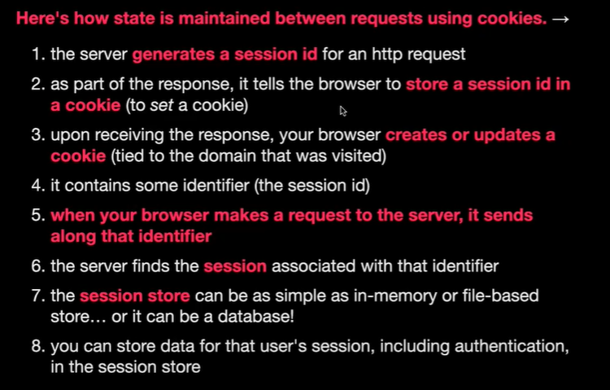
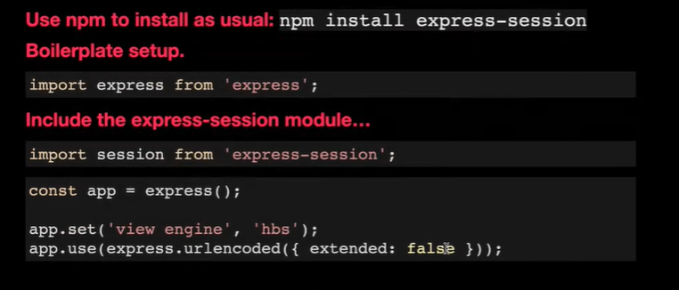
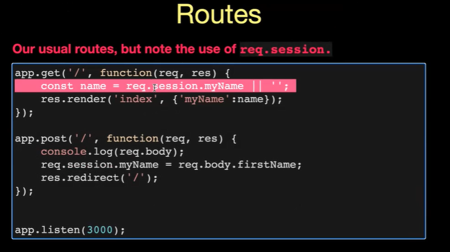

# AIT - 2022/10/04

[TOC]

## Agenda

* quickly review templating
* GET and POST forms / form handling
* cookies and sessions

(07:40) ---> How to get code snippets

## Review

```javascript
import express from "express";
import url from "url";
import path from "path";

// retrieve directory that this module is in (used for
// creating absolute paths)
const __dirname = path.dirname(url.fileURLToPath(import.meta.url));

const app = express();

app.set("view engine", "hbs");

app.use(express.static(path.join(__dirname, "public")));

app.get("/hello", (req, res) => {
  res.send(" hello ");
});

const cats = [
  { name: "kitty purry ", lives: 2 },
  { name: "lion-ardo dicatrio ", lives: 7 },
  { name: "bill furry ", lives: 5 },
];

app.get("/cats", (req, res) => {
  // render method injects data into template
  // * 1st arg template name (no extension)
  // * 2nd arg context object - maps variable names to values
  res.render("cats", { cats: cats });
});

app.listen(3000);
```


## http methods

* GET - retrieving data
    * write in the url bar
    * click on a link
    * a page has resources like images / css
    * click submit on a form (typically for forms that filter or retrieve data, but not login)
* POST - creating or updating data
    * forms like login

## Form

* GET form

    * filtering / retrieving data
    * data from form appears in query string of URL
        * `localhost:3000/some/path?name=value&name2=value2` <---- query string
        * express can parse query string
            * place data in object ... prop on request object called query
            * `req.query`

    ```javascript
    app.use((req, res, next) => {
      console.log(req.method, req.path, req.query);
      next();
    });
    //  http://localhost:3000/cats?foo=1
    //  GET /cats { foo: '1' }
    ```

* Form element
    * method = http request method to use when submitting the form
    * action = http request path (if left blank, will be same path as current)
* input
    * type = kind of 'widget' ' ui element that you'll ... number , text, etc
    * name = name in request query string if `GET `form (name in body if `POST`)
* `GET `request

```html
<form method="GET" action="/cats">
		min lives: <input type="number" name="minLives" value="">	
		<input type="submit" value="filter">	
</form>
```

```javascript
app.get("/cats", (req, res) => {
  // render method injects data into template
  // * 1st arg template name (no extension)
  // * 2nd arg context object - maps variable names to values
  const minLives = parseInt(req.query.minLives || 0); // not using double ?? because i want '' as 0
  res.render("cats", { cats: cats.filter((cat) => cat.lives >= minLives) });
});
```

* `POST`
    * we need `POST`to make changes to the data
    * login

> <u>**WHY we don't use GET request for login?**</u>
>
> 1. **Security**
>
>     * GET request are in query string. 
>
>     * Stored in url as plain text, in the browser history or server's logs.
>
>     * use https for encrypted body
>
> 2. **Semantics**
>
>     * `GET` retrieving data
>     * `POST` creating / updating a  new authenticated session

* When  you submit a form, default format is :
    * urlencoded
    * name=value&name2=value2
    * shows up in http request body
* body format can be other formats:
    * json
    * xml
    * multipart
* Express does not parse body
* To parse:
    * `app.use(express.urlencoded({extended: false}));`

* Note: in `app.post`,  we only render directly if there's an error
    * if no error, use `app.redirect`

```javascript
app.post("/cats", (req, res) => {
  // push the new cat to the cats array
  if (parseInt(req.body.catLives) > 0) {
    cats.push({ name: req.body.catName, lives: req.body.catLives });
    console.log("cats are", cats);
    res.redirect("/cats");
  } else {
    res.render("cats", { cats, error: "lives is not valid" });
  }
});
```

```html
<form method="POST" action="/cats">
		name: <input type="text" name="catName" value=""><br>
		lives: <input type="number" name="catLives" value=""><br>	
		<input type="submit" value="submit">	
</form>
```

* full code sofar

```javascript
import express from "express";
import url from "url";
import path from "path";

// retrieve directory that this module is in (used for
// creating absolute paths)
const __dirname = path.dirname(url.fileURLToPath(import.meta.url));

const app = express();

app.set("view engine", "hbs");

app.use(express.static(path.join(__dirname, "public")));

app.use((req, res, next) => {
  console.log(req.method, req.path, req.query);
  next();
});
//register body paarsing middleware
//assuming body name=value&name2=value2
app.use(express.urlencoded({ extended: false }));

app.get("/hello", (req, res) => {
  res.send(" hello ");
});

const cats = [
  { name: "kitty purry ", lives: 2 },
  { name: "lion-ardo dicatrio ", lives: 7 },
  { name: "bill furry ", lives: 5 },
];

app.post("/cats", (req, res) => {
  // push the new cat to the cats array
  if (parseInt(req.body.catLives) > 0) {
    cats.push({ name: req.body.catName, lives: req.body.catLives });
    console.log("cats are", cats);
    res.redirect("/cats");
  } else {
    res.render("cats", { cats, error: "lives is not valid" });
  }
});

app.get("/cats", (req, res) => {
  // render method injects data into template
  // * 1st arg template name (no extension)
  // * 2nd arg context object - maps variable names to values
  const minLives = parseInt(req.query.minLives || 0); // not using double ?? because i want '' as 0
  res.render("cats", { cats: cats.filter((cat) => cat.lives >= minLives) });
});

app.listen(3000);
```

```html
<form method="GET" action="/cats">
		min lives: <input type="number" name="minLives" value="">	
		<input type="submit" value="filter">	
</form>

<ul>
{{#each cats as |cat|}}
<li>{{cat.name}} {{cat.lives}}</li>
{{/each}}
</ul>

<form method="POST" action="/cats">
		name: <input type="text" name="catName" value=""><br>
		lives: <input type="number" name="catLives" value=""><br>	
		<input type="submit" value="submit">	
</form>
```


## HTTP and State

* HTTP is a stateless protocal
    * HTTP requests don't know anything about each other
* There are situations where we want to maintain state across HTTP requests
    * authentication (is this client logged in? ... maintaining logged in
        state means the user doesn't have to log in per requestl)
    * any time that we want to store persistent data about a client, like:
        have they visited the site before
    * what are some user's preferences (personalization). 
    * tracking / analyzing their behavior (t?)
* How do we maintain state?
    * store data on the server about a user
    * **link data to the requests** from a particular client
        * using a **session id** that represents the client
        * that session id is always **retransmitted** back to the serverwith every request from the same client!
        * which essentially maintains state

* Session id
    * once you own that id, you own that session!
    * which means that session ids shouldn't be easy to: 
        * steal
        * guess
    * This means that:
        * session ids should be generated sequentially
        * they shouldn't be present in the query string of a url (where
            someone shoulder surfing could see it, it appears in request logs,etc.)
* potential mechanisms for saving session ids
    * add a query string parameter for the session id on each request 
        * NOT a goo idea - shoulder surfing, logs, etc.
    * add a secret form input for every page (input type is hidden), 
        * same problem as above if using get, otherwise every request isn't a post
    * **<u>cookies</u>**! - text files stored by your browser 
        * Chrome actually stores cookies in a sqlite database, which is essentially just a text file
        * they can store a session id which links to more data on the server
        * as well as client side data (though there are better ways to do this)
* Using **Cookies**



* express has session



01:23:30
