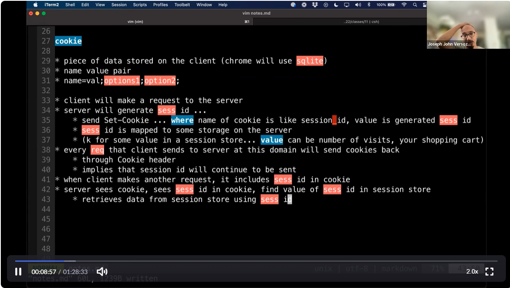
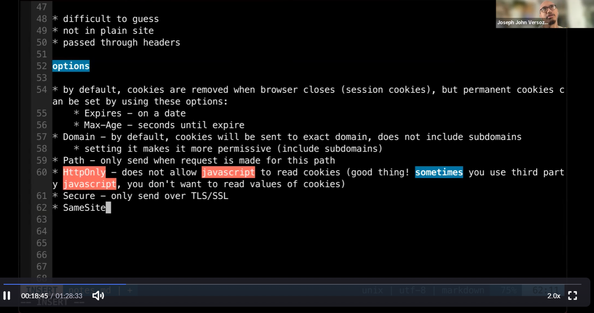
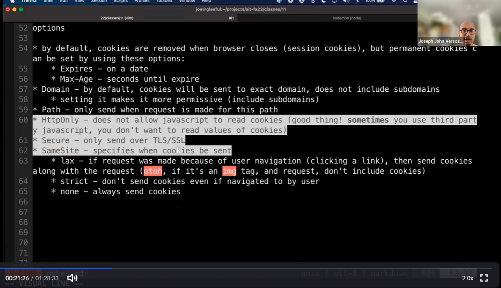
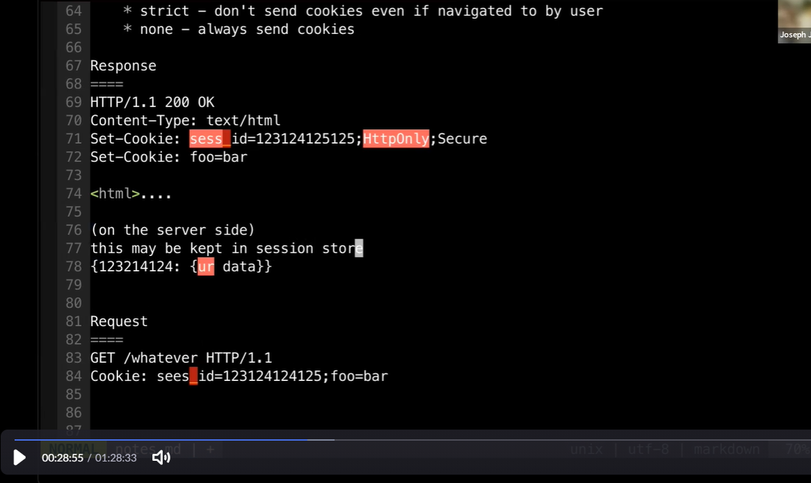
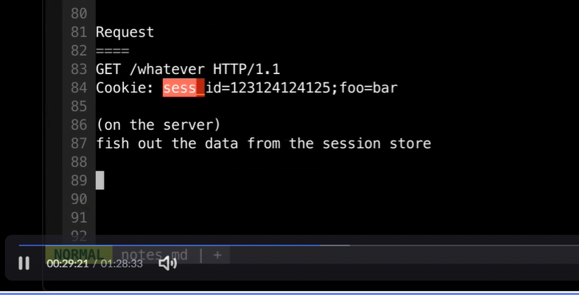
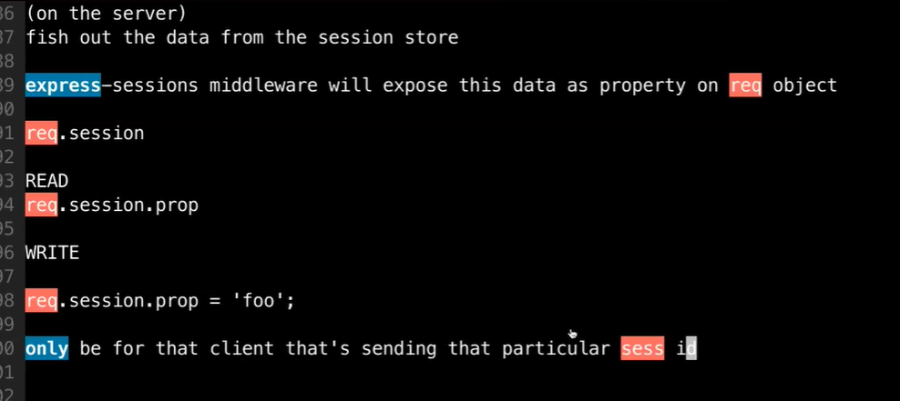

# AIT - 2022/10/06

[TOC]

## Agenda

* finish out sessions and cookies
* intro to db
* mongodb
* schedule reminder
    * next week tues - mon schedule
    * small in class activity on thursday
    * review
    * exam

## Cookies

* To store states between http requests
    * maintaining an authenticated session
    * tracking (site visits)

### How?

* headers
    * Set-Cookie: (HTTP Response)
    * Cookie: (HTTP Request)

* what is cookie

    * piece of data stored on the client (chrome will use sqlite)

    * name value pairs
      * name=value; options1; options2

* client will make a request to the server
* server will generate session id 
* (00:06:45)...
* 

### Session id

* difficult to guess
* not in plain sight
* passed through 

* Req methods 00:39:29
    * req.path
    * req.query
    * req.body
    * req.session

## Database

* ways to store data
    * in memory
    * database host on your own
    * cloud - mongbatlas, supabase, planetscale, firebase, salesforce
    * files
* Which db?
    * relational <---- bias
        * tabular (rows and cols)
        * rigid ... u have to define cols, their types, constraints
        * relationships btwn tables
        * syntax of base language for all relational databases similar (sql)
        * transactions ... series of operations tre
    * nosql

* mongodb

