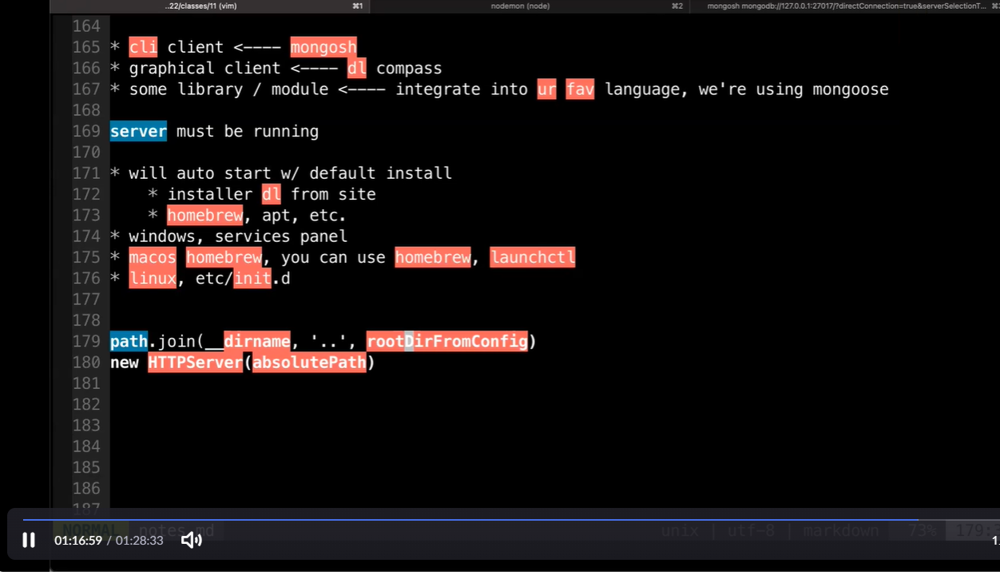

# AIT - 2022/10/06

[TOC]

## Agenda

* finish out sessions and cookies
* intro to db
* mongodb
* schedule reminder
    * next week tues - mon schedule
    * small in class activity on thursday
    * review
    * exam


## Cookies

* To store states between http requests
    * maintaining an authenticated session
    * tracking (site visits)
    * keeping data about client (shopping cart)
* what is cookie
  
    * piece of data stored on the client (chrome will use sqlite)
    
    * name value pairs
        * name=value; options1; options2

### Headers (in Req & Res)

* headers
    * Set-Cookie: (HTTP Response)
    * Cookie: (HTTP Request)

### Server & Client

1. client will make a request to the server
2. server will generate session id 
    * send `Set-Cookie` header
        * where name of cookie is like session_id, value is generated sess id

    * session id is mapped to some store on the server
        * values like number of visit, shopping carts

3. every req that client send to server at this domain will send cookies back
    * through `Cookie` header
    * implies that session id will continue to be sent

4. when client makes another request, it includes session id in cookie
5. server sees cookie, sees session id in cookie, find value of session id in session store 
    * retrieves data from session store using session id

### Example

```javascript
// setting cookies
import express from "express";
import session from "express-session";

const app = express();

app.get("/bake", (req, res) => {
  res.append("Set-Cookie", "favcolor=blue");
  res.append("Set-Cookie", "sess_id=12313221;HttpOnly");
  res.send("made y a cookie");
});

app.listen(3000);
```


### Session id 

* difficult to guess
* not in plain sight
* passed through 

#### Options

* By default, cookies are removed when 
* by default, cookies are removed when browser closes (session cookies), but permanent cookies can be set by using these options:
    * `Expires `- on a date
    * `Max-Age `- seconds until expire
* `Domain` - send to the domain and its subdomains
    * by default, cookies will be sent to exact domain, but not sent to subdomains
    * setting domain makes it more permissive (include subdomains)
* `Path `- only send when request is made for this path
* `HttpOnly `- does not allowjavascriptto read cookies 
    * (good thing! sometimes you use third party javascript, you don't want to read values of cookies)
* `Secure `- only send over TLS/SSL
* `SameSite` - specifies when cookies be sent
    * `Lax` - if request was made because of user navigation (clicking a link). then send cookies along with the request 
        * OTOH, If it's an img tag, the request don't include cookies
    * `Strict` - don't send cookies even if navigated to by user
    * `None` - always send cookies
    * Default is `Lax`


### Sample Response and Request

* Response

    ```http
    HTTP/1.1 200 OK
    Content-Type: text/html
    Set-Cookie: sess id=123124125125;HttpOnly;SecureSet-Cookie: foo=bar
    
    <html>.........
    
    (on the server side)
    this may be kept in session store
    {1223131231: {ur data}}
    ```

* Request

    ```http
    GET /whatever HTTP/1.1
    Cookie: sess_id=1223131231;foo=bar
    
    (on the server)
    fish out the data from the session store
    ```

* `express-sessions` middleware will expose this data as property on req object
* Read
    * req.session.prop
* write
    * req.sessoin.prop = "foo"
* it'll only be for that client that's sending that particular session id

00:33:36


* Req methods 00:39:29
    * req.path
    * req.query
    * req.body
    * req.session


## Database

* ways to store data
    * in memory
    * database host on your own
    * cloud - mongbatlas, supabase, planetscale, firebase, salesforce
    * files
* Which db?
    * relational <---- bias
        * tabular (rows and cols)
        * rigid ... u have to define cols, their types, constraints
        * relationships btwn tables
        * syntax of base language for all relational databases similar (sql)
        * transactions ... series of operations tre
    * nosql


* mongodb


