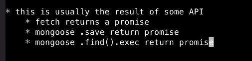
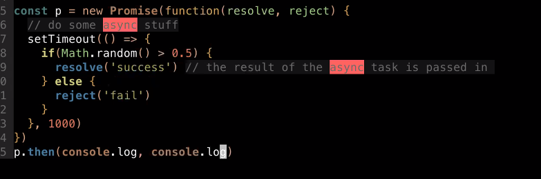
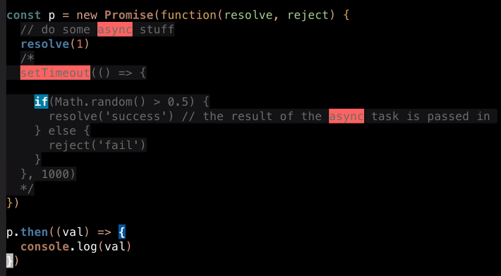
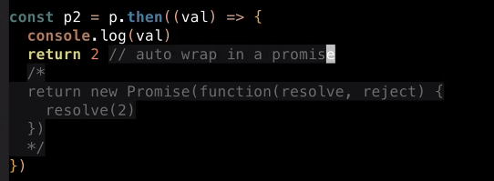
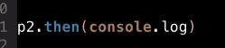
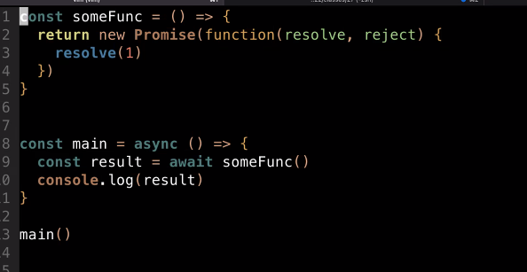

# AIT: 2022/10/20

[TOC] 

## Agenda

* final project, milestone 1
* authentication - high level overview
* `mongodb` / `mongoose` - database design
    * strategies for multiple collections

  

## Final Project

**~5 weeks**

<u>4 milestones (due every week / week and a half)</u>

1. (20) project description, project skeleton (express app starter code, mongoose schema, etc.)
    * low intensity
    * you tell me what you want to create
2. (20) one working "form" along with initial deployment
    * a GET / POST form ... or use "AJAX"
    * deploy on courant servers / wherever u want (can be part of "research" topics)
3. (20) another working "form", proof of work on "research" topics
4. (40) final working project deployed


## Build whatever u want

......as long as it's a "web" project and adheres to technical requirements

* (12) 3 x working forms (or AJAX interactions or web socket interactions)
* (2) 2 x mongoose schemas (if not using mongoose, some reasonable substitute)
* (6) 3 x classes or higher order functions of your own creation
    * or 3 x use of array higher order functions (map, reduce, filter, every, some, etc.)
* (8) overall stability, "security" :  no in-escaped html, no spilled session id, if u implement login, items hat require login should not be viewable without login 
* (4) "different enough from hw"
* (8) x number of "points" - research topics
    * choose any tech that you'd like to use that we haven't covered fully in class
    * things that are covered later, but are valid for research (web sockets, react, nect.js)
    * I'll supply point values for some common tech(s), but if it's not one that I list, then you tell me how much it's worth
        * testing (jest, mocha, jasmine)
        * css framework (tailwind, bootstrap)
        * API client (google maps, twilio, some other service)
        * frontend framework (react, vue, ~next)


## Promises / Async and Await

### Promises

* althernative to using callbacks

* object that represents some async task

* typically the return value of some async task (rather than passing in a callback during function call)

* example: mongoose

    ```javascript
    // Regular callback way
    const f = MyModel({foo:'bar'})
    f.save((err, savedObj) => {
    	// do stuff after save succeeds
        res.render('template', {obj: savedObj})
    })
    
    // Promises
    const p = f.save() // no callback function!!
    p.then(() => {
        res.render('template', {obj: savedObj})
    })
    
    // if you're in a function, don't forget, should be defined async:
    const obj = await f.save()
    res.render(...)
    
    ```

    Async and await let you to do things linearly

### async / await

* a way of waiting for promises to resolve
* pausing a function

###  When working with promises

* this is usually the result of some

    












