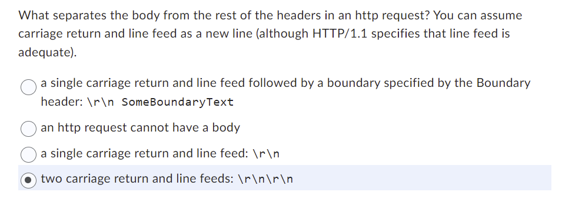
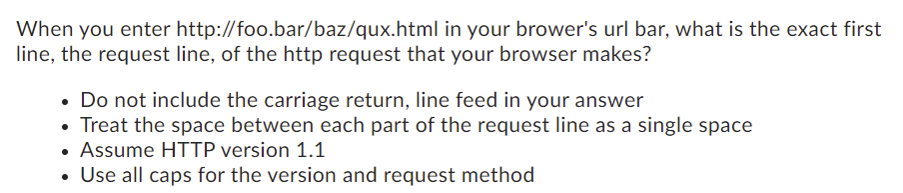
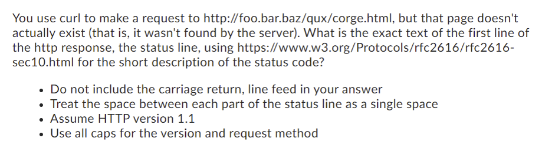

# Request & Response sample

[TOC]

##　Request

### Examples

```http
GET / HTTP/1.1
Host: localhost:3000
User-Agent: curl/7.83.1
Accept: */*
```
```http
POST /foo HTTP/1.1
Content-Type: application/x-www-form-urlencoded

bar=baz&qux=corge
```


```http
// The request body is provided in place
// 从网上偷的，不知道为什么request里带domain。课上学的是不带domain的。下同
POST http://example.com:8080/api/html/post HTTP/1.1 
Content-Type: application/json
Cookie: key=first-value

{ "key" : "value", "list": [1, 2, 3] }
```

```http
// The request body is read from a file
POST http://example.com:8080/api/html/post
Content-Type: application/json

< ./input.json
```

### From Quiz

#### Seperator between body and the rest of the headers



#### Requesting a website



* `GET /baz/qux.html HTTP/1.1`

## Response

### Examples

```html
<!-- Used curl -->
curl -i http://google.com

<!--Below is the Response-->
HTTP/1.1 301 Moved Permanently
Location: http://www.google.com/
Content-Type: text/html; charset=UTF-8
Date: Tue, 18 Oct 2022 01:51:32 GMT
Expires: Thu, 17 Nov 2022 01:51:32 GMT
Cache-Control: public, max-age=2592000
Server: gws
Content-Length: 219
X-XSS-Protection: 0
X-Frame-Options: SAMEORIGIN 

<HTML><HEAD><meta http-equiv="content-type" content="text/html;charset=utf-8">
<TITLE>301 Moved</TITLE></HEAD><BODY>
<H1>301 Moved</H1>
The document has moved
<A HREF="http://www.google.com/">here</A>.
</BODY></HTML>

```

### From Quiz

#### curl 404 response



* `HTTP/1.1 404 Not Found`

