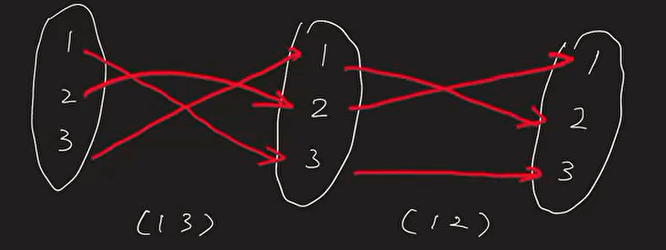

# Class 4: Subgroups, Additive Integer Group and Its Subgroup - 2022/09/19

[TOC]

## Group Cont.

### Order

<u>**Definition:**</u> The <u>order</u> of a group $G$ is the number of element $G$ has, denoted by $|G|$.

* If $|G|<\infty$, we say $G$ is a finite group. 
* Otherwise $G$ is an infinite group

### Notation of composition in groups

If we write the composition of a group is a multiplicative way, we have:
$$
\begin{align*}
k>0, \qquad g^k &= \underbrace{g* g* \dots g}_\text{k-copies},\\
g^{-k} &= \underbrace{g^{-1}*g^{-1}\dots g^{-1}}_\text{k-copies}\\
k=0, \qquad g^0&=1
\end{align*}
$$
Note:    
$$
g^k\cdot g^l= g^{k+l}
$$

### Examples of Groups

1. $G = \{\pm 1\}$, composition is multiplication.

    $|G| = 2$. Finite group.
    $$
    (+1)\cdot (+1) = +1\\
    (+1)\cdot (-1) = -1\\
    (-1)\cdot (+1) = -1\\
    (-1)\cdot (-1) = +1
    $$

    * Since it's a finite group, we can use the multiplication table to show the results.

    > ## Multiplication Table
    >
    > * "<u>Multiplication Table</u>" for a finite group is a way to express the result of all the compositions for this group.
    >
    > * Example: $G$ is a finite group, $G = \{1, g_1, g_2,..., g_{n-1}\}$
    >
    >     
    >
    > * In particular, for $G = \{\pm1\}$ we just defined, 
    >
    >     |      | +1   | -1   |
    >     | ---- | ---- | ---- |
    >     | +1   | +1   | -1   |
    >     | -1   | -1   | +1   |
    >
    > * The trivial group,
    >
    >     |      | 1    |
    >     | :--- | :--- |
    >     | 1    | 1    |

2. **<u>Klein</u> Four Group**

    > Named after the mathematician Klein 

    * $K_4 = \{1,a,b,c\}$

    * Law of composition is given by the table:

        |       | 1    | a    | b    | c    |
        | :---: | ---- | ---- | ---- | ---- |
        | **1** | 1    | a    | b    | c    |
        | **a** | a    | 1    | c    | b    |
        | **b** | b    | c    | 1    | a    |
        | **c** | c    | b    | a    | 1    |

    * Note:

        * $|K_4| = 4$
        * $\forall x \in K_4,\ \: x^{-1} = x$

    * Associativity: It was checked that $(xy)z = x(yz)$,  $\forall x,y,z \in K_4$.

        * $4^3 = 64$ cases

    * $K_4$ is an abelian group.

        > A finite group $G$ is Abelian $\iff$ its multiplication table is symmetric along diagonal

3. **Symmetric Groups $S_n$**

    > First group in math history

    * <u>Recall:</u>  

        * $X = \{1,2,3,...,n\}$.

        * $S_n$ is the groups of all bijections (permutations) on $X$.

        * with function composition

    * Problem: We don't have a good way to describe the elements (functions)

        * We can use cycle

## Cycle

### Definition

* A <u>cycle</u> $(a_1\ a_2\ ...\ a_k)$, where $a_1,a_2,...a_k$ are distinct elements in $\{1,2,...,n\}$, is an element in $S_n$ that sends $a_1\mapsto a_2$, $a_2\mapsto a_3$, ...... , $a_{k-1}\mapsto a_k$,  $a_k\mapsto a_{k+1}$, while fixing the remaining numbers.
* A cycle $(a_1\ a_2\ ...\ a_k)$ is called a <u>k-cycle</u>

### Example

* $\sigma = (1\quad 2\quad 3)\in S_5$ 
* $\sigma: \{1,2,3,4,5\} \rightarrow\{1,2,3,4,5\}$
* $\sigma(1) = 2$,  $\sigma(2) = 3$,  $\sigma(3) = 1$

> <u>**NOTE**</u>: $(1\quad 2\quad 3) = (2\quad 3\quad 1) = (3\quad 1\quad 2)$

Not every elements are cycles as the permutations do not always work in a  cyclic way

But cycle is enough to describe small groups 

* $S_1 = \{id\}$     
* $S_2 = \{id, (1\: 2)\}$ 
* $S_3 = \{id, (1\: 2), (1\: 3), (2\: 3), (1\: 2\: 3), (1\:3\:2) \}$
* $|S_n| = n!$ 

### Compute

* $(1\: 2)(1\: 3) = ?$

    > Each of the cycles is a bijective function. Here, we are composing a pair of functions
    >
    > $f_1\circ f_2(x) = f_1(f_2(x))$, so $(1\: 3)$ should be calculated first

    

    $f(1) = 3, f(2) = 1, f(3) = 2$

    Therefore, $(1\: 2)(1\: 3) = (1\:3\:2)$

* Fun facts
    * $(1\: 2)^2 = (1\: 3)^2 = (2\:3)^2 = id$
    * $(1\: 2\: 3)(1\: 3\: 2) = id$
* $S_3$ is non-Abelian, and it's the <u>smallest non-Abelian group</u>

* ==Note:== not all permutations are cycles.
    * For example, in $S_4$: 
    * $\sigma(1) = 2, \sigma(2) = 1, \sigma(3) = 4, \sigma(4) = 3,$
    * We can write it as the composition of two cycles
    * $\sigma = (1\ 2)(3\ 4)$

### Propositions

1. (Will prove later) Each element of $S_n$ can be written as a product of <u>disjoint cycles</u>, in a unique way up to reordering of these cycles
    * Disjoint cycles: $(a_1...a_k)(b_1...b_m)$ are disjoint if $a_1...a_k, b_1...b_m$ are all distinct numbers
2. Two disjoint cycles commute
    * $(a_1...a_k)(b_1...b_m) = (b_1...b_m)(a_1...a_k)$

### Exercise

* List all the 24 elements in $S_4$, ad product of disjoint cycles

## Subgroups

### Wish

* Given a group $G$, we want to study a subset of $G$ that is also a group with the same composition as that of $G$.

### Definition

* A subset of a group $G$, $H\subseteq G$, is a <u>**subgroup**</u> of $G$ if:
    1. <u>Closure</u>: $\forall h_1,h_2\in H$,  $h_1h_2 \in H$
    2. <u>Identity</u>: $1 \in H$
        * It's the same identity as in $G$
    3. <u>Inverse</u>: $\forall h \in H, h^{-1}\in H$
* In other words, it's a smaller subset lives inside of $G$ and use the same composition, and it's still a group

### Examples

* For any $G$, it has two "uninteresting" subgroups,
    * $G$
    * $\{1\}$
    * They coincide when $G = \{1\}$
* $G = (\R,+)$, then $H=\Z$ is a subgroup
    * $\forall k_1,k_2\in\Z, k_1+k_2\in\Z$
    * $0\in\Z$
    * $\forall k\in \Z, -k \in \Z$
* For $S_n$,   $H = \{\sigma\in S_n|\sigma(n) = n\}$
    * $H$ consists of all the functions that fixes the last element $n$
    * Then $H$ is a subgroup of $S_n$
    * Actually, $H$ can be regarded as a copy of $S_{n-1}$

### Proposition

* $H$ is a nonempty subset of a group $G$ satisfying that $\forall a,b\in H, a^{-1}b\in H$.  Then $H$ is a subgroup of $G$. 

#### <u>Proof:</u>

* $H\ne\O, \exists h \in H$.  then $1 = h^{-1}h \in H$  ($a=h,b=h$)
*  $\forall h\in H, h^{-1} = h^{-1}1 \in H$  ($a=h,b=1$)
* $\forall h_1,h_2\in H, h_1h_2 = (h_1^{-1})^{-1}h_2\in H$ $(a=h_1^{-1},b=h_2)$

### Example

* Recall: We defined $GL_n(\R)$ - <u>General Linear Group</u>

    * $GL_n(\R)$ consists of all $n\times n$ invertible real-matrices.
    * Composition is multiplication

* Let $SL_n(\R) = \{A\in GL_n(\R)|\ det(A) = 1\}$

* Then $SL_n(\R)$ is a subgroup of $GL_n(\R)$ called <u>Special Linear Group</u> 

* Proof: 

    * $\forall A,b \in SL_n(\R),$

    * $det(A^{-1}B) = det(A^{-1})det(B) = det (A)^{-1}det(B) = 1 $

        $\Rightarrow A^{-1}B\in SL_n(\R)$

    * So by the prop., $SL_n(\R )$ is a subgroup of $GL_n(\R )$
