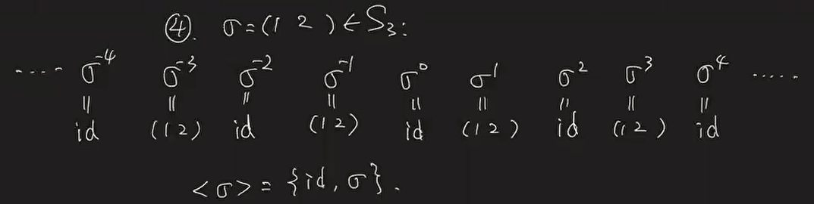

# Class 5: Cyclic Subgroups - 20220921

[TOC]

## Group of Integer

​         Integers $\Z$ with addition $(\Z,+)$ is a group.

### Notations

* $\N:$ Natural numbers: $0, 1, 2, 3, ....$
* $\Z:$ Integers
* $\Q:$ Rational numbers
* $\R:$ Real numbers
* $\C: $ Complex numbers

### Subgroups

​        Question: What are the subgroups of $(\Z,+)$?

* Observation: 
    * For any $a \in \N$,   $a\Z = \{ak\in \Z|k\in \Z\}$ is a subgroup of $\Z$:
    * $\forall ak_1, ak_2\in a\Z$,     $ (-ak_1 )+(ak_2) = a(k_2-k_1)\in a\Z$.
* Also, note that $a\Z = (-a)\Z$. 

#### Proposition

* If $H$ is a subgroup of $(\Z, +)$, then $H = a\Z$ for some $a\in \N$.

* Proof: 
    * If $H = \{0\}$, then $H = 0\Z$
    * If $H = \Z$, then $H = 1\Z$.
    * If $\{0\}\subsetneq H \subsetneq \Z$:
        * $\{0\} \subsetneq H$, so $H$ contains a nonzero element $m$. 
            * $H$ is a subgroup, so $-m\in H$. 
            * $m\ne 0$, so $m$ or $-m$ is positive
            * so $S = \{h\in H|h>0\}\ne \O$, $S\subseteq \N$
        * Take $a = \min(S)$, the smallest number in $S$. 
            * Note $a$ is the <u>smallest positive number</u> in $H$. 
            * Also, $a\ne 1$. otherwise, $1\in H$, which implies $H = \Z$.
        * We'll show $H = a\Z$.
        * Suppose $H\ne a\Z$:
            * $a\in H$, so $a\Z \in H$.  and $H \ne a\Z$.
            * so $\exists h \in H \backslash a\Z$.
            * Divide $h$ by $a$:
                * $h = aq+r$, with $q\in\Z$, $0<r<a$
                * $r = h-aq \in H$.
            * <u>Contradicts</u> with our choice of $a$ that $a$ is the smallest positive number.
        * Since we get a contradiction, we conclude that $H = a\Z$

### Greatest common divisor

#### Definition

* $a, b$ are integers, not both zero. Define the <u>greatest common divisor</u> of $a,b$ to be the positive integer $g$ such that $g\Z = a\Z + b\Z$

#### Lemma

* $a\Z+b\Z$ is a subgroup of $\Z$.
    * Proof as exercise

* Combine the Lemma with the prop. we just proved, we verified the existence of $g$.

#### Proposition

* If $g = gcd(a,b)$, then:

    * $g|a$ and $g|b$
    * For any $c\in \Z$ with $c|a$ and $c|b$, we have $c|g$.

* Proof:

    * $g = \gcd(a,b)$, $g\Z = a\Z+b\Z$

    1. $a = a*1+b*0 \in g\Z$,  so $g|a$

        $b = a*0+b*1 \in g\Z$,  so $g|b$

    2. $g = g*1\in g\Z = a\Z+b\Z$,   so $\exists k,l \in \Z$, $g = ak+bl$

        If $c|a$ and $c|b$, then $c|ak$ and $c|bl$, so $c|ak+bl = g$

#### Corollary

* If $g = \gcd(a,b)$, then $g = ak+bl$ for some $k,l \in \Z$.
* Furthermore, $g$ is the smallest positive number among all the integer linear combinations of $a$ and $b$. 

### Relatively Prime

#### Definition

* $a,b\in\Z$, not both zero, are <u>relatively prime</u>, if $\gcd(a,b) =1$
* i.e., $a,b$ are relatively prime if $a\Z+b\Z = \Z$
* In particular, we have:

#### Proposition

* $\exists k,l\in \Z$,  $ak+bl = 1$ $\iff a,b$ relatively prime
* Proof:
    * $\exists k,l\in \Z$,  $ak+bl = 1$  $\iff$  $a\Z+b\Z = \Z$   $\iff$  $\gcd(a,b) = 1$

#### Proposition

* $p$ is a prime, $a,b\in\Z$, $p|ab$.   If $p \:\not\| \: a$, then $p|b$.
* Proof:
    * $p$ is prime, $p \not\| a$, so $\gcd(p,a) = 1$
    * $\exist k,l$,   $pk+al = 1$  $\Rightarrow$    $pkb+abl = b$
    * Since $p|ab$, $p|b$

## Cyclic Subgroup

### Definition

* $G$ is a group.  $a\in G$. Define the <u>cyclic subgroup</u> of $G$ generated by $a$ to be $<a> = \{a^k\in G|k\in\Z\}$

### Lemma

* $<a>$ is a subgroup of $G$. 
    * $a^ka^l = a^{k+l}\in<a>$
    * $1 = a^0 \in <a>$
    * $\forall a^k\in <a>$, $(a^k)^{-1} = a^{-k}\in <a>$

### Examples

1. $\{1\} = <1>$

2. Every subgroup of $(\Z, +)$ is a cyclic subgroup.

3. In any group $G$,  if $a\in G$, then $<a> = <a^{-1}>$

4. $\sigma = (1\ 2)\in S_3$:  <$\sigma$> = $\{id, \sigma\}$

    

5. $\tau = (1\ 2\ 3)\in S_3$,   $<\tau> = \{id, \tau, \tau^2\}$

### Proposition

* $a\in G$.   Let $S = \{k\in\Z|a^k = 1\}$.  Then $S$ is a subgroup of $(\Z, +)$

* Proof:
    * $k,l \in S$.  $a^k = 1, a^l = 1, a^{k+l} = a^k*a^l = 1$.  $k+l\in S$
    * $a^0 = 1 \Rightarrow 0\in S$
    * $k \in S. a^k = 1, a^{-k} = (a^k)^{-1} =1$ .  $-k\in S$

### Corollary

> The order of an element in a group is **the smallest positive power of the element which gives you the identity element**. 

* 00:59:00 没有听的很懂

* The set $S$ in the above Prop. can be written as $S = n\Z$ for some $n\in \N$
* If $n = 0$, $S = \{0\}$,   write $|a| = \infty$ 
* If $n\ne 0$, $S=n\Z\ne \{0\}$,   write $|a|=n$
* we call $|a|$ the <u>order</u> of $a\in G$

#### Example

* Let's study the case $S\ne\{0\}.$ i.e. $|a|=n$ for some positive integer $n$
* $a^k = a^l \iff a^{k-l} = 1\iff k-l\in S= |a|\Z\iff 
    |a|\Big|k-l$ 

* Gives us the proposition below:

#### Proposition

* $a^k = a^l \iff |a|\Big|k-l$

### Proposition

* If $|a|$ is finite (ie. $|a|$ is a positive integer), than $<a> = \{1,a,a^2,...,a^{|a|-1}\}$

* In particular, we see $<a>$ has $|a|$ elements
* This gives an equivalent definition of |a|:   $|a| = |<a>|$

#### Example

1. $1\in G$, $|1| = 1$
2. $\sigma = (1\ 2)\in S_3$, $|\sigma| = 2$
3. $\tau = (1\ 2\ 3)\in S_3$,   $|\tau| = 3$
4. $1\in\Z$, $|1| = \infty$, $<1> = \Z$
5. $K_4 = \{1,a,b,c\}$, $|a| = 2$, $<a> = \{1, a\}$

