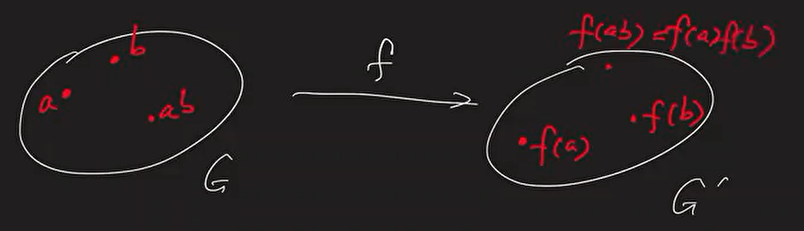

# Class 6: CyclicGroup & Homomorphism -  2022/09/26

[TOC]

## Review

*  $x\in G$. 
* Define the cyclic subgroup generated by $x$: $<x>= \{x^k\in G|k\in\Z\}$.

*  The order of $x$, denoted by $|x|$, is defined as $|<x>|$, equivalently, $|<x>|$ is the smallest positive integer that makes $x^{|x|}=1$
    *  $<x> = \{1,x,x^2,...,x^{|x|-1}\}$ when $|x|<\infty$

    *  $<x> = \{...,x^{-2},x^{-1},1,x,x^2,...\}$ when $|x|=\infty$

*  Sometimes the group itself equals one of it's cyclic subgroups

## Cyclic Group

### Definition

* A group $G$ is cyclic if $G=<x>$ for some $x\in G$
* $x$ is called the generator of $G$

### Example

1. $(\Z,+)$ is a cyclic group. 

    * $\Z = <1> = <-1>$

2. $G = \{\pm 1\}.$ With number multiplication

    * Multiplication table:

        |      | 1    | -1   |
        | ---- | ---- | ---- |
        | 1    | 1    | -1   |
        | -1   | -1   | 1    |

    * $G$ is cyclic, $G = <-1>$

3. $S_3$ is **NOT** cyclic

    * $<id> = \{id\}$
    * $<(1\ 2)> = \{id, (1\ 2)\}$
    * $<(1\ 3)> = \{id, (1\ 3)\}$
    * $<(2\ 3)> = \{id, (2\ 3)\}$
    * $<(1\ 2\ 3)> = <(1\ 3\ 2)> = \{id, (1\ 2\ 3), (1\ 3\ 2)\}$

    Later, we'll show that $S_3$ is the second smallest non-cyclic group.

    > The **smallest non-cyclic group** is $K_4$. The **Klein Four Group**.

### Proposition

* Any subgroup of a cyclic group is cyclic

* Example: $(\Z, +)$
    * We've proved that its subgroups are all of the form $n\Z$ (cyclic subgroup generated by $n$).

> Later, we will show that $(\Z,+)$ is the <u>**only** infinite cyclic group</u>.

#### Proof

* Given a cyclic group $G = <x>$

* If $H$ is a subgroup of $G$, 

* Consider $S = \{k\in\Z|x^k\in H\}$

    * $S$ is a subgroup of $(\Z,+)$ (Verify by yourself)
    * So $S = n\Z$ for some $n\in \N$
    * $S = \{k\in \Z|x^k\in H\} = n\Z$

* It follows that 
    $$
    \begin{align*}
    H &= \{x^k\in G|k\in S\}\\
    &= \{x^k\in G|k\in n\Z\}\\
    &= \{x^{n\cdot l}\in G|l\in \Z\}\\
    &= <x^n>
    \end{align*}
    $$
    

> We have been studying on the groups itself. Now we are going to study about the functions on groups

## Homomorphism

### Definition

A <u>homomorphism</u> is a map $f:G\rightarrow G'$ $(G,G'$ are  goups$)$ satisfying :

$\forall a,b\in G, f(ab) = f(a)f(b)$

> -morphism: some kind of change

> This is different from homeomorphism: bijective and continous function

### Example

1. $x\in G$. define 
    $$
    f: &\Z &\rightarrow &G\\
    &k &\mapsto &x^k
    $$
    $f$ is a homommorpism.

    $\forall k,l \in \Z$,  $f(k)\cdot f(l) = x^k\cdot x^l = x^{k+l} = f(k+l)$

2. Trivial homomorphism:

    $f:G\rightarrow G'$,   $f(g) = 1'\ \forall g\in G$

    $ \forall a,b\in G, f(a)f(b) = 1'\cdot 1' = 1' = f(ab)$

### Properties

If $f: G\rightarrow G'$ i s a homomophism, then

1. $f(1) = 1'$ (Identity maps to Identity)
2. $\forall g\in G, f(g)^{-1} = f(g^{-1})$

#### Proof

1. $f(1) = f(1\cdot1) = f(1)f(1)\Rightarrow f(1) = 1'$

2. $\forall g \in G$,  

     $\qquad f(g)f(g^{-1}) = f(gg^{-1}) = f(1) = 1'$

    $\qquad f(g^{-1})f(g) = f(g^{-1}g) = f(1) = 1'$

    so $f(g^{-1})$ is the inverse of $f(g)$, i.e., $f(g)^{-1} = f(g^{-1})$

## Kernel and Image

### Definition

If $f:G\rightarrow G'$ is a homomorphism. 

* Define the <u>Kernel</u> of $f$:  $\ker (f) = \{g\in G|f(g) = 1'\}$. 

* Define <u>image or range</u> of $f$:   $Im (f) = \{f(g)\in G'|g\in G\}$

### Prop

$\ker (f)$ is a subgroup of $G$,   $Im (f)$ is a subgroup of $G'$.

 #### Proof

1. * $\forall a,b \in \ker (f), f(a)=f(b) = 1'$,   $f(ab) = f(a)f(b) = 1'\cdot 1' = 1'$

        so $ab\in \ker(f)$

    * $1\in \ker(f)$ since $f(1) = 1'$

    * $\forall a\in \ker(f), f(a)=1', f(a^{-1}) = f(a)^{-1} = 1'^{-1} = 1'$

        so $a^{-1} \in \ker(f)$

    We get $\ker(f) $ is a subgroup of $G$.

2. * $\forall f(a),f(b)\in Im (f), a,b\in G$. So $ab\in G, f(ab)\in G'$.

        So $ab\in Im(f)$

    * $f(1) = 1'$. So $1'\in Im(f)$

    * $\forall f(a)\in Im(f)$,  $a, a'\in G$. $f(a)^{-1}= f(a^{-1})\in G'$

### Prop

If $f:G\rightarrow G'$ is a homomorphism, then $f$ is injective <u>if and only if</u> $\ker (f) = \{1\}$.

> Note that $f$ must be a homomorphism, and kernel is only defined for homomorphisms

#### Proof

* If $\ker(f)=1$:

    * For any $a,b\in G$ with $f(a)=f(b)$
        $$
        f(b)^{-1}f(a)=1'\\
        f(b^{-1})f(a)=1'\\
        f(b^{-1}a)=1'
        $$

    * So $b^{-1}a\in \ker(f) = \{1\}$, $b^{-1}a = 1$,  $a=b$

    * The function $f$ is injective

* If $f$ is injective:

    * The $\ker (f) = \{g\in G| f(1)=1'\}$ consistes of at most $1$ element 
    * $1\in \ker(f)$
    * So $\ker(f) = \{1\}$

### Examples

1. Fix $x\in G$.    

    Define  $f:\Z\rightarrow G$.   $f(k)=x^k$
    $$
    \begin{align*}
    \ker(f) &= \{k\in\Z|f(k)=1\}\\
    &=\{k\in\Z|x^k=1\}\\
    &=
    \begin{cases}
    \{0\}, &|x| = \infty\\
    |x|\Z, &|x|<\infty
    \end{cases}
    \end{align*}
    $$

    $$
    \begin{align*}
    Im(f) &= \{f(k)\in G|k\in \Z\}\\
    &=\{x^k\in G|k\in \Z\}\\
    &=<x>
    \end{align*}
    $$

    > **<u>Proposition:</u>**
    > In fact,  If $f:\Z\rightarrow G$ is a homomorphism, then $\exists x\in G$,  $f(k)=x^k$
    >
    > **<u>Proof:</u>**
    >
    > Let $x = f(1)$.  
    >
    > If $k>0$, $f(k)=f(1+1+...+1)$ (k copies) $=(f(1))^k = x^k$
    >
    > For $k\le 0$, similar argument.
    >
    > Therefore we can verify that $f(k) = x^k$ and $f(1)=x$
    >
    > 
    >
    > **It tells us** that **Homomorphisms** **from $\Z$ to $G$** are of this form of $f(k)=x^k$
    >
    > And for each homomorphism, it gives us the corresponding cyclic subgroup as a image.
    >
    > This is another way of interpretation of **cyclic subgroups**
    >
    > Each subgroup can be seen as the image of a homomorphism from $\Z$ to $G$ in the form that $f(x) = x^k$
    >
    > (01:06:51)

2. Trivial homomorphism:

    $f:G\rightarrow G'$,   $f(g) = 1'\ \forall g\in G$

    $\ker(f) = \{g\in G|f(g)=1'\} = G$

    $Im(f) = \{f(g)\in G|g\in G\} = \{1'\}$

    > Roughly speaking, **larger $\ker(f)$ leads to smaller $Im(f)$**
    >
    > Also, if the kernel is bigger, the function is far from injective. If the kernel is the smallest, the function is injective.
    >
    > <u>We'll prove later that $ |ker(f)|\cdot|Im(f)| = |G|$</u>

