# Algebra - Lecture 10/03

[TOC]

## Group of Automorphisms

* $Aut(G)$ is <u>the group of automorphisms</u> of $G$. 

* Fix $g\in G,$  define $\phi_g:G \rightarrow G$. $\phi_g(x) = gxg^{-1}$

    We've verified $\phi_g\in Aut(G). $   Each $\phi_g$ is called an <u>inner automorphism</u>.

* $\Phi :\ G\ \rightarrow \ Aut(G)$

  $ \qquad g\:\:\mapsto\quad  \phi_g$

* $Inn(G) = \{\ \phi_g\in Aut(G)\  |\ g\in G\ \} = Im(\Phi)$

* We know:  <u>the image of a homomorphism</u> is a <u>subgroup of the codomain group</u>.

    * $\Phi$ is a homomorphism:
    * 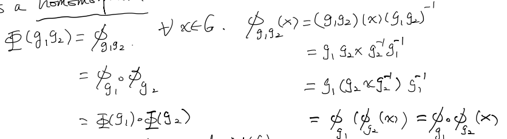
    * So $Inn(G)$ is a subgroup of $Aut(G)$

* Furthermore, $Inn(G)$ is  a normal subgroup of $Aut(G)$

    * $\forall \phi_g\in Inn(G)$,  $\forall f\in Aut(G)$,  need to check : $f\circ\phi_g\circ f^{-1}\in Inn(G)$

    * $\forall x \in G, \ f\circ\phi_g\circ f^{-1}(x) = f(\phi_g(f^{-1}(x)))$

        $ = f(gf^{-1}(x)g^{-1}) = f(g)f(f^{-1}(x))f(g^{-1}) = f(g)xf(g)^{-1} = \phi_{f(g)}(x)$

    * So $f\circ\phi_g\circ f^{-1} = \phi_{f(g)}\in Inn(G)$

* $\Phi :\ G\ \rightarrow \ Aut(G)$

  $ \qquad g\:\:\mapsto\quad  \phi_g$

    Sometimes, different $g$ may lead to same $\phi_g$.

    For example, if $G$ is abelian

    $\phi_g(x) = gxg^{-1} = x $

    $ \phi_g = id_G, \ Inn(G) = \{id\}$

* $\Phi$ will be injective iff $Z(G) = \{1\}$

    * 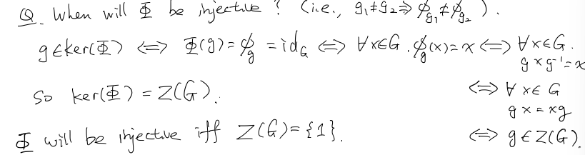

    * E.g. $Z(S_3) = \{id\}$, so we have an injective homomorphism:
        $$
        \Phi: S_3\rightarrow Aut(S_3)\\
        \Rightarrow |Aut(S_3)|\ge |S_3|
        $$

## Quotient & Product of Groups

### Cosets

$G$ is a group, $H$ is a subgroup of $G$. 

Define a relation on $G$ by $a\sim b$ if $a=bh\ (\ b^{-1}a = h\ )$ for some $h\in H$

This is an equivalence relation:

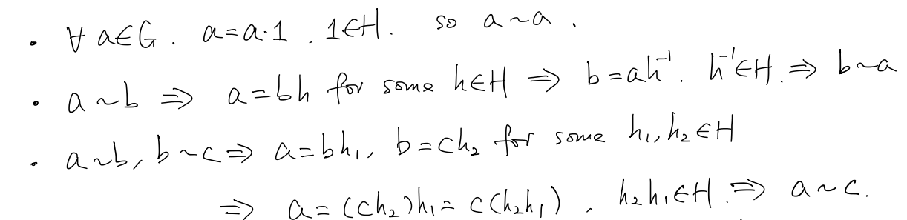

Under this equivalence relation, an equivalence class is: 

$[g] = \{x\in G|x\sim g\} = \{x\in G|x=gh \text{ for some } h\in H\} = \{gh\in G|h\in H\} = gH$

Such an equivalence class is called a <u>**left coset**</u> of $H$ in $G$.

### Cor

Two left cosets of $H$ in $G$ are either disjoint or conincide. And $G$ is a partition of its distinct left cosets.

### Example

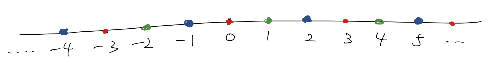

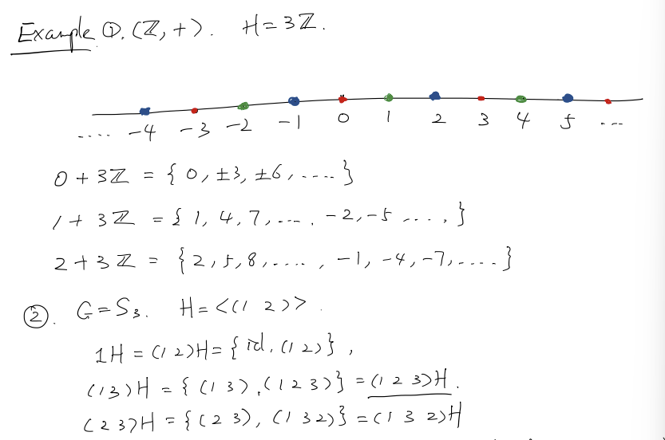

### Prop

$H$ is a subgroup of $G$.   $a,b \in G$.   Then the following are equivalent:

1. $aH = bH$
2. $a=bh $   for some   $h\in H$
3. $ b^{-1}a \in H$
4. $a\in bH$

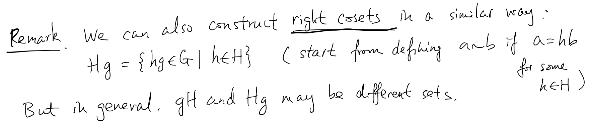

### Index

$H$ is a subgroup of $G$. 

Define the number of distinct left cosets of $H$ in $G$ to be the <u>index</u> of $H$ in $G$. 

Denoted by $[G:H]$.

#### Ex. 

1. $(\Z, +), \ H=3\Z$.  We see $[\Z:3\Z] = 3$
2. $S_3, \ H = <(1\ 2)>$.   We see $[S_3:H] = 3$

#### Lagrange Theorem

If $G$ is a finite group of $H$ is a subgroup of $G$, then
$$
[G:H] = \frac{|G|}{|H|}
$$
Proof:

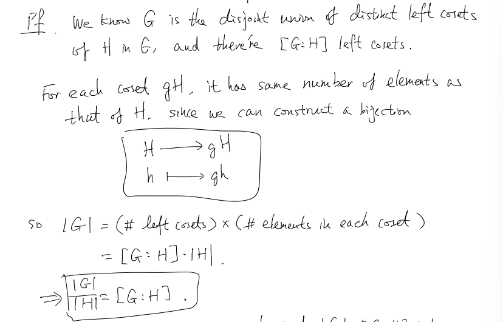

Remark:

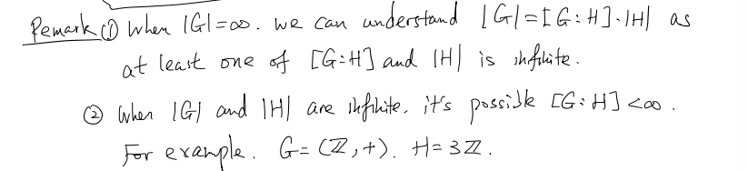

Cor

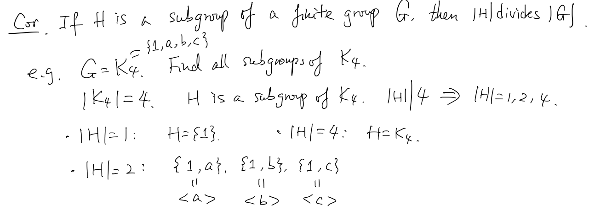

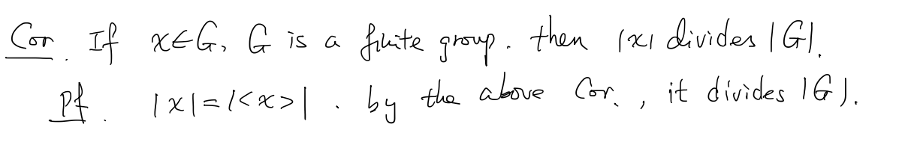

#### Prop

If $G$ is a group, $|G|$ is prime, then $G$ is a cyclic group

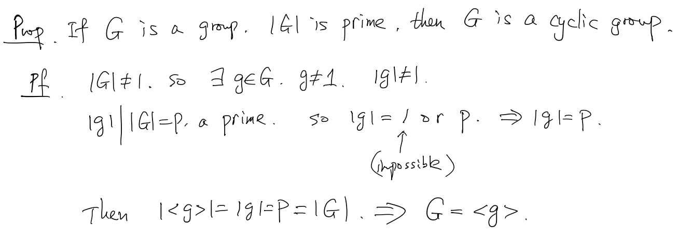

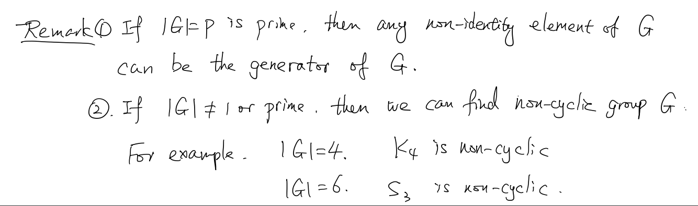
