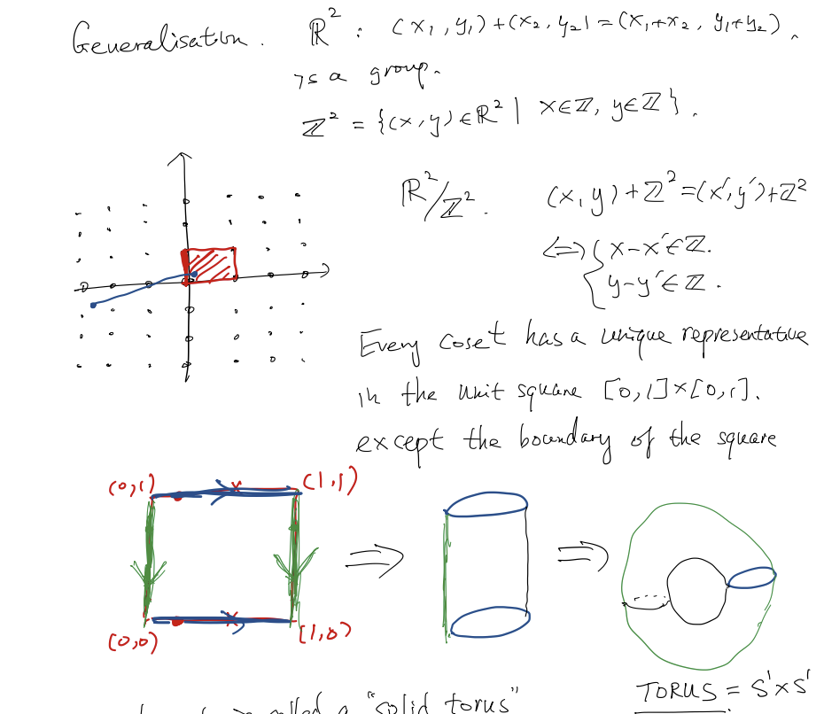

# Cosets & Quotient Group 2022/10/05

[TOC]

## Cosets 

### Prop

$H$ is a subgroup of $G$ and $K$ is a subgroup of $H$. Then $[G:K] = [G:H][H:K]$

### Claim

$\{g_ih_iK\}$ is a collection of all distinct left cosets of $K$ in $G$.

Need to show:

* These cosets are disjoint

* Their disjoint union is $G$

    

## Quotient Group

### Motivation

* When will we have $gH=Hg \quad \forall g\in G\ ?$

* Why do we need that? 
    * We wish to define a group srtucture on the <u>quotient space</u>.  (The set of left cosets)
    * $aH \cdot bH = \ ?$
    * We want $aH\cdot bH = abH$
        * If $bH = Hb$, then we can use $aH\cdot bH = abHH = abH$
    
* Observe:
    * $\forall g\in G, \ gH = Hg \iff \forall g \in G, \ gHg^{-1} = H$
    
        $\qquad \qquad \qquad \quad \quad\iff H\lhd G$

### Definition

$G$ is a group. $N$ is a <u>normal subgroup</u> of $G$.  We define the <u>**quotient group**</u> of $G$ by $N$ to be the <u>set of all cosets</u> of $N$ in $G$, with composition given by $aN \cdot bN = abN$.

The quotient group is denoted by $G/N$.

==Note==: $|G/N| = [G:N]$.  In particular, if $\displaystyle |G|<\infty, \ |G/N| = \frac{|G|}{|N|}$

### Examples

1. $K_4 = \{1,a,b,c\}$.   $N = \{1,a\} = <a>$

    $K_4/N = \{N, bN\} = <bN>$.   a cyclic group of order 2  (Note $N = aN,\ bN = cN$)

    ==Note==: In $G/N$, the identity is $N$. Since $N\cdot aN = aN\cdot N = aN$

    

### Group of $\Z/n\Z$

