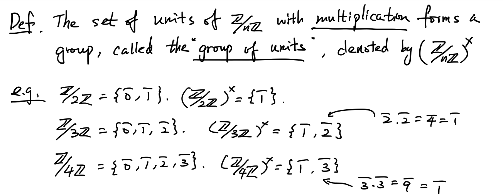

# $\Z/n\Z$ & Unit 20221011

[TOC]

## Quotient Group:  $\Z/n\Z$

* $(\Z, +)$  and   Subgroup $n\Z$. 
    * We'll study the quotient group $\Z/n\Z, \ (n\ge 2)$.

### Notations

* Elements in $\Z/n\Z$ are of form $k+n\Z$. 
    * Denote $\bar{k} = k+n\Z$. 
    * $\overline{k_1} = \overline{k_2} \ \iff \  (-k_1)+k_2\in n\Z \ \iff \ n \text{ devides } k_2-k_1$
    * $\quad(aN=bN \ \iff \ a^{-1}b\in N)$
* So $\Z/n\Z = \{\bar 0 , \bar 1, \bar 2, ... ,\overline{k-1} \}$
    * The composition is  $\bar a+\bar b = \overline{a+b}$
    * $((a+n\Z)+(b+n\Z) = (a+b)+n\Z)$
* We also say "$a$ is congruent to $b$ modulo $n$", denoted by $a\equiv b\ (\mod n)$   if $\bar a = \bar b$ in $\Z/n\Z$.

### Multiplication

* We can also define another composition, called multiplication on $\Z/n\Z:$

    * $\bar k \cdot \bar l = \overline{kl}$

* We need to verify this multiplication is "Well-Defined":

    * i.e.    $\overline {k_1} = \overline {k_2}, \ \overline {l_1} = \overline {l_2}\quad \Rightarrow \quad \overline {k_1} \cdot\overline {k_2}= \overline {l_1} \cdot\overline {l_2}. \quad (\overline{k_1l_1} = \overline{k_2l_2})$

    * 
        $$
        \overline {k_1} = \overline {k_2} \quad \Rightarrow \quad k_2-k_1 = an \ \text{  for some }a\in \Z\\
        \overline {l_1} = \overline {l_2} \quad \Rightarrow \quad l_2-l_1 = bn \ \text{  for some }b\in \Z
        \\
        \\
        \begin{align*}
        k_2l_2-k_1l_1 &= (k_1+an)(l_1+bn)-k_1l_1\\
        &= k_1l_1+al_1n+bk_1n+abn^2-k_1l_1\\
        &= (al_1+bk_1+abn)n
        \end{align*}
        $$

    * So $\overline{k_1l_1} = \overline{k_2l_2}$

* Question: Is $\Z/n\Z = \{\bar0, \bar1, ..., \overline{n-1}\}$ withe the multiplication a group?
    * Associativity: $(\bar a \bar b)\bar c = \overline{ab}\cdot \bar c = \overline{abc} =$
    * Identity:
    * Inverse:
* Conclusion: $(\Z/n\Z, \cdot)$ is NOT a group

## Unit

### Definition

$\bar a\in \Z/n\Z$ is called a <u>unit</u> if it has multiplicative inverse.

i.e. ($\exists \bar b \in \Z/n\Z, \bar a \cdot \bar b = \bar b \cdot \bar a  = \bar 1$)

### Group of Units 

### Theorem 

## The Euler's Phi Function

## Fermat's Little Theorem

