# First Isomorphism & Product Groups: 2022/10/12

[TOC]

## First Isomorphism Theorem

### Lemma

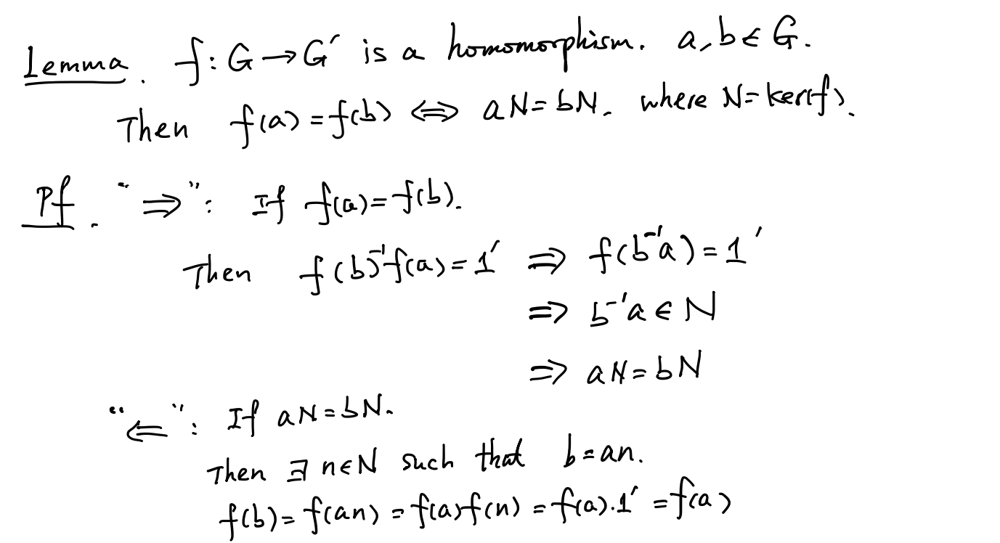

### Theorem

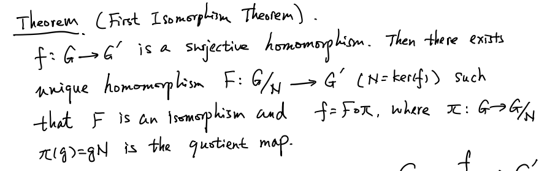

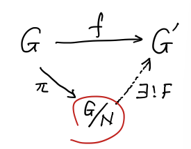

### Proof

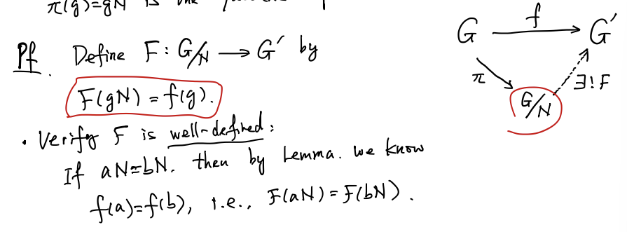

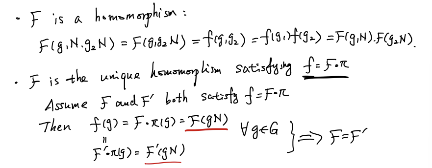

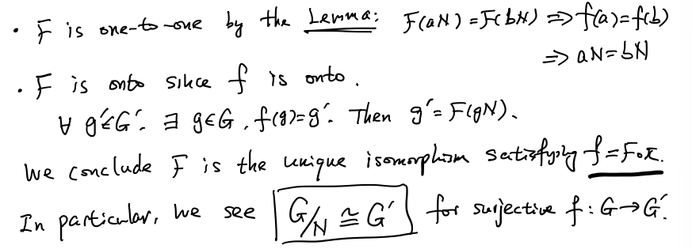

### Cor

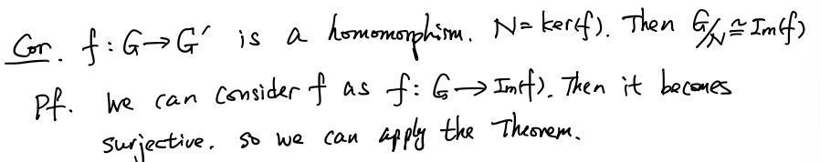
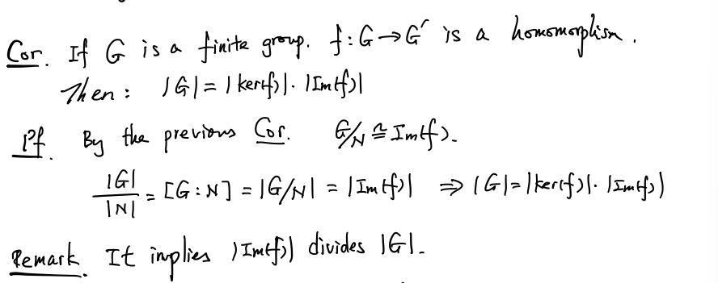
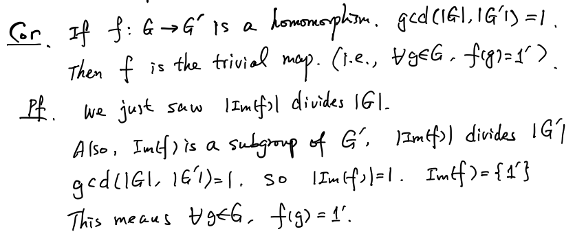

### Examples

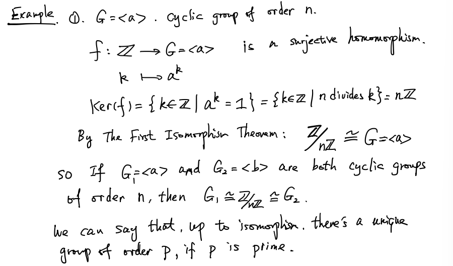
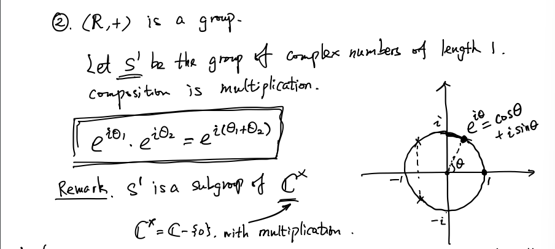
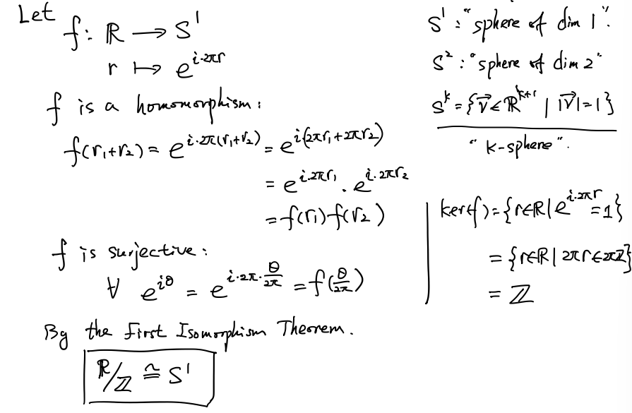
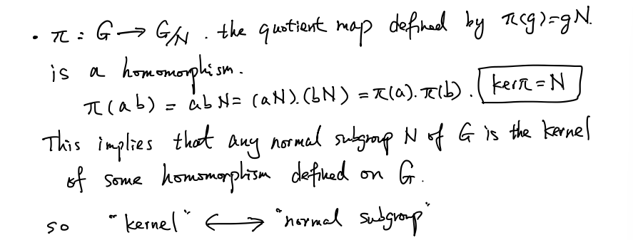

## Product Groups

### Definition

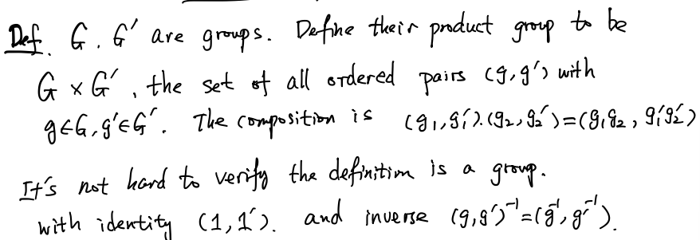

### Properties

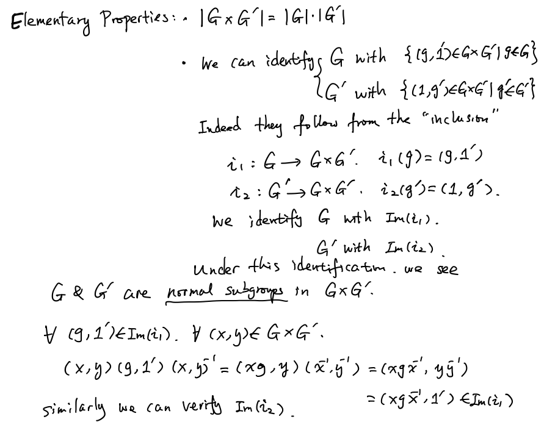