# Chinese Remainder Theorem: 2022/10/17

[TOC]

## $G\times G'$ product group

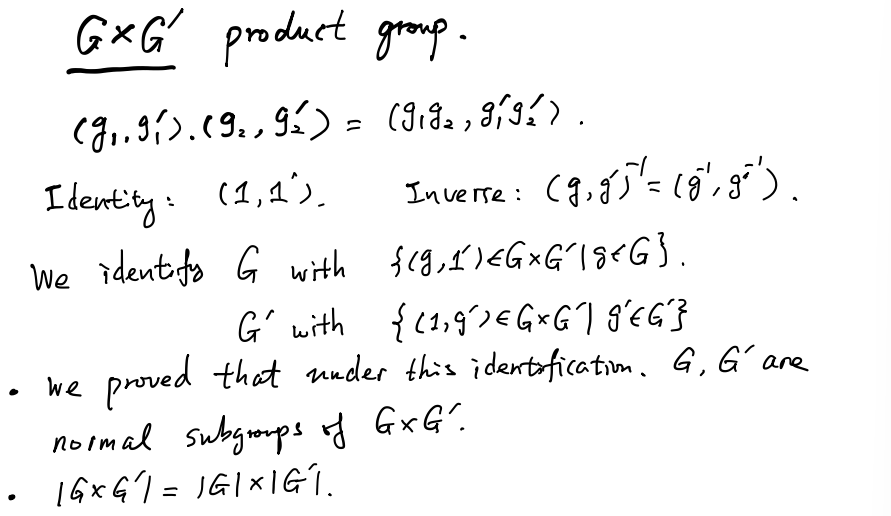

### Subgroups

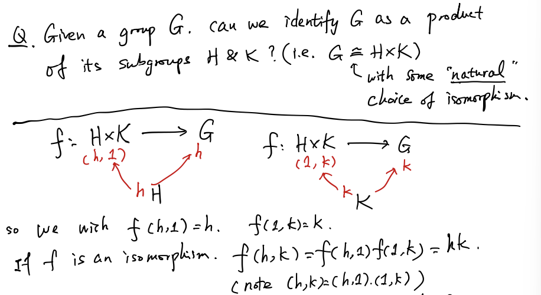

### Theorem

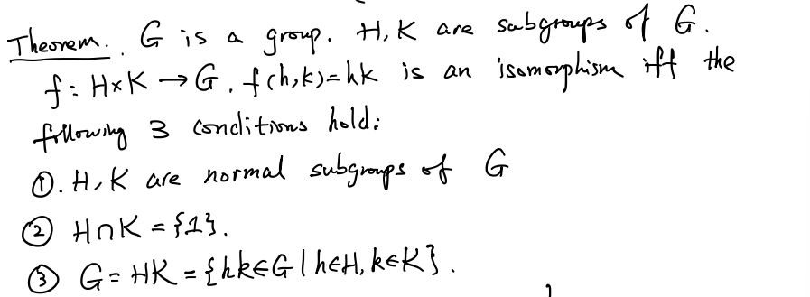

#### Proof

1. $\Rightarrow$

    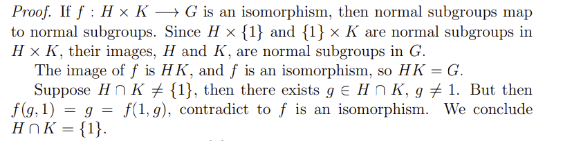

2. $\Leftarrow$

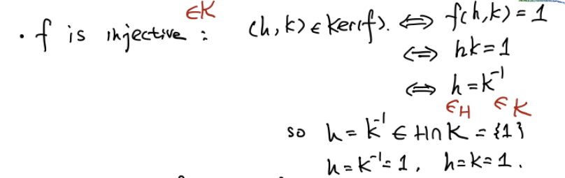

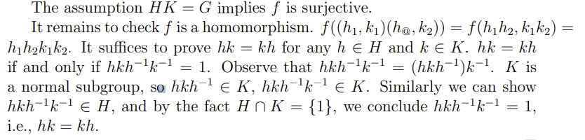

### $G = H\times K$

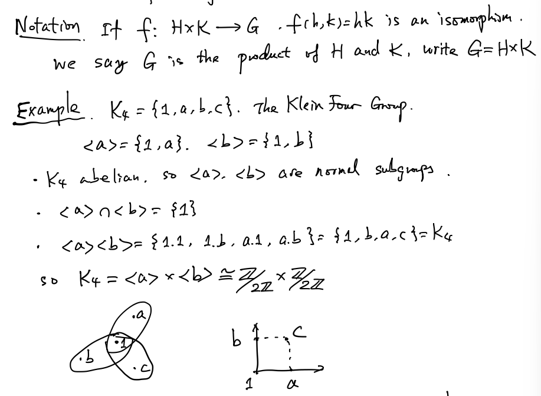

### Proposition

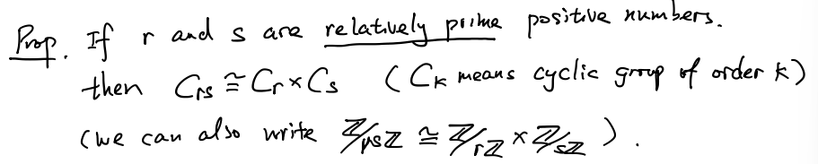

#### Proof

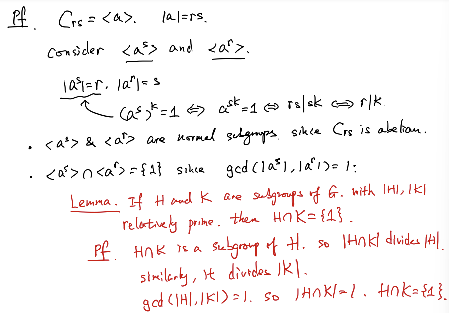

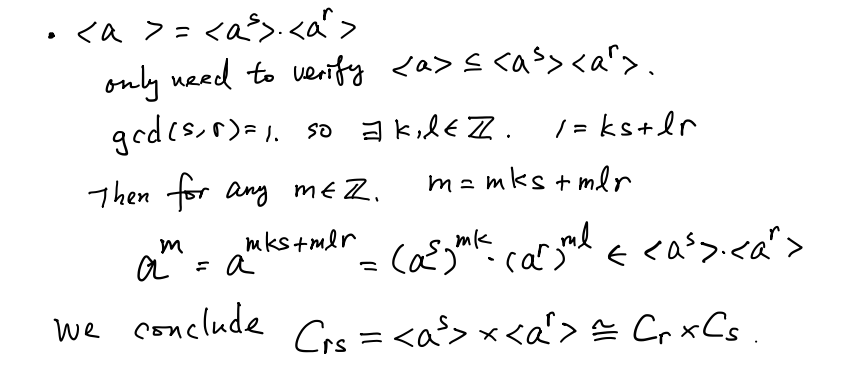

## Chinese Remainder Theorem

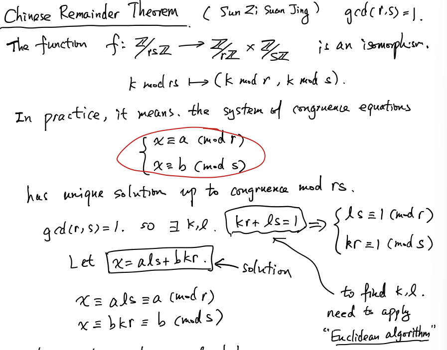

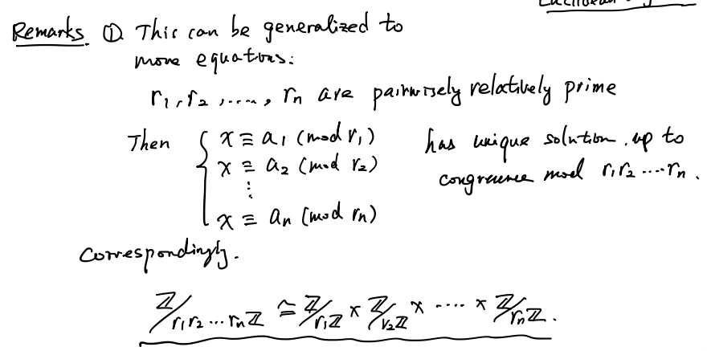

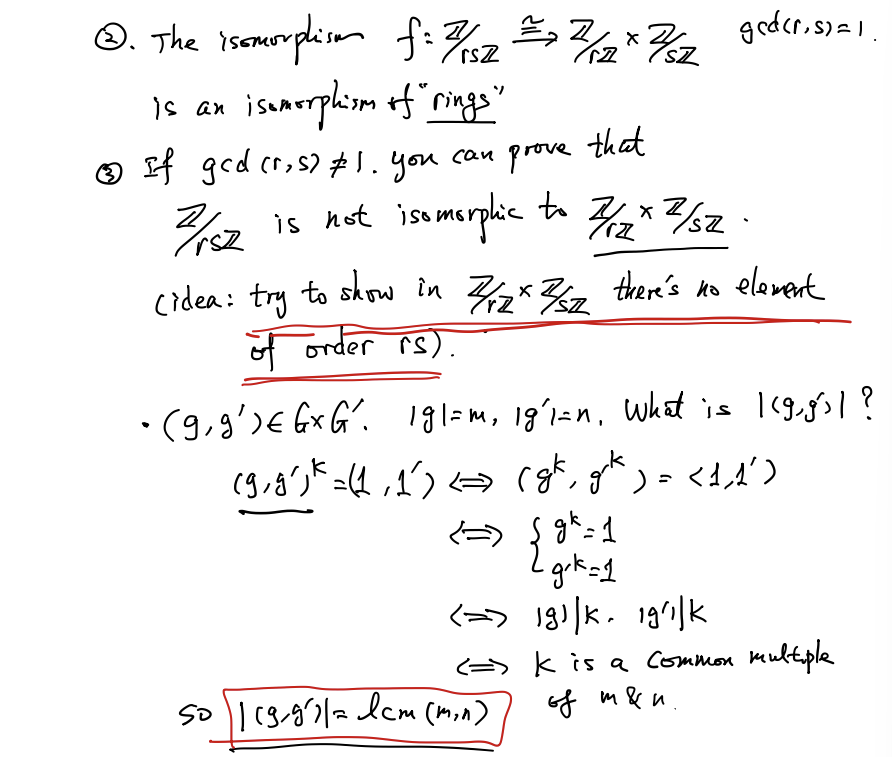