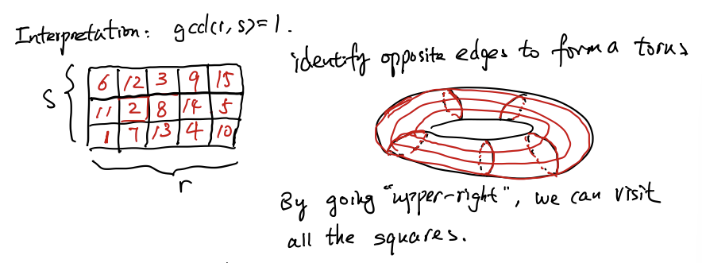

# Chinese Remainder Theorem: 2022/10/17

[TOC]

## $G\times G'$ product group

### Subgroups

### Theorem

#### Proof

1. $\Rightarrow$

    

2. $\Leftarrow$

### $G = H\times K$

### Proposition

#### Proof

## Chinese Remainder Theorem

