# Midterm Review

[TOC]

## Set Theory

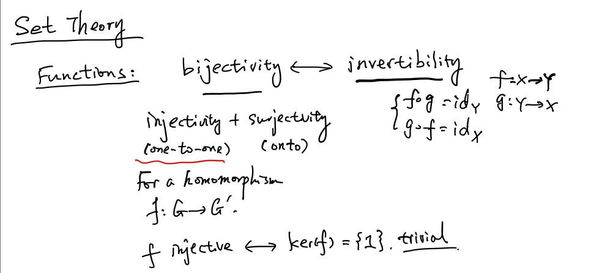

* Use inverse to prove bijectivity
* Use Kernel to prove injectivity

## Equivalence Relation

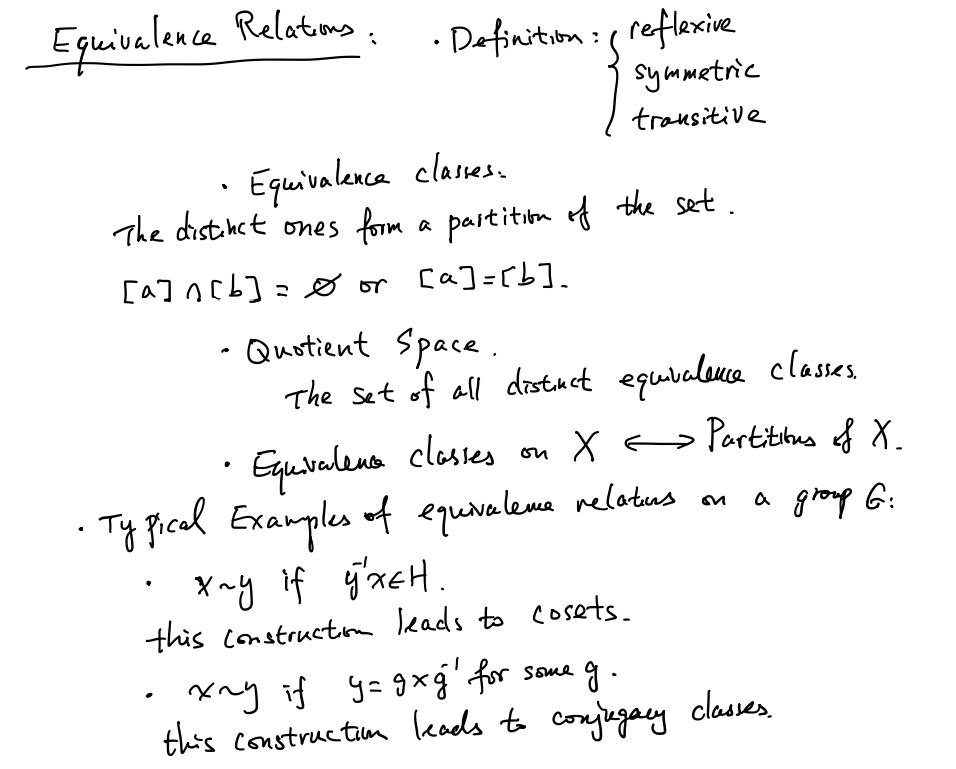

------

## Groups

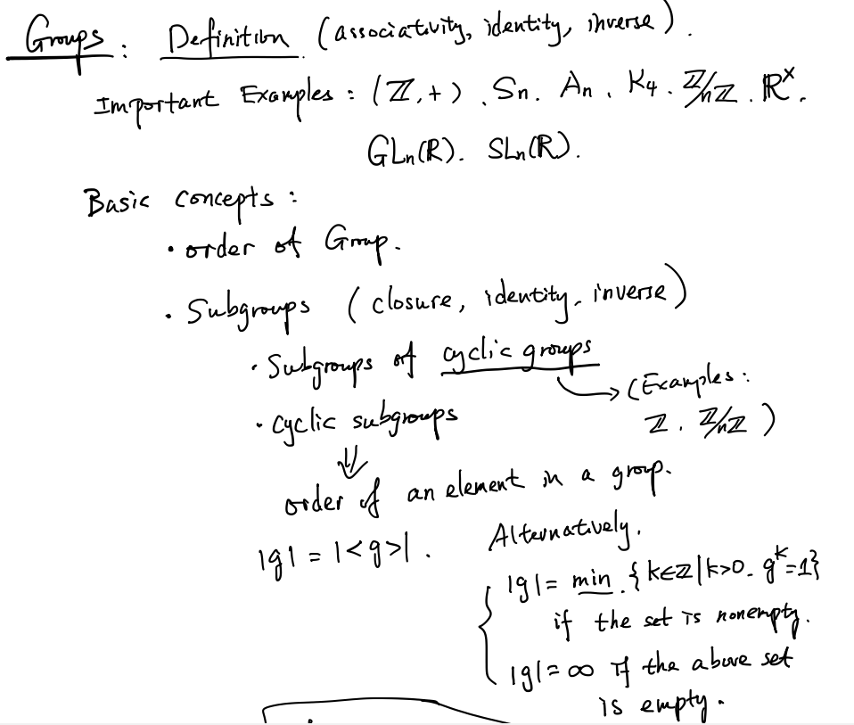

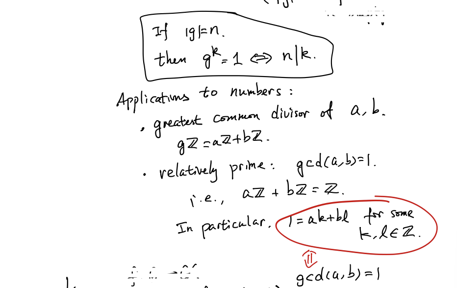

## Homomorphisms

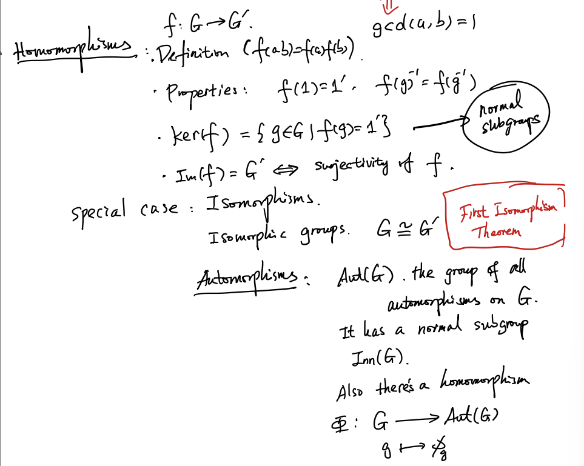

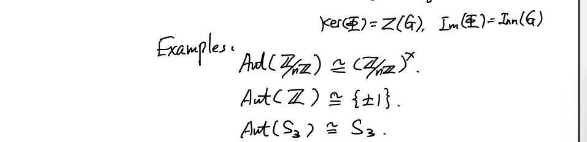

## Quotient of Groups

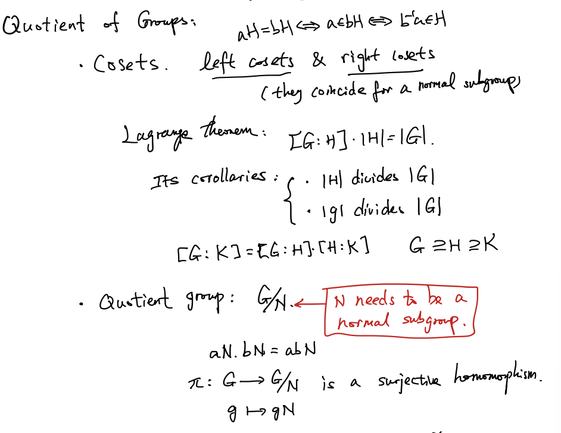

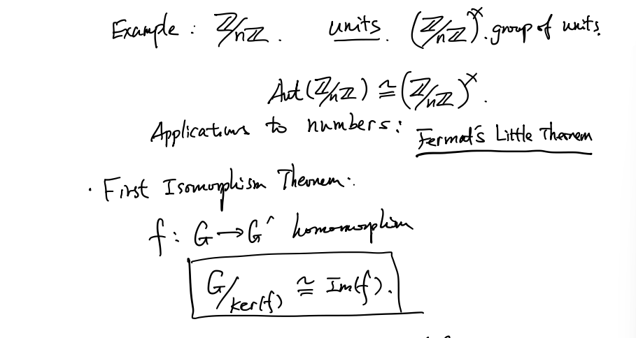

## Product 

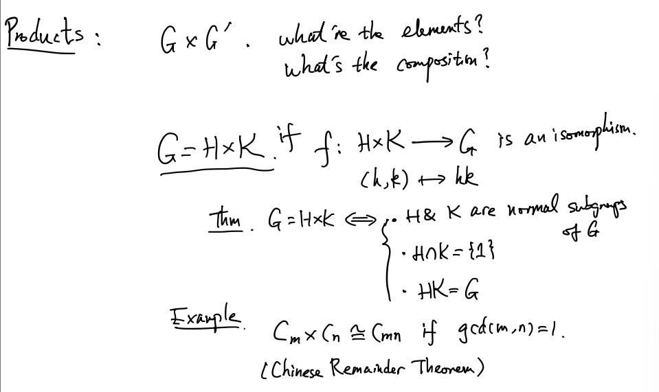

## Symmetric Groups

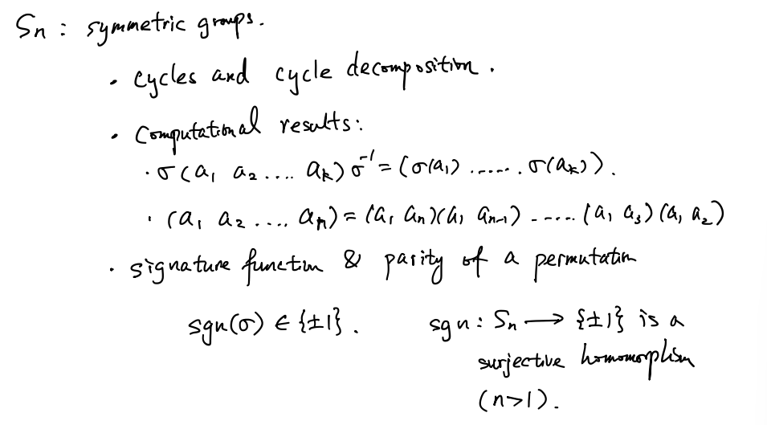

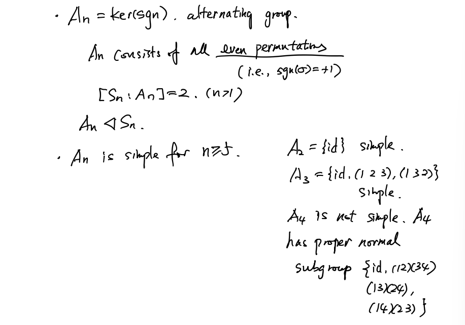

