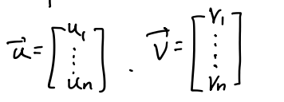

# Algebra: 10/31

[TOC]

## Isometry

Consider the Euclidean space $\R^n$

There's a <u>dot product</u> defined on it:

* If $\vec u, \vec v,\in \R^n$

* 

* Their <u>dot product</u> is 

    

* The dot product determines the geometry of $\R^n$
    * The length of $\vec v \in \R^n$ is defined to be $|\vec v| = \sqrt{<\vec v, \vec v>}$
    * The angle $\theta$ between $\vec u, \vec v \in \R^n$ is defined to be $\displaystyle \cos \theta = \frac{<\vec u,\vec v>}{|\vec u|\cdot|\vec v|}$

### Inner Product

* The dot product is an example of "<u>inner product</u>"
* Given an inner product on a vector space, take an orthonormal basis,
* The the inner product becomes the dot product under the orthonormal basis
* <u>Inner product:</u> symmetric, positive definite bilinear forms