# Algebra: 11/09

[TOC]

## Orbit

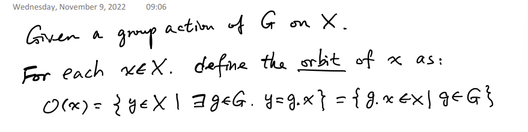

### Orbits forms a Partition

#### Equivalence

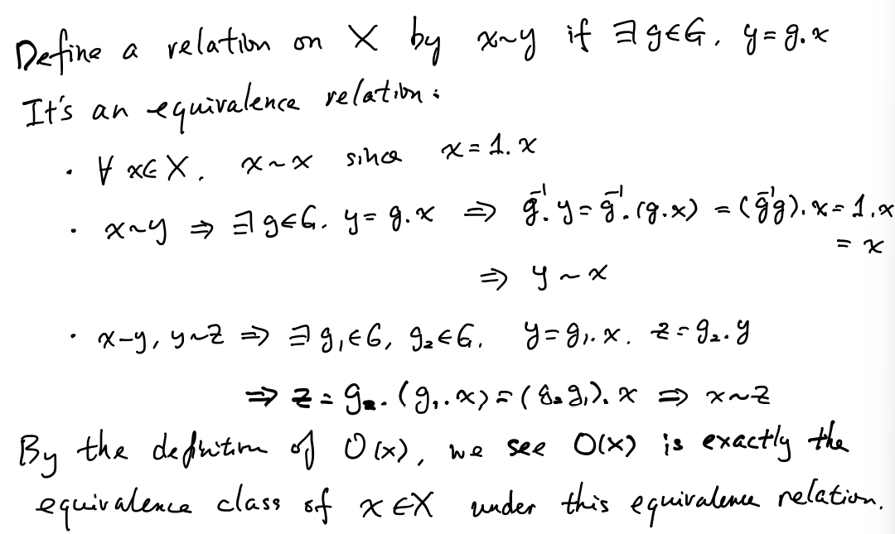

#### Examples

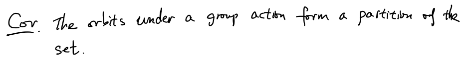

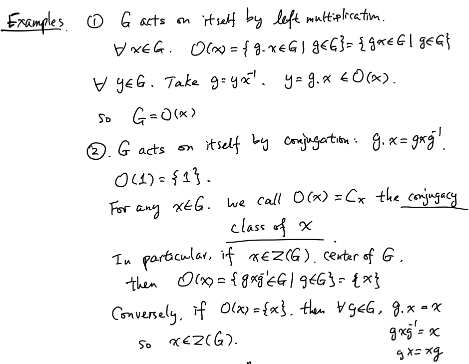

   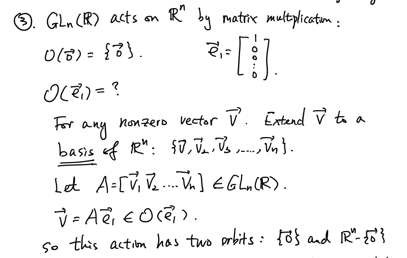

## Transitive Action

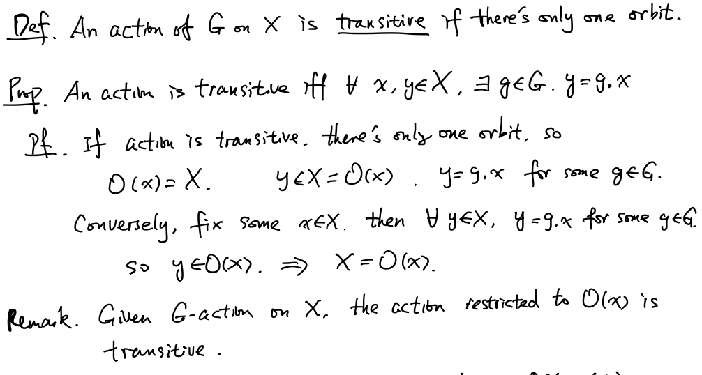

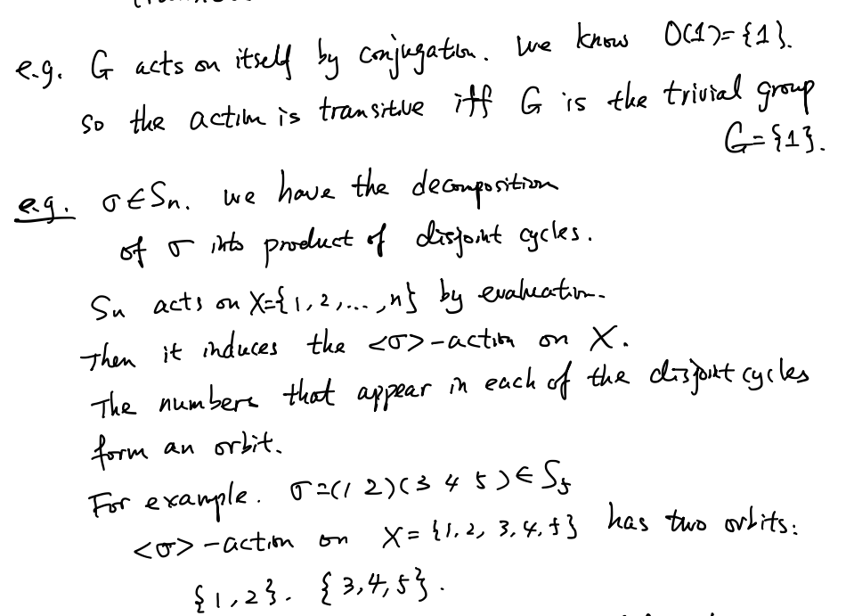

## Stabilizer

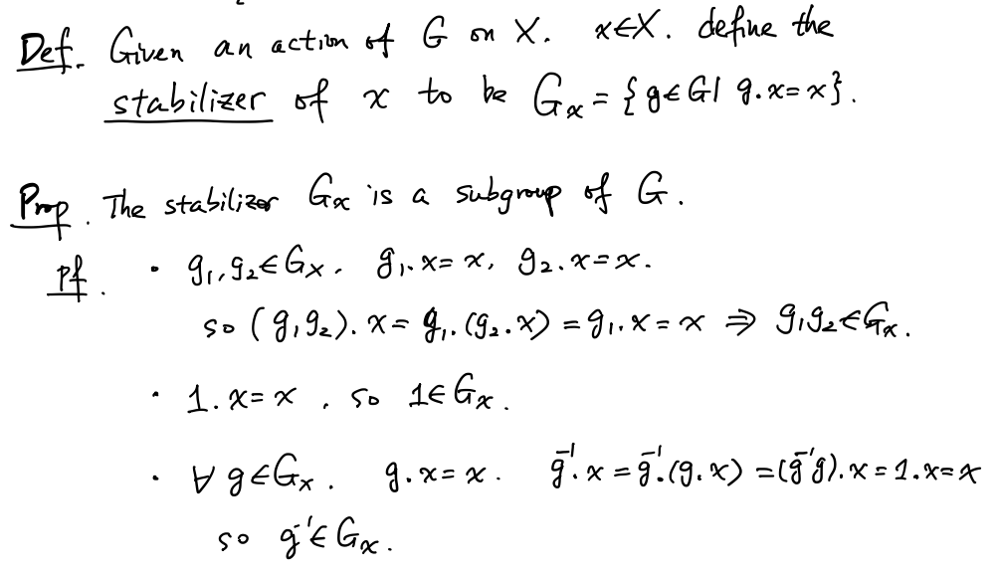

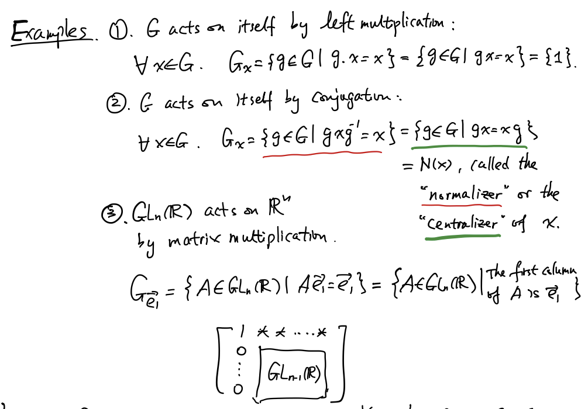

### Lemma

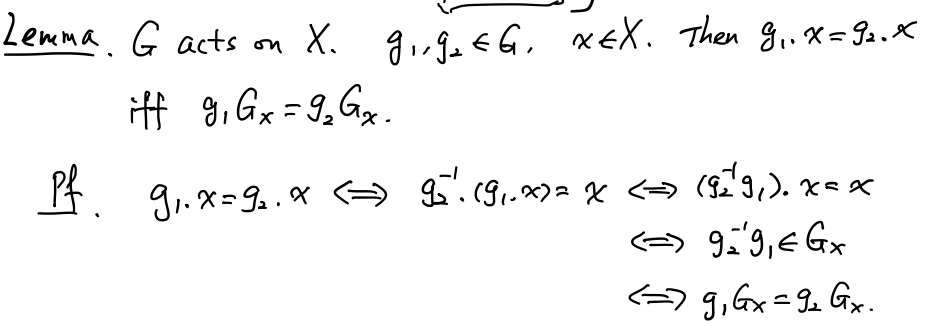

### Counting Formula / Orbit-Stabilizer Theorem

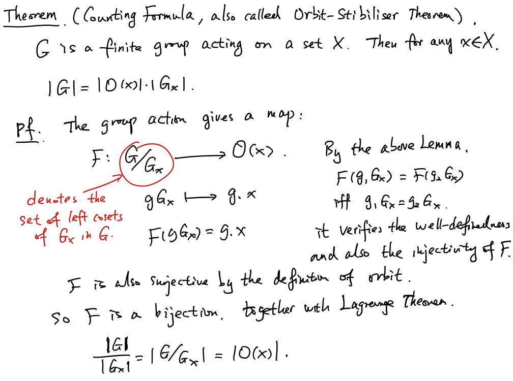

#### Example

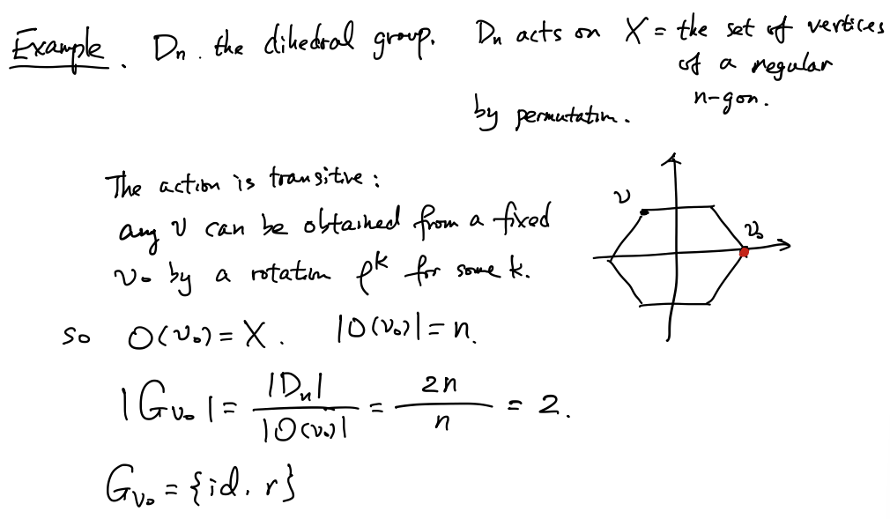

### Proposition

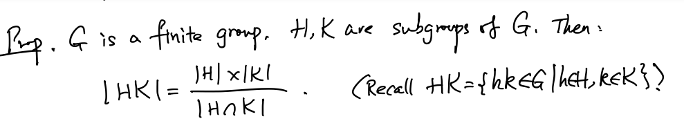

#### Proof

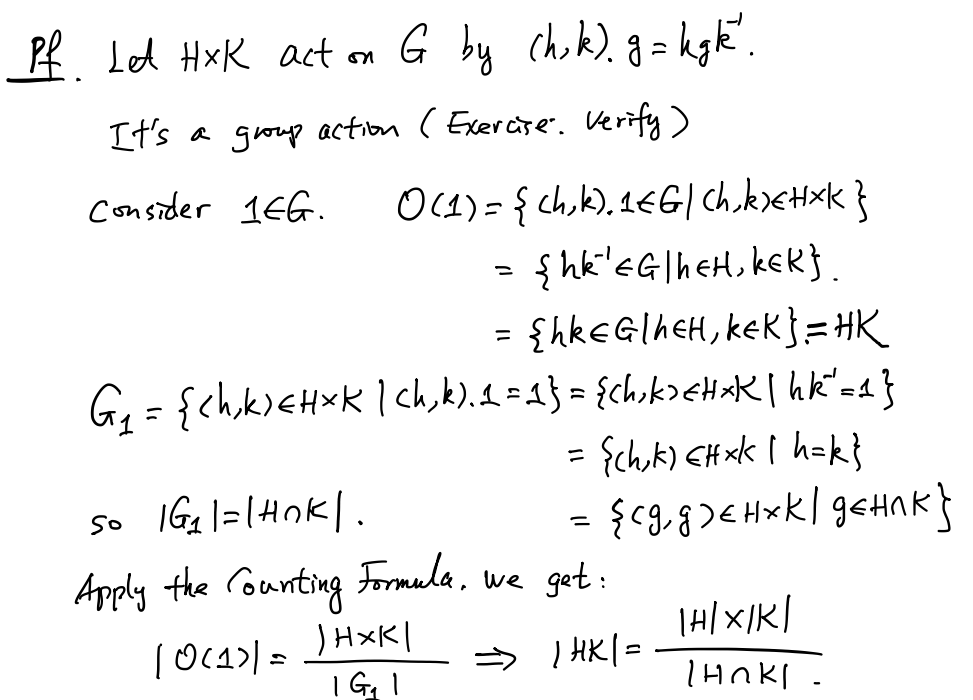