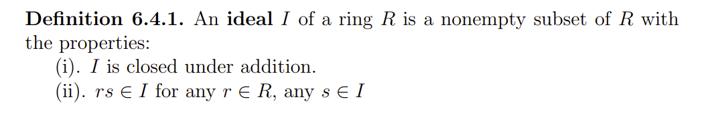
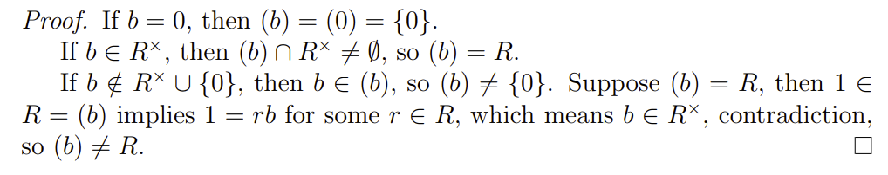
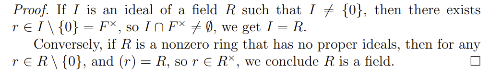

# Algebra 2022/12/07

[TOC]

## Kernel

## Ideal

### Definition

### Prop

### Prop

If $I$ is an ideal of a ring $R$,  then $I$ is a subgroup of $R$ with respect to addition

<u>**Proof:**</u>

* We need to verfy $0\in I$ and $I$ is closed with respect to inverse
* Take any $a \in I$, then $0 = 0\cdot a \in I$
* $\forall a \in I,\ -a = (-1)a \in I$

### Examples

1. $\{0\}$ is an ideal of $R$, $R$ is an ideal of $\R$

2. What're the ideals in $\Z$? 

    By the above prop., an ideal of $\Z$ is necessarily a subgroup of $(\Z,+)$. So the candidates for ideals are: $n\Z$,  $(n\in \N)$

    Then for each  $n\in \N$,  $n\Z$ satisfies definition of an ideal, 

    * $na+nb \in n\Z$
    * $(na)r = n(ra) \in n\Z$

3. $R = \R[x]$. $I = \{p\in R|p(0)=0\}$.  Then $I$ is an ideal of $R$.

    * 
    * for all p \in I for all S\in R

    Another viewpoint: $I = \big\{\sum a_ix^i\in R\big|a_0=0\big\} = \big\{xp(x)\in R\big|p(x) \in R\big\} = xR$

### <u>Principal Ideal</u>

$R$ is a ring, $a\in R$.  The ideal $(a) = aR$ is called a <u>principal ideal</u> of $R$ generated by $a$

* In Example (3), we can weite $I = (x)$
* In Example (2), we can write $n\Z = (n)$

### Prop

$R$ is a ring, $I$ is an idel of $R$. Then the following are equivalent:

1. $I = R$
2. $１\in I$
3. $I\cap R^\times\ne \O$

#### Proof

* 1 -> 2,  2->3 are trivial

* 3->1:
    * If $I\cap R^\times\ne \O$, $\exists u \in I\cap R^\times$.
    * $\forall r \in R, r = u(u^{-1}r)\in I$, so $R\subseteq I$
    * $\Rightarrow R=I$

### <u>Proper Ideal</u>

### Prop

$R$ is a ring, $a \in R$.  Then $(a)$ is a proper ideal iff $a \notin R^\times\cup\{0\}$

### Cor

A non-zero ring $(R\ne \{0\})$ is a field if and only if it has no proper ideal

> The <u>corollary</u>  implies that in the study of a firld, ideals won't help, as fields have no proper ideals

Question: are all ideals principal in a ring $R$? 

<u>**Def.**</u>

An <u>intergral domain</u> is called a <u>Principle Ideal Domain (PID)</u> if all of its ideals are principal

e.g. The ring of integers $\Z$ is a PID

Recall: If $R$ is an integral domain, then in $R[x]$, 

First, $f(a)\in I$ implies $(f(x))\subseteq I$

Next, suppose $I\subseteq (f(x)).$  That is, $\exists g(x)\in I,$ but $g(x)\notin (f(x))$

Apply the division algorithm, $g(x) = f(x)q(x)+r(x)$

