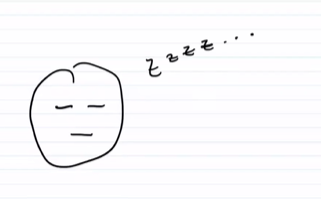
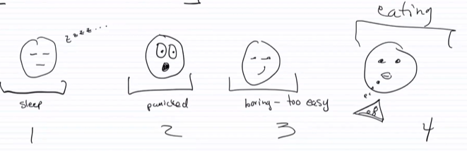
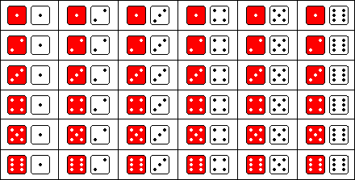
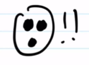
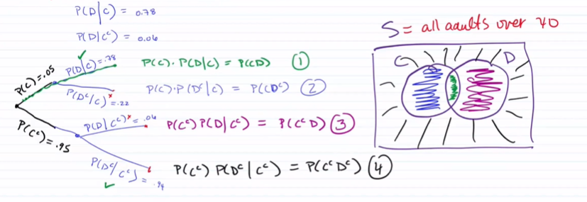
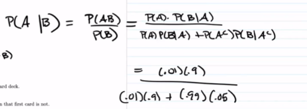

# Class - 2022/09/22

[TOC]

### Review: the Matching Problem

1. If $4$ married couple are arranged in a row, find the probability that no husband sits next to his wife

    Let $A_i$ = couple $i$ gets seated together

    $|S| = 8!$

    $\displaystyle P(A_1) = \frac{2*7!}{8!}$

    $\displaystyle P(A_1A_2) =  \frac{2*2*6!}{8!}$

    $\displaystyle P(A_1A_2A_3) = \frac{2*2*2*5!}{8!}$

    $\displaystyle P(A_1A_2A_3A_4) = \frac{2^4*4!}{8!}$

    $\displaystyle P(A_1\cup A_2\cup A_3\cup A_4) = \binom{4}{1}\frac{2*7!}{8!}-\binom{4}{2}\frac{2*2*6!}{8!}+\binom43\frac{2*2*2*5!}{8!}-\frac{2^4*4!}{8!}$
    
    $\displaystyle P(\text{none}) &= 1-P(\text{at least one match})\\&=1-P(A_1\cup A_2\cup A_3\cup A_4) $

 





## Chapter 3

### Conditional Probability

#### Definition

* The probability of an event $A$ <u>given</u> an event $B$
* Denoted $P(A|B)$

#### Example



* $A=\{\text{roll a sum of $4$}\}$

    $\displaystyle P(A) = \frac{|A|}{|S|} = \frac3{36}$

* $B=\{\text{white dice is 1 or 2}\}$

    $\displaystyle P(B) = \frac{12}{36}$

* $\displaystyle P(A|B) = \frac2{12}\ne P(A)P(B)$

* $\displaystyle P(A|B) = \frac{P(AB)}{P(B)} = \frac{2/36}{12/36} = \frac{2}{12}$

#### Formula

$$
P(A|B) = \frac{P(AB)}{P(B)}\\
P(B|A) = \frac{P(AB)}{P(A)}\\
\\P(AB) = P(B)\cdot P(A|B) = P(A)\cdot P(B|A)
$$


#### Practice Problems

1. In an experiment to study the relationship of hypertension and smoking habits, the following data below are collected for $180$ individuals, 

    |      | Nonsmokers | Moderate Smokers | Heavy Smokers |
    | ---- | :--------: | :--------------: | :-----------: |
    | $H$  |     21     |        36        |      30       |
    | $NH$ |     48     |        26        |      19       |

    where $H$ and $NH$ in the table stands for *Hypertension* and *Non-hypertension*, respectively. If one of these individuals is selected at random, find the probability that the person is:

    * (a) not experiencing hypertension, given that the person is a heavy smoker
    * (b) a nonsmoker, given that the person is not experiencing hypertension

    **<u>Answer:</u>**

    * $\displaystyle P(H|HS) =\frac{P(H\cap HS)}{P(HS)} = \frac{30}{49}$
    * $\displaystyle P(NS|NH) = \frac{48}{93}$

    

2. In a certain region of the country it is known from past experience that the probability of selecting an adult over $40$ years of age with cancer is $0.05$. If the probability of a doctor correctly diagnosing a person with cancer as having the disease is $0.78$ and the probability of incorrectly diagnosing a person without cancer as having the disease is $0.06$, what is the probability that a person is diagnosed as having cancer?

    

    **<u>Answer:</u>**

    * $C = \{\text{the person HAS cancer}\}$

        $P(C) = 0.05$

    * $D = \{\text{the person is diagnosed with cancer}\}$

        $P(D) = ?$

    * $P(D|C) = 0.78$

    * $P(D|C^c) = 0.06$

    Using a tree: 

    ```mermaid
    graph LR
    A{Cancer} 
    	A --"P(C)=0.05"--> B(has cancer)
    	A -->|"P(C')=0.95"| C(no cancer)
      	B -->|"P(D|C)=0.78"| D("1. diagnosed, P(C)P(D|C)=P(CD)")
      	B -->|"P(D'|C)=0.22"| E("2. not diagnosed, P(C)P(D'|C)=P(CD')")
      	C -->|"P(D|C')=0.06"| F("3. diagnosed, P(C')P(D|C')=P(C'D)")
      	C -->|"P(D'|C')=0.94"| G("4. not diagnosed, P(C')P(D'|C')=P(C'D')")
    ```

    
    Therefore, 
    $$
    \begin{align*}
    P(D) &= P(CD)+P(C^cD)\\ 
    &= P(C)P(D|C)+P(C^c)P(D|C^c)\\
    &=0.05*0.78+0.95*0.06 \\
    &= 0.096
    \end{align*}
    $$

    **<u>More questions:</u>**

    1. What is the probability of an incorrect diagnosis?
        * $P(CD^c)+P(C^cD) = 0.05*0.22+0.95*0.06$

    2. What is the probability you have cancer given you are diagnosed with it?
        * $P(C|D) = P(CD)/P(D) = 0.05*0.78/0.096 = 0.4$

     

3. In a small community, there is a polygamous man named Sammy. He is married to one percent of the women in the community. If you were raised to call Sammy ”dad”, then there is a 90 percent chance that he is your father. If you call someone else "dad”, there is still a 5 percent chance that Sammy is your father. Given that Sammy is your father, what is the probability that you call him dad?

    * $A = \text{you call Sammy dad}$
    * $B = \text{Sammy is your dad}$
    * $P(A) = 0.01$
    * $P(B|A) = 0.9 = P(AB)P(A)$
    * $P(B|A^c) = 0.05 = P(A^cB)P(A^c)$
    * $P(A|B)=?$

    

    **<u>Answer:</u>**

    * $P(A^c) = 0.99$
    * $P(AB) = P(A)P(B|A) = 0.009$
    * $P(A^cB) = P(A^c)P(B|A^c) = 0.0495$
    * $P(B) = P(AB)+P(A^cB) = 0.0585$

    * $P(A|B) = P(AB)/P(B) = 0.154$

    * $15.4\%$

        

