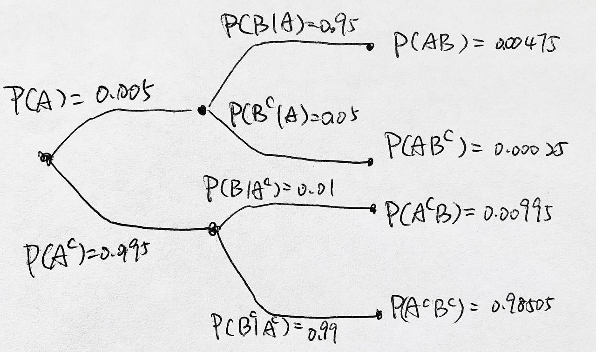

# Class - 2022/09/27

## Practice Problem

1. Suppose you are dealt two cards face down from a standard deck.
    **(a)** Find the probability that the first card is an ace.
    **(b)** Find the probability that the second card is an ace,   given that first card is not.  
    **(c)** Find the probability that the first card is an ace, given that second card is not.
    
    Answer:
    
    $A_1$ = first card is ace
    
    $A_2$ = second card is ace
    
    Draw a tree:
    
    
    
    1. $P(A_1) = 4/52$
    2. $P(A_2|A_1^c) = 4/51$
    3. $P(A_1|A_2^c) = P(A_1A_2^c)/P(A_2^c) = \frac{4/52*48/51}{4/52*48/51+48/52*47/51}$
    
     

## Simplifying Notation

### Tree

>  Note that the **branch** is a <u>conditional probability</u>, and the **node** is the <u>the conditional probability times the previous probability (the intersection)</u>. 

### $2$ disjoint events

### $3$ disjoint events

### $n$ disjoint events

### Notation

$$
\begin{align*}
P(B_1) &= P(A_1B_1)+P(A_2B_1)+...+P(A_nB_1)\\
&= P(A_1)P(B_1|A_1)+P(A_2)P(B_1|A_2)+...+P(A_n)P(B_1|A_n)\\
P(B_1) &= \sum^n_{i=1}P(A_iB_1)\\
P(B_j) &= \sum^n_{i=1}P(A_iB_j)\\
&= \sum^n_{i=1}P(A_i)P(B_j|A_i)\\
P(A_i|B_j) &= \frac{P(A_iB_j)}{P(B_j)} = \frac{P(A_i)P(B_j|A_i)}{\sum^n_{i=1}P(A_i)P(B_j|A_i)}
\end{align*}
$$

For $P(C_k)$,
$$
P(C_k) = \sum^n_{i=1}\sum^m_{j=1}P(A_i)P(B_j|A_i)P(C_k|A_iB_j)
$$

## Problem

1. An absent-minded professor goes for a walk carrying a digital audio device using 2 batteries. He has 2 fresh replacement batteries stashed away in one of four pockets. Sure enough, both batteries lose their charge and he removes them. Not wanting to throw the depleted batteries into the woods, he places them into a pocket chosen at random from the 4 available. A little while later he remembers the two fresh batteries, but he cannot remember which pocket. He fishes around in his pockets until he finds one with batteries (either 2 or 4 indistinguishable batteries). He removes 2 batteries and inserts them into the digital audio device. The digital audio device requires at least one good battery in order to play. 

    

    $(a)$ Find the probability the digital audio device works on the first try.

    

    $P(B) = P(AB)+P(A^cB) = \frac38+\frac5{24} = \frac5{12}$

    

    $(b)$ Given that the digital audio device plays, calculate the probability he chose two good batteries

    $P(2G|B) = \frac{P(2G\cap B)}{P(B)} = \frac{3/8+1/24}{5/12}$

    

    $(c)$ Given that the digital audio plays, the probability he had placed all four in the same pocket

    $P(A^c|B) = \frac{P(A^cB)}{P(B)} = \frac{5/24}{7/12} = \frac 5{14}$

    

2. A laboratory blood test is 95 percent effective in detecting a certain disease when it is, in fact, present. However, the test also yields a “false positive” result for 1 percent of the healthy persons tested. If .5 percent of the population actually has the disease, what is the probability that a person has the disease given that the test is positive?

    Let $A$ = has the disease, $B$ = detect the disease

    

    $\displaystyle P(A|B) = \frac{P(B|A)P(A)}{P(B|A)P(A)+P(B|A^c)P(A^c)} = \frac{0.00475}{0.00475+0.00995}$

    

