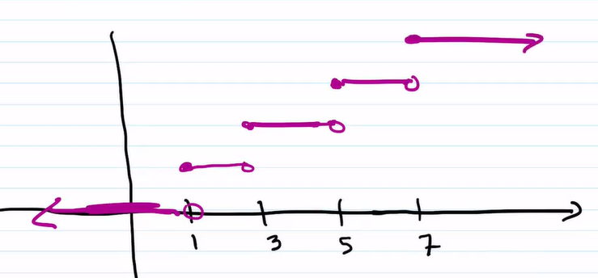

# Theory of Probability: Class 20221004

[TOC]

## Review: Random Variable

* A **function** that assigns a real number to each element in the sample space
* Generates a **PDF** <u>(Probability Distribution Function)</u>
* **DRV / Discrete Random Variable** and **Continuous Random Variable**
    * <u>Discrete</u>: The values that the RV can take are either finite or countably infinite
        * Gaps between values
* DRV has a **PMF**(<u>Probability Mass Function</u>)
    * Notation: $p:X\rightarrow [0,1]$
    * $0\le p(x)\le 1\ \forall x\in X$
    * $\displaystyle \sum_{x\in X} p(x) = 1$
    * $p(a) = P(X=a)$

## The Cummulative Distribution Function (CDF)

### Notation

* $F(x):\R \rightarrow [0,1]$
* $\displaystyle F(a) = P(X\le a) = \sum_{x\le a}p(x)$

### Examples

1. Consider our Alpha Experiment (Flip 3 coins)

    * $X$ is RV that counts number of heads

    * $X:S\rightarrow \{0,1,2,3\}$

    * | $X$  | $P(x)$ (pmf)          |
        | ---- | --------------------- |
        | $0$  | $p(0) = P(X=0) = 1/8$ |
        | $1$  | $p(1) = P(X=1) = 3/8$ |
        | $2$  | $p(2) = P(X=2) = 3/8$ |
        | $3$  | $p(3) = P(X=3) = 1/8$ |
        |      | Total = 1             |

        $$
        F(x) = \begin{cases}
        0, \qquad\quad x<0\\
        1/8,\qquad 0\le x< 1\\
        4/8,\qquad 1\le x< 2\\
        7/8,\qquad 2\le x< 3\\
        1, \qquad\quad x\ge3
        \end{cases}
        $$

    * **Graph**: a "Stepp" function

        

        > ### Sketch the pmf DRV (Histogram)
        >
        > 

    * Note that the domain of the functions are all different:

        Experiment $\rightarrow S$

        $X:S\rightarrow \mathbb{R}$

        $p(x):\ X\rightarrow [0,1]$

        $F(X): \mathbb{R}\rightarrow [0,1]$

2. $T$ is a **DRV** which represents whole years

    * $T = \{1,3,5,7\}$

    * Define **CDF**:
        $$
        F(t) = \begin{cases}
        0, \qquad\quad t<1\\
        1/4,\qquad 1\le t<3\\
        1/2,\qquad 3\le t<5\\
        3/4,\qquad 5\le t<7\\ 
        1,\quad\qquad t\ge7\\
        \end{cases}
        $$

    1. Sketch the cdf

        

    2. Define the pmf

        | T    | $P(t)$ |
        | ---- | ------ |
        | $1$  | $1/4$  |
        | $3$  | $1/4 $ |
        | $5$  | $1/4 $ |
        | $7$  | $1/4$  |

    3. $P(T=5)$

        * $=1/4$

    4. $P(T>3)$

        * $=1/2$

    5. $P(T\le 5|T\ge 2)$

        * $\displaystyle = \frac{P(2<T\le 5)}{P(T<2)} = \frac{P(3\ or \ 5)}{P(3\ or\ 5\ or \ 7)} =\frac{1/2}{3/4} = \frac 23$

    6. $P(T=5.5)$

        * Does not make sense.
        * Not in the domain of the function

    7. $F(5.5)$

        * $= 3/4$

3. A shipment of 7 tvs that contains 2 defectives arrive. You purchase 3 of the tvs randomly. 

    * Define $X$ to be the RV that counts the # of defects in the purchase.

        $X = \{0,1,2\}$ <------ DRV!

    1. Find the **pmf**

        $\displaystyle P(X=i) = \frac{\binom 2i\binom5 {3-i}}{\binom 73}$

        > ##### Hypergeometric Distribution!
    
        | X    | $P(x)$ |
        | ---- | ------ |
        | $0$  | $2/7$  |
        | $1$  | $4/7$  |
        | $2$  | $1/7$  |
    
    2. Define the **cdf**
        $$
        P(x) = \begin{cases}
        0, \qquad\quad x<0\\
        2/7,\qquad 0\le x< 1\\
        6/7,\qquad 1\le x< 2\\
        1, \qquad\quad x\ge2
        \end{cases}
        $$

    3. Sketch both
    
        PMF: 
        CDF:

## Expectation

### Definition

The <u>Expectation</u> of **DRV**, $X$:
$$
\mu = E(X) = \sum _{x\in X} x\cdot p(x)
$$

### Example

1. Alpha Experiment
    | $X$  | $P(x)$      |$x\cdot p(x)$|
    | ---- | ----------- | ----------- |
    | $0$  | $1/8$ |$0$ |
    | $1$  | $3/8$ |$3/8$|
    | $2$  | $3/8$ |$6/8$|
    | $3$  | $1/8$ |$3/8$|

    $E(X) = 3/8+6/8+3/8 = 12/8 = 1.5$

    > $1.5$ heads <u>doesn't make sense</u>
    >
    > <u>What it's actually saying</u> is that the expected value is between $1$ and $2$,
    >
    > and it's as likely to be $1$ as it's likely to be $2$.

2. We go to Atlantic City to play some cards

    Player pays $p$ dollars to play game

    * Game: one card is flipped over
    * Player wins $\$3$ if the card is $J$ or $Q$
    * Player wins $\$5$ if the card is $A$ or $K$
    * Player wins $0$ if otherwise

    Question: How much should the player pay to play for the game to be fair?

    In other words, $E(X) = 0$?

    <u>**Answer:**</u>

    Let $X$ represent the profit earned in a given game $[Won-Paid]$

    $X = \{3-p,\ 5-p,\ 0-p\}$

    $P(x) = \{2/13,\ 2/13, \ 9/13\}$

    $E(X) = \frac2{13}(3-p)+\frac 2{13}(5-p)+\frac 9{13}(-p) = \frac{16}{13}-p = 0$

    $\Rightarrow p = 16/13 \approx 1.23$

    

### Law Of The Unconscious Statistician (LOTUS)

Note that we have the formula of expectation of $x$,
$$
E(X)= \sum_x x\cdot p(x)
$$
LOTUS gives us the expectation of a function of $x,$
$$
E(g(X)) = \sum_{x} g(x)\cdot p(x)\\
\quad \quad \quad \quad \ne \sum_{x}g(x)\cdot p(g(x))
$$

| $x$   | $g(x)$   | $p(x)$                |
| ----- | -------- | --------------------- |
| $x_1$ | $g(x_1)$ | $p(x_1)\ne p(g(x_1))$ |
| $x_2$ | $g(x_2)$ | $p(x_2)$              |
| ...   | ...      | ...                   |

* Alpha Experiment as Example:
* $E(X) = \sum_x xp(x) = \frac 18(0)+\frac 38(1)+\frac 38(2)+\frac 18(3) = 1.5$
* $E(X^2) = \sum _x x^2p(x) =  \frac 18(0)^2+\frac 38(1)^2+\frac 38(2)^2+\frac 18(3)^2 = 3$

## Linear Operator

* Linear Operator: 
    * $f(ax+b) = f(ax)+f(b) = af(x)+f(b)$
* Non-Linear Operator: 
    * $\sin(2x) = 2\cdot \sin(x)\cdot \cos(x) \ne 2\cdot sin(x)$
    * $\sin(x+y)\ne \sin(x)+\sin(y)$

### The <u>**Expectation**</u> is **LINEAR**

* $E(aX) = aE(X)$
* $E(X+b) = E(X)+b$
* $E(aX+b) = aE(X)+b$ 

#### Proof

* $\displaystyle E(aX) = \sum_{x\in X}(ax)\cdot p(x) = a\sum_{x\in X}x\cdot p(x) = aE(X)$
* $\displaystyle E(X+b) = \sum_{x\in X}(x+b)p(x) = \sum_{x\in X}xp(x)+b\sum p(x) = E(X)+b$
* $\displaystyle E(ax+b) = \sum_{x\in X}(ax+b)p(x) = \sum_{x\in X}axp(x)+b\sum p(x) = aE(X)+b$
* (Note that $\sum p(x) = 1$)

### Remark

* Given DRVs $X_1, X_2, X_3,...,X_n$
* Let DRV $Y = \sum^n_{i=1}X_i$
* Then $E(Y) = E(\sum^n_{i=1}X_i) = E(X_1)+E(X_2)+...+E(X_n)$

