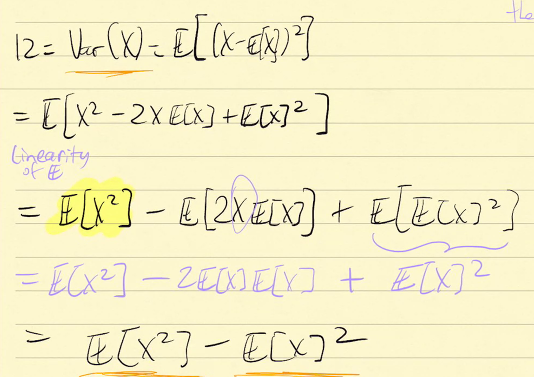
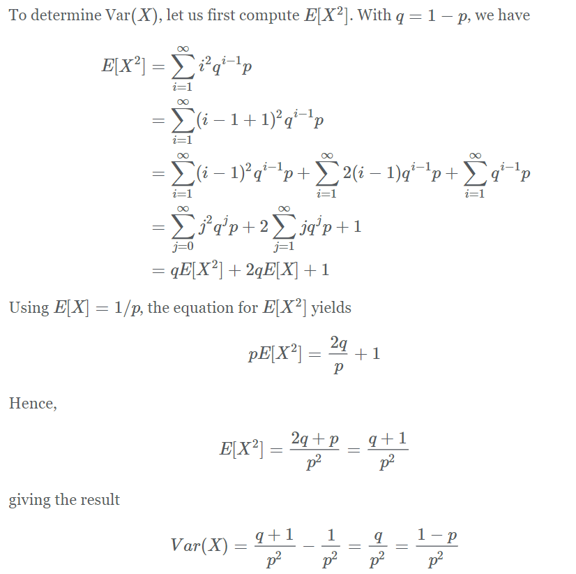

# Theory of Probability - 2022/10/06

[TOC]

## Recap

### Expectation ($E(X)$)

* $\displaystyle E(X) = \sum_{x\in X}xP(x)$
* <u>LOTUS</u>:
    * $E(g(X))= \sum g(x)p(x)$

* <u>Linearity</u>:
    * $E(aX+b) = aE(X)+b$

## Variance

<u>**Motivation**</u>:

Recall from a statistics, a discrete data set,

$X =\{x_1,x_2,x_3,...\}$

$\displaystyle E(X) =\frac{\sum x_i}{n} = \mu$

It only gives us the average, but we don't know the spread.

What is the average distance each data point is from the mean?

Note that we can't simply use $x_i-\mu$, because $\displaystyle \frac{\sum(x_i-\mu)}{n}=0$

We can use $|x_i-\mu|$ or $(x_i-\mu)^2$

Variance: $\displaystyle \frac{\sum(x_i-\mu)^2}{n}$

### Definition

If $X$ is a RV with $E(X)=\mu$, then define <u>Variance</u> of $X$, $Var(X)$ by,
$$
Var(X) = E[(X-\mu)^2]
$$
and <u>Standard Deviation</u> of $X$, $SD(X)$
$$
SD(X) = \sqrt{Var(X)}
$$

### Formula

Given DRV, $X$, 

Note that $\sum xp(x) = E(X)=\mu$,  $\sum p(x) = 1$
$$
\begin{align*}
Var(X) &= E[(X-\mu)^2]  \\
&= \sum_{x\in X}(x-\mu)^2p(x)\\
&=\sum_{x\in X} (x^2-2x\mu+\mu^2)p(x)\\
&= \sum x^2p(x)-2x\mu p(x)+\mu^2p(x)\\
&= \sum x^2p(x)-2\mu\sum x p(x)+ \mu^2\sum p(x)\\
&= E(X^2)-2E(X)^2+ E(X)^2\\
&= E(X^2)-E(X)^2
\end{align*}
$$

Therefore, 
$$
Var(X) = E(X^2)-E(X)^2
$$
which is <u>[The mean of the squares -  the suqare of the mean]</u>

### Example

| $X$  | $p(x)$ | $xp(x)$       | $x^2p(x)$       |
| ---- | ------ | ------------- | --------------- |
| 0    | $1/8$  | $0$           | $0$             |
| 1    | $3/8$  | $3/8$         | $3/8$           |
| 2    | $3/8$  | $6/8$         | $12/8$          |
| 3    | $1/8$  | $3/8$         | $9/8$           |
| Sum  | 1      | $E(X) =12/8 $ | $E(X^2) = 24/8$ |

$Var(X) = E(X^2)-(E(X))^2 = 3/4$

$SD(X) = \sqrt{3/4}$

### Variance is NOT linear

Remember that $E(X)$ is linear, that is $E(aX+b) = aE(X)+b$

Determine $g(X) = aX+b$ for Variance
$$
\begin{align*}
Var(aX+b) &= E((aX+b)^2)-(E(aX+b))^2\\
&= E(a^2X^2+2abX+b^2)-(aE(X)+b)^2\\
&= a^2E(X^2)+2abE(X)+b^2-a^2E(X)^2-2abE(X)-b^2\\
&= a^2E(X^2)-a^2E(X)^2\\
&= a^2[E(X^2)-E(x)^2]\\
&= a^2\cdot Var(X)\\
&\ne aVar(X)+b
\end{align*}
$$
Therefore <u>Variance is **NOT** linear</u>

Given $X_1,X_2,...X_n$ are Random Variables, 
$$
Var(\sum X_i)\ne \sum Var(X_i)
$$
BUT when $X_i$ are **<u>independent</u>**,
$$
Var(\sum X_i)= \sum Var(X_i)
$$

## Named Discrete Distributions

### <u>Bernoulli Distribution</u>

#### Bernoulli Trial

* A trial with exactly two outcomes: <u>Success</u> (with probability $p$) or <u>Failure</u> (with probability $1-p$)

* Given an experiment $\rightarrow S$ and an event $A$. 
    * Success: $A$ occurs
    * Failure: $A$ does not occur
* Note: A Bernoulli Trial is only a single trial.

#### Definition

* Define $X$ to be the RV that counts the number of success in a Bernoulli Trial

    * $X = \{0,1\}$

    * | x    | $P(X)$ |
        | ---- | ------ |
        | 0    | $1-p$  |
        | 1    | $p$    |

    * $E(X) = \sum xp(x) = p$

    * $Var(X) = E(X^2)-E(X)^2 = p-p^2 = p(1-p)$

#### **Properties**

* $X\sim Ber(p)$
    * $X=\{0,1\}$ count number of success
    * $p(x) = \begin{cases}
        1-p \qquad ,x = 0\\  
        p\ \quad\ \quad\  \quad ,x = 1
        \end{cases}$
    * $E(X) = p$
    * $Var(X) = p(1-p)$

#### Example

* Given an experiment $\rightarrow S$ and an event $A$. 

    * Success: $A$ occurs
    * Failure: $A$ does not occur

* Define $I_A$ as an indicator RV

    * $I_A = \begin{cases}1\quad \text{ if A occurs}\\0\quad \text{ if A not occur}\end{cases}$
    * $I_A\sim Bern(p)$ where $p=P(A)$

    

### <u>Binomial Distribution</u>

#### Definition

If we perform "$n$" <u>independent, identical Bernoulli trials</u>, each with probability of success, $p$, and we let $X$ be the R.V. that counts the number of successes in "$n$" trials, Then we say

* $\quad\quad X$ is a <u>Binomial Random Variable</u> with <u>parameters</u> $n,\ p$

  
    $$
    X\sim Bin(n,\ p)
    $$
    
* $X=\{0,1,2,...,n\}$

Note:

* We have **Fixed** number of trials ($n$)
* Trials are **Independent**
* Each trial has **Same probability of Success** ($p$)

#### Example

1. Flip $3$ coins, with $p(H) = p, \quad p(T) = 1-p$

    * Fixed trials: $n=3$
    * Trials Independent
    * Trial has $P(Success) = p$

    $\Rightarrow $ Satisfies the requirements for binomial distribution

    Let $X$ count number of successes, then $X\sim Bin(3,\ p)$.

    $X = \{0,1,2,3\}$

    | S             | X    | $P(x)$                                      |
    | ------------- | ---- | ------------------------------------------- |
    | TTT           | 0    | $(1-p)(1-p)(1-p) = (1-p)^3$                 |
    | HTT, THT, TTH | 1    | $p(1-p)^2+(1-p)p(1-p)+(1-p)^2p = 3p(1-p)^2$ |
    | HHT, HTH, THH | 2    | $3p^2(1-p)$                                 |
    | HHH           | 3    | $p^3$                                       |

    

2. Let's consider $X\sim Bin(4,\ p)$

    $X = \{0,1,2,3,4\}$

    |            | X    | $P(X)$                              |
    | ---------- | ---- | ----------------------------------- |
    | TTTT       | 0    | $\displaystyle \binom 40(1-p)^4p^0$ |
    | HTTT, .... | 1    | $\displaystyle \binom 41(1-p)^3p^1$ |
    | HHTT, .... | 2    | $\displaystyle \binom 42(1-p)^2p^2$ |
    | HHHT, .... | 3    | $\displaystyle \binom 43(1-p)^1p^3$ |
    | HHHH       | 4    | $\displaystyle \binom 44(1-p)^0p^4$ |

#### **Properties**

* Therefore, If we have $X\sim Bin(n,\ p)$
    * $P(X=a) = \displaystyle \binom na(1-p)^{n-a}p^a$

* We think of $X\sim Bin(n,p)$ as $\displaystyle x = \sum^n_{i=1}X_i, \quad X_i\sim Ber(p)$

    * $\displaystyle E(X) = E(\sum^n_{i=1}X_i) = \sum^n_{i=1} E(X_i) = np$

    * $Var(X) = Var(\sum X_i) = \sum Var(X_i) = np(1-p)$ (independent)

<u>**Properties**</u>:

* $X\sim Bin(n,\ p)$
    * $P(X=a) = \displaystyle \binom nap^a(1-p)^{n-a}$
    * $E(X) = np$
    * $Var(X) = np(1-p)$
    * $SD(X) = \sqrt{np(1-p)}$

> Bernoulli is a <u>special case</u> of Binomial when $n=1$

### <u>Geometric Distribution</u> 

* #### Motivation

Consider the experiment

Perform independent, identical Bernoulli trials each with probability of success $p$, UNTIL you achieve first success.

Let $X$ count the number of trials needed to achieve first success

$X = \{1,2,...\}$

* We have:
    * Independent Bernoulli trials,
    * Each with same probability of success $p$
* We don't have:
    * A fixed number of trials  

* $ \Rightarrow NOT\ Binomial$

#### Definition

* We say $X$ is a Geometric R.V. with parameter, $p$

* Notation:

     $\quad \quad X\sim Geo(p)$

* **pmf**: 

| X    | P(X)       |
| ---- | ---------- |
| 1    | $p$        |
| 2    | $p(1-p)$   |
| 3    | $p(1-p)^2$ |
| ...  | ....       |
|      |            |

* Expectation:
    $$
    \begin{align*}
    E(X) &= \sum^\infty_{x=1} xp(x)\\
    &= \sum^\infty_{x=1} x(1-p)^{x-1}p\\
    &= \sum^\infty_{x=1} (x-1+1)(1-p)^{x-1}p\\
    &= \sum^\infty_{x=1} (x-1)(1-p)^{x-1}p+\sum^\infty_{x=1}(1-p)^{x-1}p\\
    &= \sum^\infty_{x=0} x(1-p)^{x}p+\sum^\infty_{x=1}p(x)\\
    &= \sum^\infty_{x=1} x(1-p)^{x}p+1\\
    &= (1-p)\sum^\infty_{x=1} x(1-p)^{x-1}p + 1\\
    &= (1-p)E(X)+1
    \end{align*}
    $$
    Therefore, 
    $$
    E(X) = (1-p)E(X)+1\quad \\ 
    \Rightarrow E(X) = \frac 1p
    $$

* Variance:

    

#### **Properties**

* $X\sim Geo(p)$
    * $X$ counts number of trials until first success
    * $X = \{1,2,3,...\}$
    * $P(X=x) = (1-p)^{x-1}p$
    * $E(X) = 1/p$
    * $\displaystyle Var(X) = \frac{1-p}{p^2}$

