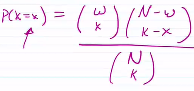

# TOP：2022/10/13

[TOC]

## Recap:

* Named discrete disctributions
    * Bernoulli Trials
    * Bernoulli distributions
    * Binomial distributions
        * $X$ counts the number of success, $n$ is number of trials, $p$ is probability of success
        * $X\sim Bin(n,\ p)$
            * $P(X=a) = \displaystyle \binom nap^a(1-p)^{n-a}$
            * $E(X) = np$
            * $Var(X) = np(1-p)$
            * $SD(X) = \sqrt{np(1-p)}$
    * Geometric distributions
        * $X$ counts number of trials until first success, $p$ is probability of success
        * $X\sim Geo(p)$
            * $X = \{1,2,3,...\}$
            * $P(X=x) = (1-p)^{x-1}p$
            * $E(X) = 1/p$
            * $\displaystyle Var(X) = \frac{1-p}{p^2}$

## Negative Binomial Distribution

Consider the following:

You have identical, independent Bernoulli trials, each with probability of success $p$. Repeat the trils until we achieve $K$ successes.

For example: 

* $P(S) = p$,  repeat until 3 successes.

* Let $X$ count  the number of trials needed to achieve $k$ successes.

* $X = \{3,4,5,....\}$

* ==Note==: we know the last trial must be a success

* | X    | $P(X)$                                        |
    | ---- | --------------------------------------------- |
    | $3$  | $p^3$                                         |
    | $4$  | $\displaystyle \binom {3}{2}p^3(1-p)$         |
    | $5$  | $\displaystyle \binom 4 2 p^3(1-p)^2$         |
    | ...  |                                               |
    | $n$  | $\displaystyle \binom {n-1}{2}p^3(1-p)^{n-3}$ |

### Definition

Let $X$ count the number of trials needed to achieve $k$ successes.

$X$ is the <u>Negative Binomial Random Variable</u>

* $X\sim Neg\ Bin(p,\ k)$

* $X = \{k,k+1,...\}$
* $\displaystyle P(X = n) = \binom {n-1}{k-1}p^k(1-p)^{n-k}$

### Requirements

* Independent Trials
* Identical Bernoulli Trials $P(S) =p$
* <u>**NOT** a fixed number of trials</u> (different from binomial )

<u>Note:</u>

* If $X\sim Geo(p)$, the $X\sim Neg\ Bin(p,1)$

## Hypergeometric Distribution

- Consider the following: 
    - an urn with balls
    - $w$ = white balls
    - $b$ = black balls
    - $N = w+b = \text{total balls}$
- Grab $k$ balls from the urn.
- Let $X$ represent the number of white balls in $k$ balls

For example:

* $w = 3, \ b = 6, \ k = 4$

* $X = \{0,1,2,3\}$

* | X    | P(X = x)                                              |
    | ---- | ----------------------------------------------------- |
    | 0    | $\displaystyle \frac{\binom 30 \binom 64}{\binom 94}$ |
    | 1    | $\displaystyle \frac{\binom 31 \binom 63}{\binom 94}$ |
    | 2    | $\displaystyle \frac{\binom 32 \binom 62}{\binom 94}$ |
    | 3    | $\displaystyle \frac{\binom 33 \binom 61}{\binom 94}$ |

* Let $Y$ count the number of black balls in pull of $4$

* $Y = \{1,2,3,4\}$

* | Y    | $P(Y=y)$                                              |
    | ---- | ----------------------------------------------------- |
    | 1    | $\displaystyle \frac{\binom 33 \binom 61}{\binom 94}$ |
    | 2    | $\displaystyle \frac{\binom 32 \binom 62}{\binom 94}$ |
    | 3    | $\displaystyle \frac{\binom 31 \binom 63}{\binom 94}$ |
    | 4    | $\displaystyle \frac{\binom 30 \binom 64}{\binom 94}$ |

* $X$, $Y$ are Hypergeometric R.V.
* $X\sim Hyper(N,w,k)$

### Capture / Recapture Problem

- $N$ elks in population

    - $w$ is number of tagged elks
    - $N-w$ is number of untagged
    - $k$ is the number we recapture

- Let $X$ connt the number of tagged ones in the recapture

- $\displaystyle P(X=x) = \frac{\binom wx\binom{N-w}{k-x}}{\binom Nk}$

    

### Requirements

* Two outcomes? Success / Failure
* Fixed number of trials
* <u>Trials are **NOT** independent</u> (Difference from bonomial)

## Practice Problems 

1. Suppose Omar passes a probability quiz with probability success $p(S) = 0.9$. 

    Each quiz is independent from each other

    * Find probability that Omar will pass exactly 3 out of 10 quizzes?

        * $X\sim Bin(10,0.9)$
        * $P(X=3) = \binom {10}3 0.9^30.1^7$

    * Find probability that Omar passes his first quiz on Quiz 5

        * $X\sim Geo(0.9)$
        * $P(X=5) = 0.9^10.1^4$

    * Find probability that Omar passes his 3rd quiz on Quiz 7

        * $X\sim Neg\ Bin(0.9,\ 3)$
        * $P(X=7) = \binom620.9^30.1^4$

    * Find probability that Omar passes his 3rd quiz **BY** Quiz 7

        * $X\sim Neg\ Bin(0.9,\ 3)$

        * $X = \{3,4,5,6,7,...\}$

        * $P(X\le 7) = P(X=3)+P(X=4)+...+P(X=7)$

            $\displaystyle \qquad\ \quad \quad = \sum^7_{i=3} \binom {i-1}{2}0.9^30.1^{i-3}$

2. Omar has $5$ classes of which, $3$ are math. If we randomly select $2$ classes, how many are math? What R.V. does this descrive and what is its pmf?

    * Hypergeometric Random Variable
    * $X$ counting number of math class selected
    * $X\sim Hyper(N,w,k)\sim(5,3,2)$
    * $X=\{0,1,2\}$
    * $P(X=x) = \binom {3}{x}\binom{2}{2-x}/\binom{5}{2}$

## Poisson Distribution

Poisson Distribution is (Binomial-esque/"ish")

* <u>"Independent-ish" identical Bernoulli trials</u>
    * $P(S) = p$
    * $P(F) = 1-p$
* <u>"Fixed-ish" number of trials</u>
    * $n\rightarrow \infty$
* $n$ large, $p$ small

For example:

* Assume some number of cars passing through an intersection, how many accidents happen?
* Number of typos in a book

### Definition

A discrete random variable that takes on the values $ \{0,1,2,...\}$ is said to be **Poisson** with <u>parameter</u> $\lambda$,   $\lambda > 0$,  if the $\displaystyle \text{pmf} = P(X=i) = \frac{e^{-\lambda}\lambda^i}{i!}$, $i = 0,1,2,...$ 

* ==Note==: $\lambda$ is the average rate per unit of measurement
* Instead of constructing a pmf, we define a random variable based on the pmf

* Valid pmf?

    * $P(X)\ge 0$ for all $x$

    * $\displaystyle\sum^\infty_{x=0}p(X) = 1$

* We have:

    * $\displaystyle p(x) = \frac{e^{-\lambda}\lambda^i}{i!}$

    * Since $\lambda > 0, e^{-\lambda}>0, x\ge 0,$  we have $p(x)\ge 0$. 
        * First condition matched!

    * $\displaystyle \sum^\infty_{x=0}\frac{e^{-\lambda}\lambda^x}{x!} = e^{-\lambda}\sum^\infty_{x=0}\frac{\lambda^x}{x!} = e^{-\lambda}e^{\lambda} = e^0 = 1$
        * Second condition matched!

* Expectation
    $$
    \begin{align*}
    E(X) &= \sum_xxp(x) \\
    &= \sum^\infty_{x=0}x\frac{e^{-\lambda}\lambda^x}{x!} \\
    &= e^{-\lambda}\sum^\infty_{x=1}x\frac{\lambda^x}{x!}\\
    &= \lambda e^{-\lambda}\sum^\infty_{x=1}\frac{\lambda^{x-1}}{(x-1)!}\\
    &= \lambda e^{-\lambda}\sum^\infty_{j=0}\frac{\lambda^j}{j!}\\
    &= \lambda e^{-\lambda}e^\lambda\\
    &= \lambda
    \end{align*}
    $$

* 

* Using similar argument on $E(X^2), $  you can show $Var(X) = E(X^2)-(E(X))^2 = \lambda$

### <u>**Properties**</u>

* $X\sim Pois(\lambda)$,   $\lambda > 0$
    * $X$ counts the number of success
    * $X = \{0,1,2,...\}$
    * $\displaystyle p(X) = \frac{e^{-\lambda}\lambda^x}{x!}$
    * $E(X) = Var(X) = \lambda$

### Example

1. The average number of typos on a page in my book is 3/page
    * $P(X\ge 3)$
        * $ = 1-P(0)-P(1)-P(2) = 1-e^{-\lambda}-\lambda e^{-\lambda} - \lambda^2e^{-\lambda}/2$
        * $= 1-17e^{-3}/2$
    * $P(X\ge 3|X\ge 1)$
        * $ = \frac {1-P(0)-P(1)-P(2)}{1-P(0)}$
        * $ = \frac{1-e^{-\lambda}-\lambda e^{-\lambda} - \lambda^2e^{-\lambda}/2}{1-e^{-\lambda}}$
        * $ = \frac{1-17e^{-3}/2}{1-e^{-3}}$
    * What is the probability $2$ out of the next $5$ pages has $3$ or more typos?
        * Let $p^* = P(X\ge 3)$
        * $Y \sim Bin(5, p^*)$
        * $P(Y=2) = \binom 52(p^*)^2(1-p^*)^3$

