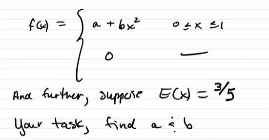

# Class 2022/10/20

[TOC]

## Matching Revisited

### Recap

Recall the matching problem:

* $N$ men with hats through them into center and then host randomly gave each man a hat

What's the probability no man got matched with his hat?

* We used inclusion / Exclusion principle

* Let $E_i$ = event the $i^{th}$ man got matched with his hat

* then $E_1\cup E_2...\cup E_N$ represent the event at least one man gets his hat

* $E_1E_2E_3...E_N$ represent everyone gets matched with hat

* Then, 
    $$
    \begin{align*}
    P(none) &= 1-P(E_1\cup E_2...\cup E_N) = \\
    &=  1-\bigg[\sum^N_{i=1} P(E_i)-\sum_{i_1<i_2} P(E_{i_1}E_{i_2})+\dots+(-1)^{n+1}P(E_{i_1}E_{i_2}...E_{i_n})\bigg]\\
    &=1-1+\frac1{2!}-\frac1{3!}......
    \end{align*}
    $$
    
* Finally, we concluded as $N\rightarrow \infty,\quad P(none)\approx e^{-1}$

### When $N\rightarrow \infty$

$$
  P(E_i) = \frac{(N-1)!}{N!} = \frac 1N\\
P(E_iE_j) = \frac{(N-2)!}{N!} = \frac 1{N(N-1)}\\
P(E_i|E_j) = \frac{P(E_iE_j)}{P(E_i)} = \frac {\frac 1{N(N-1)}}{\frac 1N} = \frac1{N-1}\\
$$

* Note that when $N$ is very large,

    *  $\displaystyle P(E_i|E_j) =\frac1{N-1}\approx\frac1N = P(E_i) $

        $\Rightarrow P(E_i|E_j)\approx P(E_i)$

    * independent?

* Weakly Dependent

### Using Poisson

So, consider the following

Let $X$ be the RV that cound the number of matches (success = match)

* 2 outcomes S/F
* Fixed number of trials ($N$)
* "kinda" independent (as $N\rightarrow \infty$)

$\displaystyle \Rightarrow X$ is "kinda" Binomial 

* $X\sim Bin(N,\ p=1/N)$

And Since $N\rightarrow \infty$, 

* $X\sim Pois(\lambda = Np = N\frac 1N = 1)$

    $\quad \sim Pois (1)$

Therefore, using Poisson, 
$$
P(none) = P(X=0) = \frac{e^{-1}\lambda^0}{0!} = e^{-1}
$$

> Useful #44 in HW6

## Chapter 5: Continuous Random Variables

### Definitions for CRV 

Let $X$ be a Continuous Random Variable

$X$ can take on uncountably many values (similar to $\R$ or $(a,b)$, no gaps!)

* Ex. time, length, distance, height

### Probability Density Function (pdf)

* the Probability distribution function for the CRV is called a Probability Density Function (pdf)
* $f:X\rightarrow [0,1]$
* (extend--->)$\quad f:\R\rightarrow[0,1] = ...(x\in X), and \quad 0 (x = else)$

#### Properties

1. $\displaystyle \int^\infty_{-\infty} f(x)dx =1$

2. **<u>UNLIKE</u> the DRV** (whose $p(x) = P(X=x)$)

    $f(x)\ne P(X=x)$

    In fact $P(X=x) = 0, \ \forall x$

    

    **For CRV**,

    * $\displaystyle P(x_1<X<x_2) = \int^{x_2}_{x_1}f(x)dx$

    * $P(a\le X\le b) = P(a< X\le b) =P(a\le X< b) =P(a< X< b) $
    * $P(X=a) = 0$
        * $P(x\le X\le x) = \int^{x}_{x}f(t)dt = 0$

    

### CDF

* $F(x) = P(X\le x)$

* $\displaystyle F(a) = P(X\le a) = \int^a_{-\infty}f(x)dx$

Things to Know:
$$
P(X\le a) =F(a) = \int^a_{-\infty}f(x)dx\\
 P(X> a) =1-F(a) = \int_a^{\infty}f(x)dx\\
$$
<u>Sometimes</u>, it's useful to find the <u>closed form</u> of $F(X)$

### PDF

CRV, $X$ and $f(x) $ pmf, $f(x)\ge 0 $ for all $x\in \R$

1. $\displaystyle \int^\infty_{-\infty} f(x)dx =1$

2. $\displaystyle F(x) = \int_{-\infty}^{x}f(t)dt =  P(X\le x)$

    $F'(x) = f(x)$ (**FTC**!)

3. $\displaystyle  E(X) = \int^{\infty}_{-\infty} x\cdot f(x)\ dx$

    $\displaystyle  E(g(X)) = \int^{\infty}_{-\infty} g(x)\cdot f(x)\ dx$

4. $\displaystyle  Var(X) = E(X^2)-E(X)^2 = \int^{\infty}_{-\infty} x^2\cdot f(x)\ dx - \bigg[\int^{\infty}_{-\infty} x^2\cdot f(x)\ dx\bigg]^2$

><u>In **DRV**, we **count**</u>
>
><u>In **CRV**, we **integrate**</u>

### Example

1. 

    * Find $c$
        $$
        \int_{-1}^{1} f(x)dx=1\\
        \int_{-1}^{1} c(1-x^2)dx=1\\
        c\int_{-1}^{1} (1-x^2)dx=1\\
        c \Big(x-\frac{x^3}{3}\Bigg|^{1}_{-1}\Big)=1\\
        \frac43c = 1\\
        c = \frac 34
        $$
        Then the pdf is:
        $$
        f(x) = \begin{cases}
         \frac34(1-x^2), &-1<x<1\\
        0, \quad \quad \quad &else
        \end{cases}
        $$
        Graph:

    * Expectation:
        $$
        E(X) = \int_{-1}^{1}x\frac34(1-x^2)dx = \frac34\int_{-1}^{1}x-x^3\ dx = 0
        $$

    * Find closed form:

        

        Instead of calculating $P(X<a)$ each time when we have a new $a$, we want to find an answer for all $P(X<a)$, which is called a closed form.
        $$
        \begin{align*}
        P(X<a) = F(a) &= \int_{-1}^af(x)dx \\
        &= \int_{-1}^a \frac 34(1-x^2)dx\\
        &= \frac 34\int_{-1}^a (1-x^2)dx\\
        &= \frac 34\Big(x-\frac {x^3}3\Bigg|_{-1}^a \Big)\\
        &= \frac 34\Big(x-\frac {x^3}3\Bigg|_{-1}^a \Big)\\
        &= \frac 34\Big(a-\frac{a^3}3+1-\frac13\Big)
        \end{align*}
        $$
        Therefore our closed form is 
        $$
        F(a) = \frac 34\Big(a-\frac{a^3}3+\frac23\Big)
        $$

    * $P(X\le 1/2\ |\ X>1/3)$

        We can use the closed form to solve this
        $$
        \begin{align*}
        P(X\le \frac12\ |\ X>\frac13) &= \frac{P(\frac13<X\le\frac12)}{P(X>\frac13)}\\
        &= \frac{\int_{1/3}^{1/2}f(x)dx}{\int_{1/3}^{1}f(x)dx}\\
        &= \frac{F(\frac12)-F(\frac13)}{1-F(\frac13)}
        \end{align*}
        $$

2. $X$ is CRV with pdf:

    

    $a = 3/5,\  b = 6/5$

3. Let $X$ be a CRV, with pdf $f_X(x)$ and cdf $F_X(x)$

    Find the pdf for $Y = 2X$, that is to find $f_Y(y)$

    <u>**Process:**</u>

    Start with the CDF of $Y$,

    $F_Y(a) = P(Y\le a) = P(2X\le a) = P(X\le a/2) = F_x(a/2)$

    Take derivative,
    $$
    F_Y(a) = F_X(a/2)\\
    \frac d{da} F_Y(a) = \frac d{da} F_X(a/2)\\
    f_Y(a) = f_x(a/2)\cdot 1/2
    $$

    > We'll revisit these a lot

    

    
