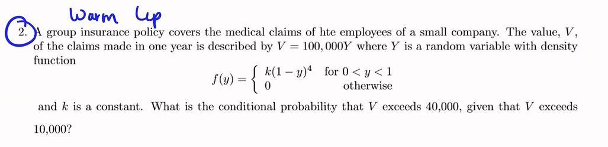
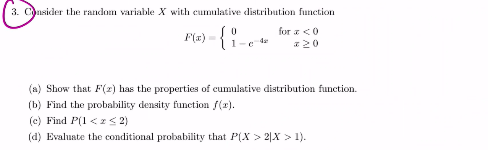
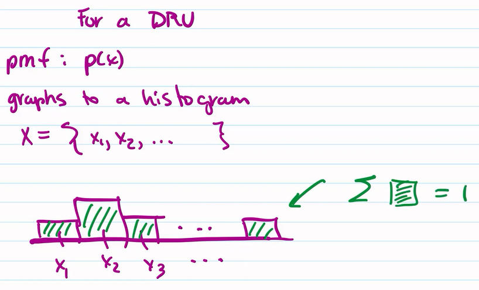
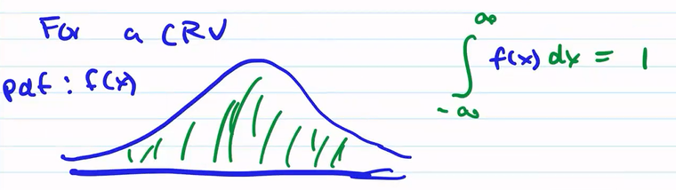
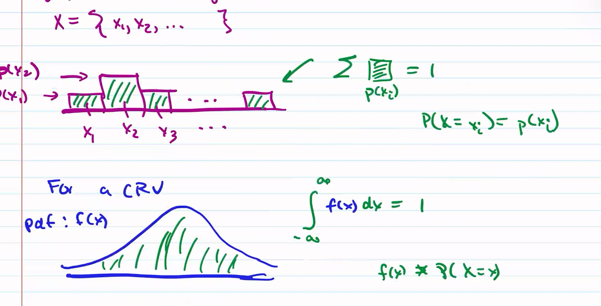
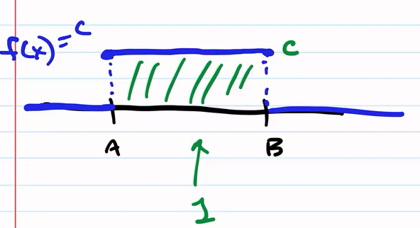
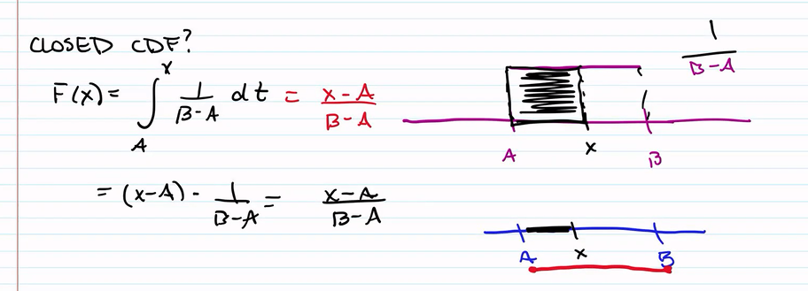
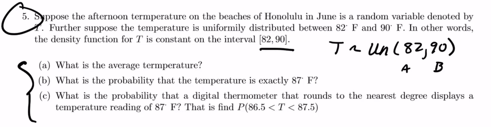
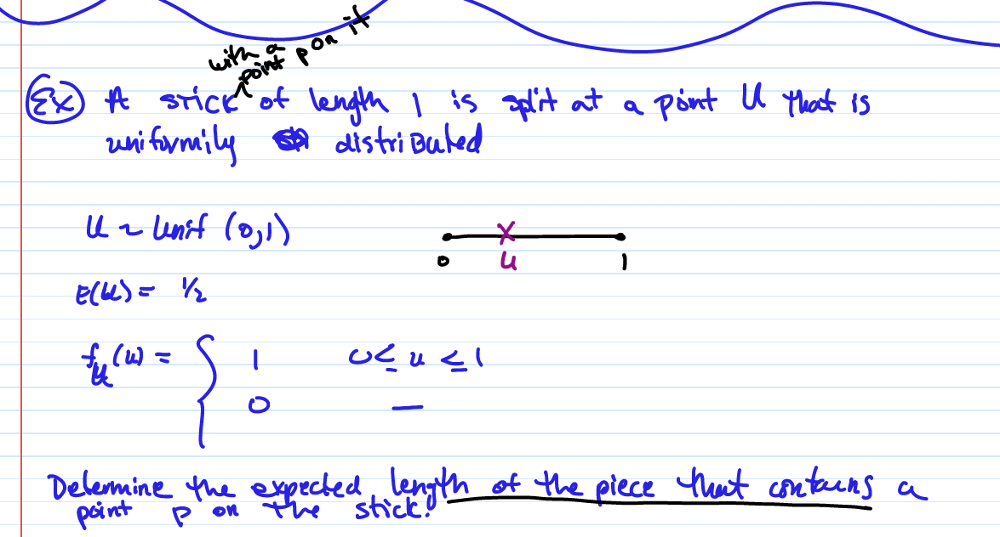
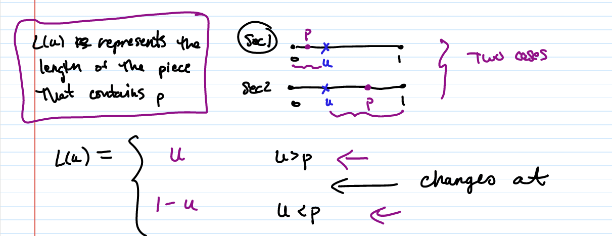

# TOP: 2022/11/01

[TOC]

## Recall: Continuous Random Variables

* Recall:
    * PDF
    * CDF

### Warm Up

####  Question 2

$$
\begin{align*}
f(y) &= k(1-y)^4\\
\\\int^1_0 f(y)dy &= \int^1_0 k(1-y)^4dy\\
&= -k\int^1_0 -(1-y)^4dy\\
&= -k \Big( \frac{(1-y)^5}{5}\Bigg|^1_0\Big)\\
&= -k (-\frac{1}{5})\\
&= \frac k5 = 1\\
\\k &= 5\\
\end{align*}
$$
Therefore, we have 
$$
f(y) = 5(1-y)^4, \quad  0<y<1\\
\begin{align*}
F(y) &= \int^y_0 5(1-t)^4dt \\ 
&= -\frac {5(1-t)^5}{5}\Bigg|^y_0\\
&= -(1-y)^5+1\\
&= 1-(1-y)^5\\
\end{align*}
\\
F(a) = \int^a_0 5(1-y)^4dy\\
$$

$$
\begin{align*}
P(Y>0.4|Y>0.1) &= \frac {P(Y>0.4)}{P(Y>0.1)} \\
&= \frac{1-F(0.4)}{1-F(0.1)}\\
&= \frac{1-(1-(0.6)^5)}{1-(1-(0.9)^5)}\\
&= \frac{0.6^5}{0.9^5}
\end{align*}
$$

#### Question 3

$(a)$ 

> 1. To verify the PDF $f(x)$ is valid, we want to show $\int^\infty_0 f(x)dx= 1$. 
>
>     Since CDF $F(X) = \int^x_0 f(t)dt$, if the CDF is valid, 
>
>     we want $\lim_{x\rightarrow \infty}F(X) = 1$
>
> 2. $F(x)\ge 0$

1. Since $x\ge 0$, $e^{-4x}\le 1$, so $F(x)\ge 0$
2.  $\lim_{x\rightarrow \infty}F(X) = 1-e^{-4x} = 1-0 = 1$

$(b)$

$F'(x) = 4e^{-4x}$

So 
$$
f(x) = \begin{cases}4e^{-4x}, \quad \quad x\ge 0\\
0, \quad \quad \quad \quad x<0
\end{cases}
$$

$(c)$

$P(1<x\le 2) = F(2)-F(1) = (1-e^{-8})-(1-e^{-4}) = e^{-4}-e^{-8}$

$(d)$

$P(X>2|X>1) = \frac{\displaystyle P(X>2)}{\displaystyle P(X>1)} = \frac{\displaystyle 1-F(2)}{\displaystyle 1-F(1)} = \frac{\displaystyle e^{-8}}{\displaystyle e^{-4}} = \frac 1{\displaystyle e^4}$

‘

## Named Distributions

### Uniform Distribution

#### PDF

Uniform distribution has a constant pdf

$$
f(x) = \begin{cases} c, \quad A\le x\le B\\0, \quad \quad else \end{cases}
$$

$$
c(B-A) = 1\\
c = \frac 1{B-A}
$$
#### Graph

 

#### Properties

$X\sim Uni(A,B)$

If its pdf is
$$
f_X(x) = \begin{cases} \frac 1{B-A}, \quad A\le x\le B\\ \ 0, \quad \qquad else \end{cases}
$$

* **Closed Form:** 

$$
P(X\le k) = F(x) = \int^x_A \frac 1{B-A} dt = \frac {x-A}{B-A}
$$

* **Expectation**:
    $$
    E(x) = \frac{1}{B-A}\int ^B_A x\ dx = \frac{1}{B-A} \cdot \frac {x^2}2 \bigg|^B_A = \frac {B^2-A^2}{2(B-A)} = \frac {B+A}{2}
    $$

    $$
    E(X) = \frac {B+A}{2}
    $$

* **Variance**

$$
\begin{align*}
Var(X) &= E(X^2) - [E(X)]^2 \\
&= \frac{1}{B-A}\int ^B_A x^2\  dx - \Big(\frac {B+A}{2}\Big)^2\\
&= \frac{1}{B-A} \cdot \frac {x^3}3 \bigg|^B_A - \frac{(B+A)^2}{4}\\
&= \frac{B^3-A^3}{3(B-A)}-\frac{(B+A)^2}{4}\\
&= \frac{B^2+AB+A^2}{3}-\frac{B^2+2AB+A^2}{4}\\
&= \frac{4B^2+4AB+4A^2-3B^2-6AB-3A^2}{12}\\
&= \frac{B^2-2AB+A^2}{12}\\
&= \frac{(B-A)^2}{12}
\end{align*}
$$

#### **<u>Summary</u>**

* $X\sim Uni(A,B)$

* **pdf**: 
    $$
    \displaystyle f(x) = \begin{cases} \frac 1{B-A}, \quad A\le x\le B\\ \ 0, \quad \qquad else \end{cases}
    $$

* **cdf**:
    $$
    F(x) = \begin{cases}\ 0, \quad \qquad x<A\\ \frac {x-A}{B-A}, \quad A\le x\le B\\ \ 1, \quad \qquad x>B \end{cases}
    $$
    
* **Expectation**:         $\displaystyle E(X) = \frac {B+A}{2}$

* **Variance**:           $\displaystyle Var(X) = \frac{(B-A)^2}{12}$

#### Examples

$(a)$  $E(X) = (90+82)/2 = 86$

$(b)$  $P(X=87) = 0$

$(c)$  $P(86.5<x<87.5) = (87.5-86.5)/(90-82) = 1/8$

$$
\begin{align*}
E(L(u)) &= \int^1_0 L(u)f(u)\ du \quad \quad (\int^1_0 f(u) = 1)\\
&= \int^p_0 (1-u)\ du + \int^1_p u \ du\\
&= p-\frac{p^2}{2} + \frac 12 - \frac {p^2}{2}\\
&= p-p^2+\frac 12
\end{align*}
$$

> Revisit: 
>
> Last class we learned:
>
> Let $X$ be a CRV, with pdf $f_X(x)$ and cdf $F_X(x)$
>
> Find the pdf for $Y = 2X$, that is to find $f_Y(y)$
>
> <u>**Process:**</u>
>
> Start with the CDF of $Y$,
>
> $F_Y(a) = P(Y\le a) = P(2X\le a) = P(X\le a/2) = F_x(a/2)$
>
> Take derivative,
> $$
> F_Y(a) = F_X(a/2)\\
> \frac d{da} F_Y(a) = \frac d{da} F_X(a/2)\\
> f_Y(a) = f_x(a/2)\cdot 1/2
> $$
>

Example: $X\sim Unif(0,1)$

Find the density function for $Y=e^X$
$$
f_X(x) = \begin{cases}\ 1, \quad 0\le x\le 1\\ \ 0, \quad \qquad else \end{cases}
$$

$$
F(x) = x
$$

Then 
$$
\begin{align*}
F_Y(a) &= P(Y\le a) \\
&= P(e^X\le a)\\
&= P(X\le \ln a)\\
F_Y(a) &= F_X(\ln a)\\
\frac d {da} F_Y(a) &= \frac d {da} F_X(\ln a)\\
f_Y(a) &=  f_X(\ln a) \frac 1a\\
&= \frac 1a
\end{align*}
$$
Therefore, 
$$
f_Y(x) = \begin{cases}\ \frac 1a, \quad 1\le x\le e\\ \ 0, \quad \qquad else \end{cases}
$$
