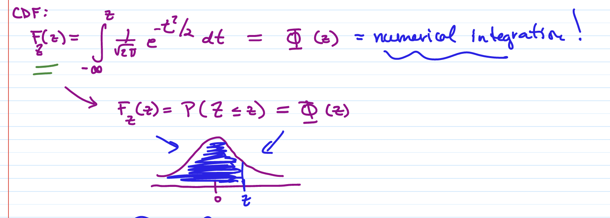

# TOP: 20221103

[TOC]

## Exponential Distribution

### Definition

If $X$ is CRV, with pdf
$$
f(x) = \begin{cases}\lambda e^{-\lambda x}, \quad\quad x\ge 0 \quad\lambda >0\\
0, \quad\quad \quad\quad \text{else}
\end{cases}
$$
then, we say $X\sim Exp(\lambda)$ , $x$ is an exponential RV

> #### Verify a pdf is Valid
>
> 1. $f(x)\ge 0$ for all $x \in \R$
> 2. $\displaystyle \int^\infty_{-\infty} f(x)\ dx = 1$

Verify that $f(x)$ is a valid pdf:

1. $f(x)\ge 0\  \forall x \in \R$ 
2. $\displaystyle \int^{\infty}_0 \lambda e^{-\lambda x}\ dx = \frac{\lambda e^{-\lambda x}}{-\lambda} = -e^{-\lambda x}\Big|^\infty_0 = 1$

### cdf

* Closed form cdf?

$$
F(x) = \int^x_0 \lambda e^{-\lambda t}dt = -e^{-\lambda t}\Big|^x_0 = 1-e^{-\lambda x}
$$

* CDF:

$$
\begin{align*}
F(x) =\  &P(X\le x) =\ 1-e^{-\lambda x}\\
&P(X>x) = 1-F(x) =\  e^{-\lambda x}
\end{align*}
$$

* Store in your brain!

### Expectation

> #### Intergration by parts
>
> Reminder!
> $$
> \int u\ dv = u\cdot v\ - \int v\ du
> $$

$$
\begin{align*}
E(x) &= \int^\infty_0 x\cdot \lambda e^{-\lambda x} dx\\
&\quad\quad u = x, du=dx\\
&\quad\quad v = -e^{-\lambda x}, dv = \lambda e^{-\lambda x} dx\\
\\&= -xe^{-\lambda x}\Big|^\infty _0+\int^\infty_0 e^{-\lambda x} dx\\
&\quad\quad (-\infty\     e^{-\infty} = 0)\\
\\&= 0+\frac{e^{-\lambda x}}{-\lambda }\Bigg|^\infty_0\\
&= -\frac{1}{\lambda}[e^{-\infty}-e^0]\\
&= \frac 1\lambda
\end{align*}
$$

 

### Variance

$$
\begin{align*}
Var(x) &= E(x^2)-[E(x)]^2 \\
&= E(x^2)-\Big(\frac 1{\lambda}\Big)^2\\
...\\
&= \frac 1{\lambda ^2}
\end{align*}
$$

### **<u>Summary</u>**

* $X\sim Exp(\lambda)$

* <u>pdf</u>: 

    ​     $f(x) = \begin{cases}
    \lambda e^{-\lambda x}, \quad x\ge 0\\
    0, \qquad \quad else
    \end{cases}$

* <u>cdf:</u>

    ​     $F(x) = 1-e^{-\lambda x}$

* <u>Expectation:</u>

    ​    $\displaystyle E(X) = \frac 1\lambda$

* <u>Variance:</u>

    ​    $\displaystyle Var(X) = \frac 1{\lambda ^2}$

### Examples

* $\displaystyle X\sim Exp(\frac 12)$

1. $\displaystyle f(x) = \frac 12 e^{-x/2}, \ x\ge 0$

2. $F(x) = 1-e^{-x/2} = P(X\le x)$

3. $P(X>x) = e^{-x/2}$

    $P(x>2) = e^{-1}$

4. $E(X) = 2$

5. $Var(X) = 4$

6. $\displaystyle P(X>12|X>10) = \frac{P(X>12)}{P(X>10)} = \frac{e^{-12/2}}{e^{-10/2}} = e^{-1}$

Note that:
$$
P(X>10+2|X>10) = P(X>2)
$$
This is a special Property that only Exponential distribution CRV has:

* If $X\sim Exp(\lambda)$, 
$$
\begin{align*}
P(X\ge t+t_0|x\ge t_0) &= \frac{P(X\ge t+t_0)}{P(X\ge t_0)}\\
&= \frac{e^{-\lambda (t+t_0)}}{e^{-\lambda t_0}}\\
&= e^{-\lambda t}\\
&= P(X\ge t)
\end{align*}
$$

## Normal Distribution

### Calculus Review

1. $\displaystyle g(x) = \int^x_a f(t)dt \rightarrow g'(x) = f(x)$      (FTC, I)

2. $\displaystyle \int^b_a e^{-x^2} dx \approx $ numerical integration / Taylor series

    * (Geometric)

    * $\displaystyle \int e^{-x^2} dx$ has no closed form

3. Intergration by Parts

    * $ \displaystyle \int u\ dv = u\cdot v-\int v\ du$

### Task 1: Integrate $\int e^{-z^2/2} dz$

### Task 2: Define $Z$ as the Standard Normal RV (CRV) 

PDF:

CDF:

Expectation:

* $\mu = E(Z) = 0$

Variance:

* $Var(Z) = E(Z^2)-[E(Z)]^2$
    $$
    \begin{align*}
    E(Z^2)&= \frac 1{\sqrt{2\pi}} \int^\infty_{-\infty}z^2e^{-z^2/2}dx\\
    &= \frac 1{\sqrt{2\pi}} \int^\infty_{-\infty}z\cdot ze^{-z^2/2}dx\\
     
    \end{align*}
    $$
    

### Summary

* $Z\sim N(\mu = 0, \sigma^2 = 1)$
* $f_Z(z) = \frac1{\sqrt 2\pi}e^{-z^2/2}$
* $\displaystyle F_Z(z) = \Phi(z) = \int^z_{-\infty}f_Z(z) = P(Z\le z)$
* $E(Z) = 0$
* $Var(Z) = 1$
* $SD(Z) = \sqrt{Var(Z)} = 1$
* Graph of pdf:

* It changes concavity at $1$ and $-1$

    ($1$ standard deviation above the mean and $1$ standard deviation below the mean)

    

### Z-table

* We use Z-table to find $\Phi(z) = P(Z<z)$

    

>  For the positive numbers, the values are always greater than $0.5$

* There's also a negative chart

    

* For $P(Z\ge z)$, we calculate $1-\Phi(z)$  or $P(Z\le-z)$ since it's **symmetric**

    * $P(Z>1.5) = 1-P(Z\le 1.5) = 1-0.9332 = 0.0668$
    * $P(Z>1.5) = P(Z<-1.5) = 0.0668$

    

#### Properties

$$
\begin{align*}
P(Z\ge z) &= P(Z\le -z)\\
1-\Phi(z) &= \Phi(-z)\\

\\P(Z\le z) &= P(Z\ge -z)\\
\Phi(z) &= 1-\Phi(-z)\\
\end{align*}
$$

