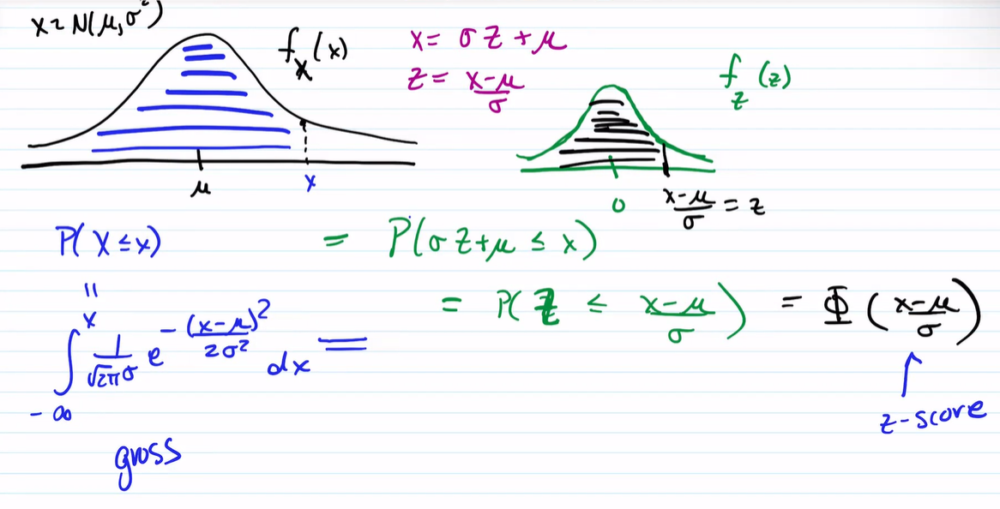
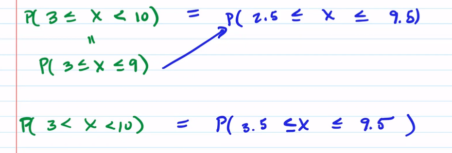
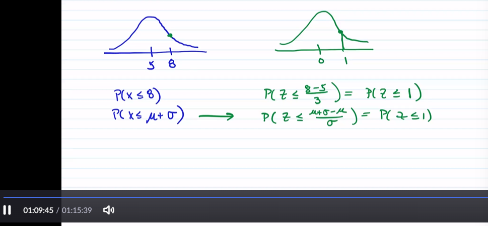
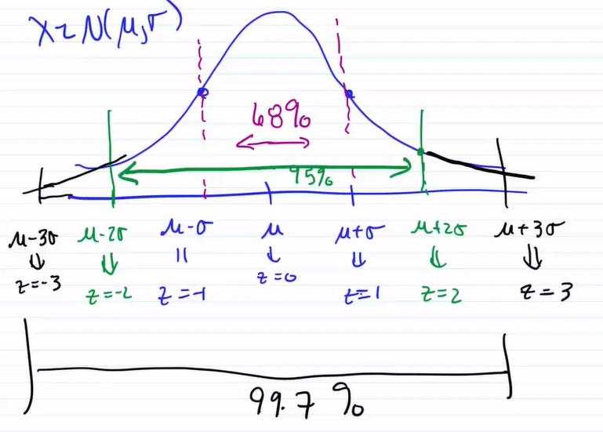

# TOP: 20221108

[TOC]

## Review: Standard Normal RV $Z$ and Z-table

## Normal Distribution

### Definition

$X$ is said to be <u>normally distributed</u> if it can be expressed as a <u>linear transformation of the standard normal RV</u>.

That is, $X = aZ+b$,   $a,b$ constants

* $E(X) = E(aZ+b) = aE(Z)+b = b = \mu_x$              ($\mu_z = 0$)
* $Var(X) = Var(aZ+b) = a^2Var(Z) = a^2 = \sigma_x^2$     ($Var(Z) = 1$)

Therefore $X = \sigma_xZ+\mu_x$

### Notation

$X\sim N(\mu_x, \sigma_x^2)$

* $X\sim N(3, 16) \Rightarrow X = 4Z+3$

* $X\sim N(1,2) \Rightarrow X = \sqrt2Z+1$

Therefore, 
$$
X\sim N(\mu, \sigma^2)\iff X = \sigma Z+\mu \iff Z = \frac{X-\mu}{\sigma}
$$

### pdf & cdf

#### Graph of pdf

### Z-score

#### Example

(00:27:00)

....

(00:32:30)

### Special Case of Central Limit Theorem

For discrete cases (00:47:55)

(00:53:00)

#### Example

#### Example

### $Z$ score means standard deviation above/below mean

$Z$-scores are literally the number of $SD$ $X$ is above or below the mean

