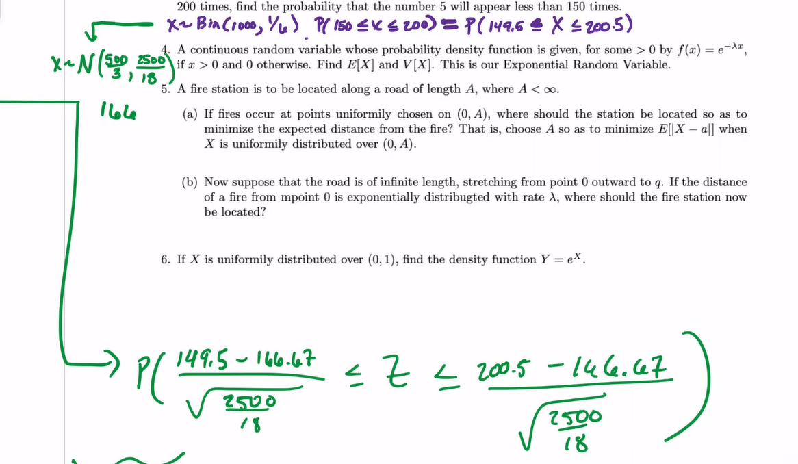
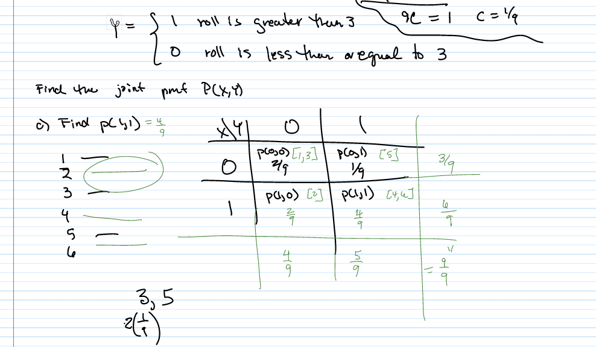

# TOP: 20221110

[TOC]

### Warm Up

Don't continuity correct on question 2!

We only continuity correct when we use continuous distribution to approx discrete distribution, but question 2 is already a continous distribution

### Recall

## Chapter 6: Joint Distribution

### Discrete Case

#### Joint PMF for DRV

* $p(x_i,y_) = f(x_i,y_j) = P(X=x_i, Y=y_j)$
* $f:B\rightarrow \R$,    such that 
    1. $f(x_i, y_j)\ge 0$  for $(x_i,y_j)\in B$
    2. $\displaystyle \sum_{ij} f(x_i,y_j) = 1 = \sum^n_{j=1}\sum ^m_{i=1} f(x_i,y_j)$

### Continuous joint

* We say $X, Y$ are "jointly continous" **if** there exists a function $f(x,y)$ defined for all real $x,y$ and has the property for each set $C$ of ordered pairs of real numbers
    $$
    P((x,y)\in C) = \int\int_{(x,y)\in C}f(x,y)\ dxdy
    $$

* And if $C = \{(x,y)|\ x\in A, y\in B\}$
    $$
    P(x\in A, y\in B) = \int_B\int_A f(x,y)\ dxdy= \int_A\int_B f(x,y)\ dydx \le 1
    $$
    

#### PMF

* Let $R$ be a region given in the $xy-plane$ and let $f: \R^2\rightarrow \R$
    1. $f(x,y)\ge 0$ for all $(x,y)\in \R^2$
    2. $f(x,y) = 0$ for all $(x,y)\notin R$
    3. $\displaystyle \int\int_R f(x,y) \ dA = \int^\infty_{-\infty}\int^\infty_{-\infty} f(x,y) \ dxdy = \int^\infty_{-\infty}\int^\infty_{-\infty} f(x,y) \ dydx = 1$ 

#### Marginal Probability

> Recall: For DRV, 
  > $$
  > p_X(x) = \sum_j P(x,y_j)=\sum_j P(X=x,Y=y_j)\\
  > p_Y(y) = \sum_i p(x_i,y)=\sum_i P(X=x_i,Y=y)\\
  > $$

Therefore, we have 
$$
f_X(x) = \int^\infty_{-\infty} f(x,y)\ dy\\
f_Y(y) = \int^\infty_{-\infty} f(x,y)\ dx\\
$$

#### Joint CDF for continuous $X,Y$

$$
F(a,b) = P(X\le a, Y\le b) = \int^b_{\infty}\int^a_{\infty}f(x,y)\ dxdy
$$

* $(X\le a, Y\le b)$ defines our bounds

> Recall:
>
> $F'(x) = f(x) $
>
> $\displaystyle \frac{\part^2[F(x,y)]}{\part x\part y} = f(x,y)$

##### Example:

* $X,Y$ joint continuous distribution with pdf
    $$
    f(x,y) = \begin{cases}
    2e^{-x} e^{-2y}, \quad 0\le x< \infty, 0\le y< \infty \\
    0, \quad\quad\qquad else
    \end{cases}
    $$
    $P(X>1,Y<1)=?$
    $$
    \begin{align*}
    P(X>1,Y<1) &= \int^\infty_1\int^1_0 2e^{-x} e^{-2y}\  dydx\\
    &= -e^{-x}\int^\infty_1  e^{-2y}\Big|^1_0   \  dx\\
    &= -e^{-x}\int^\infty_1  (e^{-2}-1)   \  dx\\
    &= -(e^{-2}-1) \int^\infty_1 -e^{-x}  \  dx\\
    &= -(e^{-2}-1) (e^{-x}\Big|^\infty_1) \\
    &= -(e^{-2}-1)e^{-1}\\
    &= -e^{-3}+e^{-1}
    \end{align*}
    $$
    

