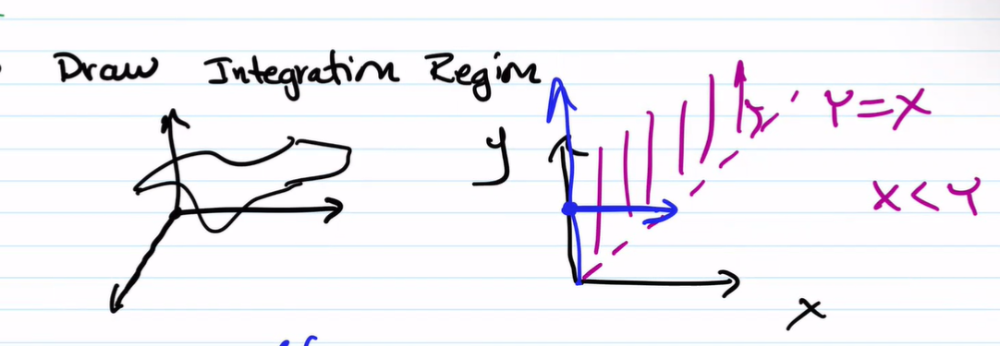
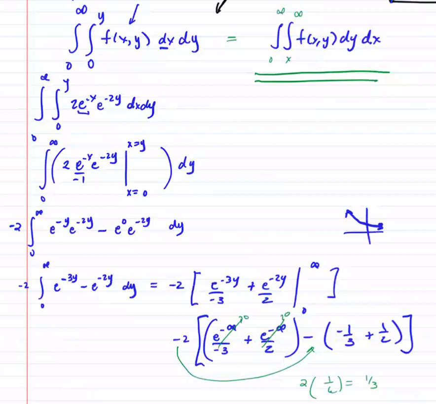
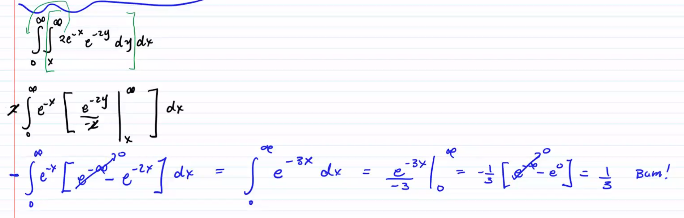
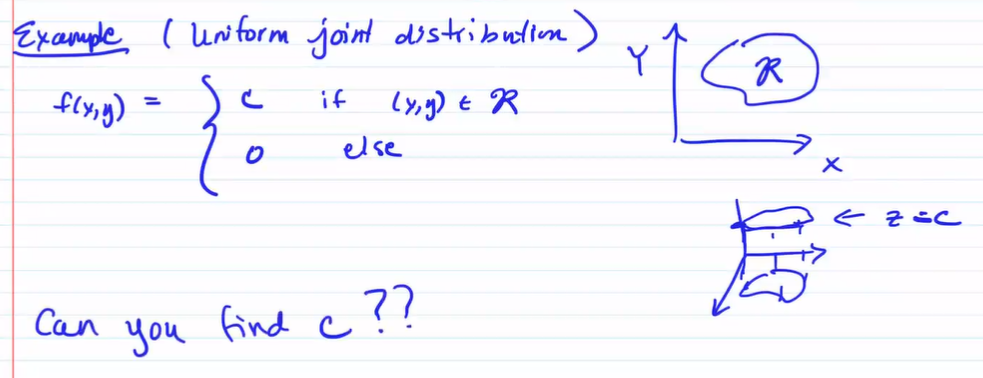
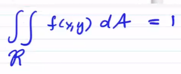
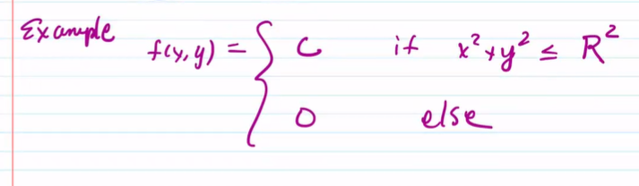
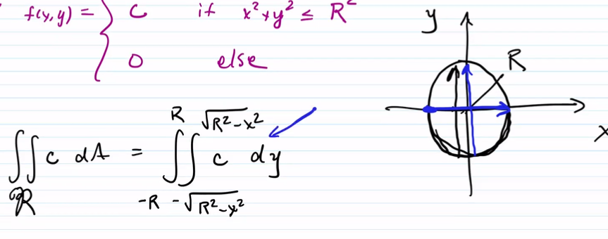

# TOP: 2022/11/15

[TOC]

## Recall

Last week we learned joint pdf for continous distribution over a rectangular region. But what if the region is not rectangle?

## Joint Distribution

### Probability for not rectanglar region

* $X,Y$ joint continuous distribution with pdf
    $$
    f(x,y) = \begin{cases}
    2e^{-x} e^{-2y}, \quad 0\le x< \infty, 0\le y< \infty \\
    0, \quad\quad\qquad else
    \end{cases}
    $$
    $P(X<Y)=?$

    

    Graph:

    

    Therefore, the intergral is:
    $$
    \int^\infty_0\int^y_0 f(x,y) \ dxdy = \int^\infty_0\int^\infty_x f(x,y) \ dydx
    $$
    

    We can calculate from both side:

    

    

### Probability for only $X$ or $Y$ bounded

* Suppose $f(x,y)$ pdf for $X,Y$ CRV
    $$
    P(X<a) = \int^a_{-\infty}\int^\infty_{-\infty}f(x,y) \ dydx = \int^a_{-\infty } f_X(x) \ dx = F_X(a)\\
    \\F_X(a) = \int^a_{-\infty } f_X(x) \ dx
    $$
    Similarly,
    $$
    P(Y<b) = \int^b_{-\infty}\int^\infty_{-\infty}f(x,y) \ dxdy = \int^b_{-\infty } f_Y(y) \ dy = F_Y(b)
    $$

### Example

* 

    

    

    