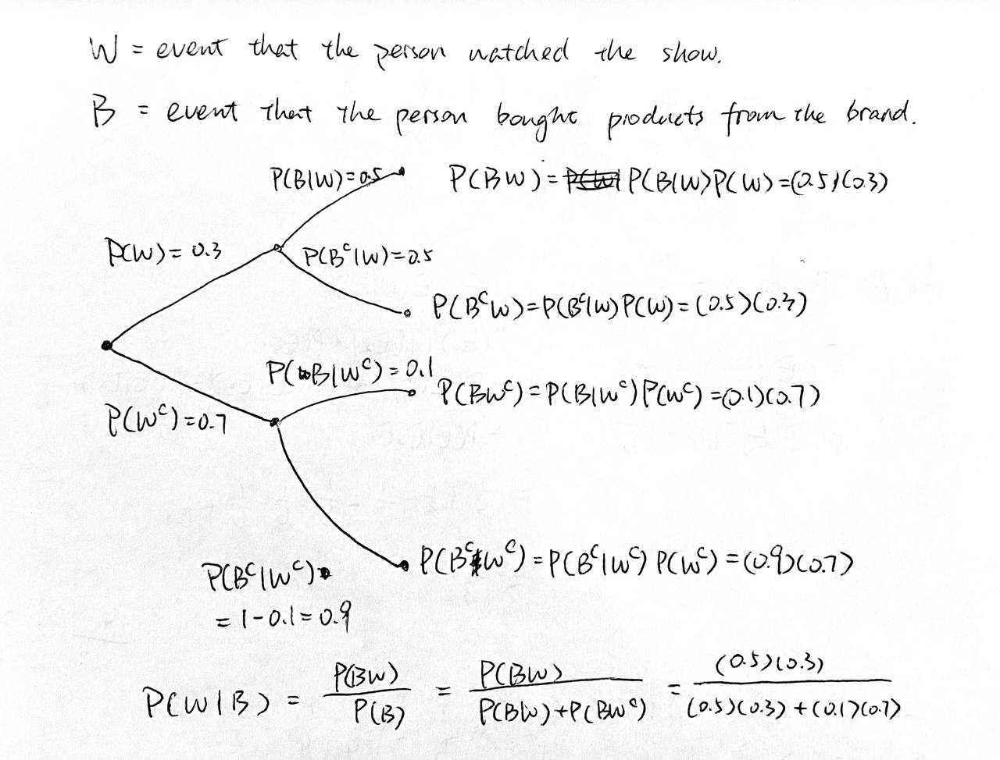

# Midterm Quizzes Solutions

[TOC]
## Chapter 1

Since Clara wants to visit all $7$ stars, and she will visit them one by one, we know that the order of the stars matters. Since she plans to spend a total of 7 days, we know she only visit each star once, and thus repetition not allowed.

Therefore, we use permutation, and Clara has $7!$ ways to plan her journey.

## Chapter 2

Since Timmie has $7$ ducks and $10$ pigeons, there are $\binom {17}5$ ways for him to randomly pick 5 fowls.

So $|S| = \binom{17}5$

Let $E$ be the event that all $5$ are ducks, we have $|E|=\binom75$.

Therefore, the probability is $\displaystyle P(E) = \frac {|E|}{|S|} = \frac{\binom 75}{\binom{17}5}$

## Chapter 3

## Chapter 4

Let $X$ be the R.V. that counts the number of rolls Andy made.

$X\sim Geo(0.01)$

$P(X = 100) = (1-0.01)^{99}(0.01)^1 = 0.99^{99}\cdot0.01$

