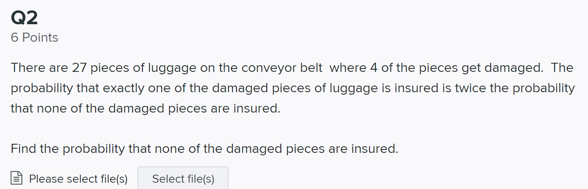

## Q3

A jug contains 12 marbles where 4 are white and 8 are blue.  Three players: Roger, Rafa, and Novak successively draw from the jug: First Roger, then Rafa and third Novak, and then they repeat the order continuously.  The winner is the first one to draw a white ball.  If the balls are not replaced after each draw, what is the probability that Novak wins?  

<u>**Answer**</u>:

* For Novak to win, the first white ball should occur at the 3rd, 6th, or 9th.

    * Note that the first white ball can't be on the 12th since there are 4 white balls and 12 balls in total.

* The probability that Novak wins is 
    $$
    P(N) = \frac{(8\cdot7)\cdot4}{12\cdot 11\cdot 10}+\frac{(8\cdot7\cdot6\cdot5\cdot4)\cdot4}{12\cdot 11\cdot 10\cdot 9\cdot8\cdot7 }+\frac{8!\cdot 4}{12\cdot11\cdot10\cdot9\cdot8\cdot7\cdot6\cdot5\cdot4}
    $$

* I love tennis too!

    

## Q4

When my colleague and I grade these exams, we do not grade the work but instead, randomly assign grades.  He will have a 1/4 chance of assigning an A whereas I have a 2/3 chance of assigning an A.  I will grade 70% of the exams and he will grade 30% of them.

a) When your exam is graded, what is the probability it will be assigned an A? 

b)If an A is assigned, what is the probability that I was grading? 

c)If my colleague grades all exams (there are 40), what is the probability that his first A will be on his 6 exam? 

d) If my colleague grades ALL exams (there are still 40), what is the probability that the third A will be assigned on the 10th attempt?

## Q6

Box A contains 2 white balls and 4 red balls, whereas Box B contains 1 white ball and 1 red ball. A ball is selected at random from box A and put into box B and then a ball is randomly selected from box B.

(a) What is the probability that the ball selected from box B is white?

(b) What is the probability that the transferred ball was white given that the ball selected from box B was white?1

<u>**Answer:**</u>

$A$ = event the ball from box A to box B is white

$B$ = event the ball from box B is white

We have $\displaystyle P(A) = \frac 13, \ P(B|A) = \frac 23, \ P(B|A^c) = \frac 13$

(a) 
$$
P(B) = P(AB)+P(A^cB) = \frac 23 \cdot \frac 13+\frac 23\cdot \frac 13 = \frac 49
$$
(b)
$$
P(A|B) = \frac{P(AB)}{P(B)} = \frac{\displaystyle\frac 23\cdot \frac 13}{\displaystyle\frac 49}= \frac 12
$$

